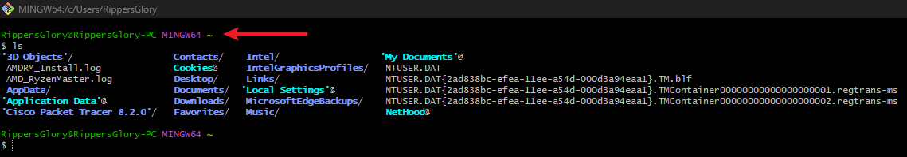

# Tech Environment Setup

## Description
This is the first of many mini projects within my Devops course. This one is very basic and revolves around installation and documentation of comprehensive DevOps programs that retain necessary tools and resources. 

---

## Tools needed to be installed:
- Visual Studio Code (VScode)
- GIT
- Virtual Box
- Ubuntu on virtual box (Windows or intel chip macOS)

---

## Accounts to be created:

1. Github Account
2. Amazon Web Services (AWS) Account

---

### VSCode Installation

I downloaded VSCode via Chrome as seen below.

VSCode was very straight forward to install and it's up and runnning and ready to use. (See Below)

---

### Git Installation

The next key tool & resource to install was Git, as seen below Git was downloaded via Chrome

And finally an a showcase of GIT running on my PC

---

### Virtual box Ubuntu windows installation

Virtual box was installed successfully alongside an ISO of Ubuntu which was mounted when creating a virtual desktop. The installation files can be seen below for both.

Below you will find the successful installation of virtualbox and successful creation of a virtual machine using Ubuntu

---

### Github Account Creation

Please see attached my account already logged into Github with repository already created.

---

AWS Account Creation

