# Git Branching and Merging

### Merging Changes 

within this part of my project i will be merging changes made previous to Tom & Jerry's branches and creating pull requests (PR)

---

I firstly open my web browser and go to the GitHub page for the repository. (see img below)

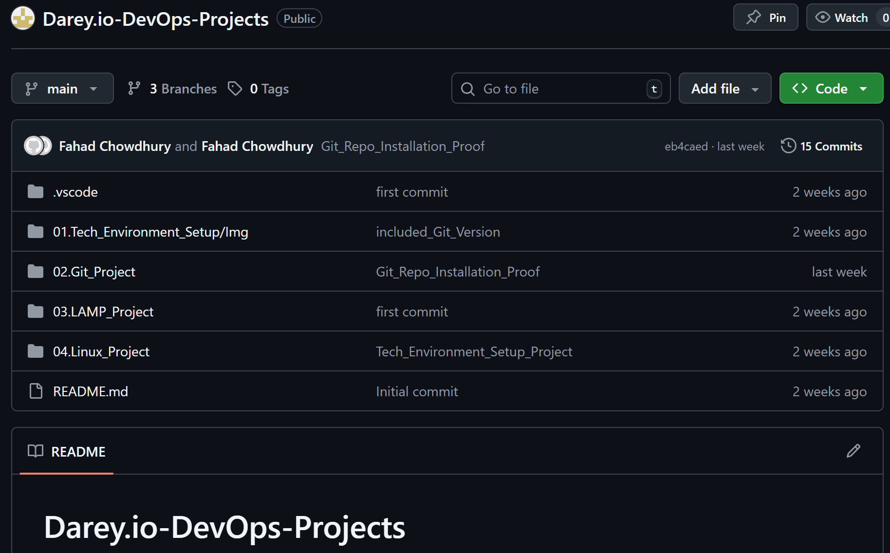

---

I then proceed to switch from my main branch to the branch Tom worked on, in this instance that would be the 'Update-Navigation' branch.

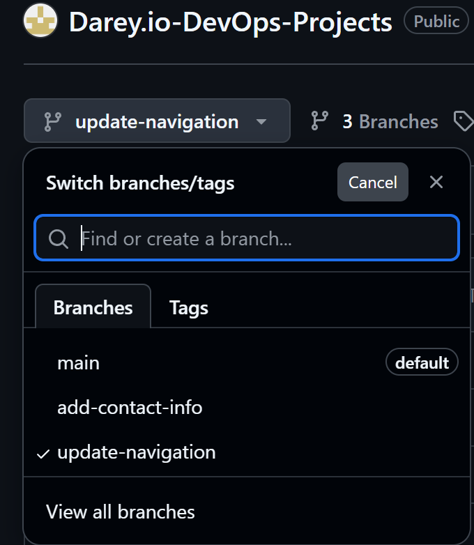

---

Next step is to generate a pull request on the page.

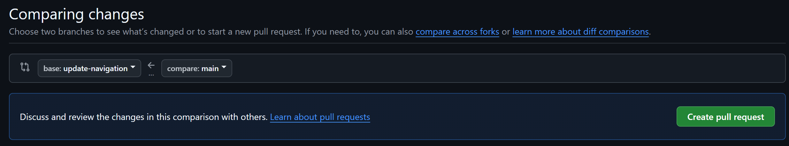

---

### Reviewing Toms changes

Over here the base is set to the main projects branch and checks it against Toms branch to compare them.

Below before creating the pull request i would review the changes to ensure everything is correct.

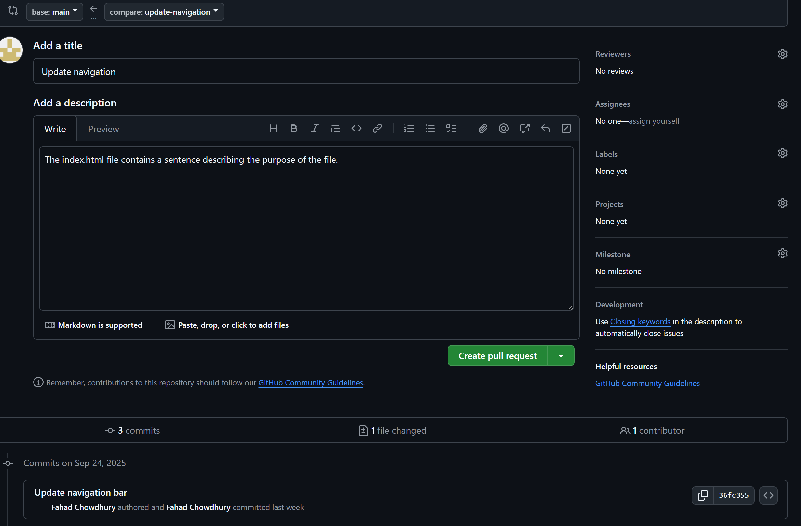

Here is the open request after successfully creating a pull request.

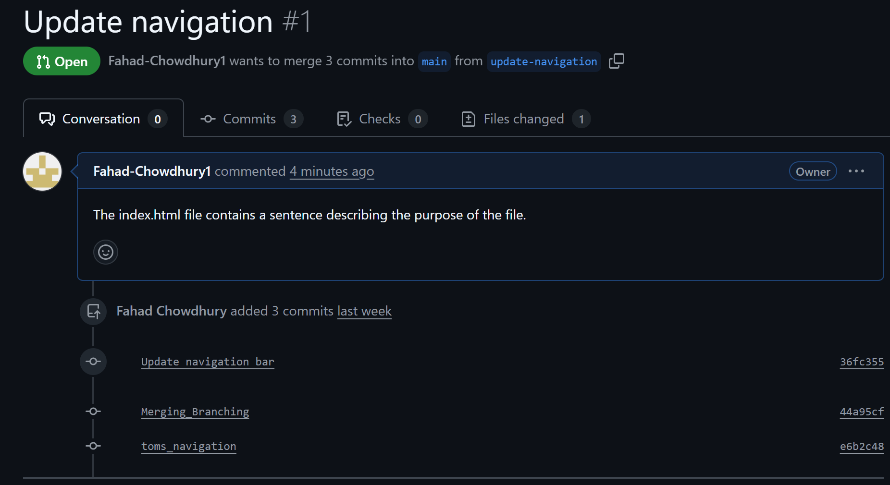

---

### Steps to update Jerry's Branch

Now i'll do the same with Jerry's branch by first navigating to his branch by using the command "git checkout add-contact-info"

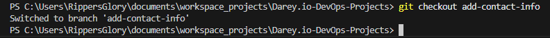

After switching to Jerry's branch i pull all the changes from the main branch using the git pull command.

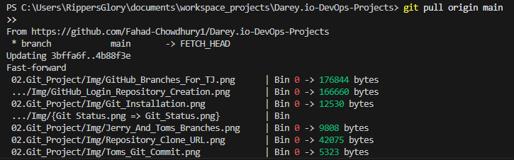

---

### Merging Toms Pull Request

Toms pull request now has to be merged so that his changes merge into the main branch.

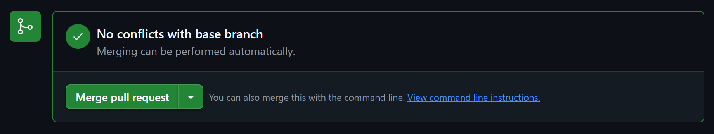

Final Confirmation of the pull request merging.
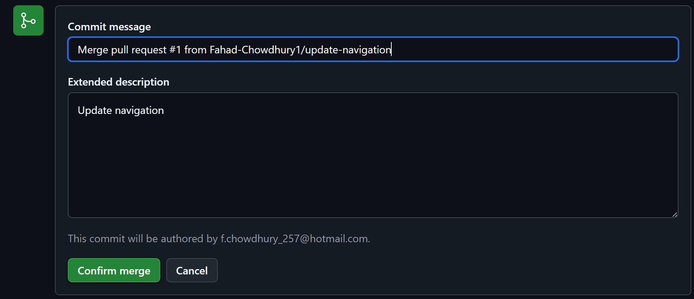

Confirming merge pull request.

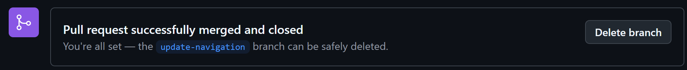

---

### Pushing Jerry's update branch to GitHub

After successfully merging Tom's Pull Request we push Jerry's branch to GitHub.
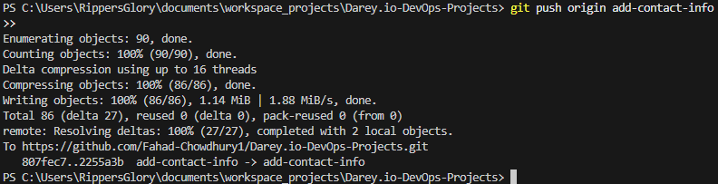

Then the same is done with Jerry's branch, where a pull request is raised same as Toms, and then the pull request is merged into the main branch as done with Tom.