# Enhancing a Community Library Website

### Summary
For this project i am part of a development team tasked with enhancing the website for the "Greenwood Community Library". The website aims to be more engaging and informative for its visitors. It currently includes basic sections: Home, About Us, Events, and Contact Us. I have been tasked to add a "Book Reviews" section and update the "Events" page to feature upcoming community events.

I will be simulating the roles of two contributors "Morgan and Jamie". Morgan will focus on adding the "Book Reviews" section, while Jamie will update the "events" page with new community events.

---

### Repository creation and local cloning

I'll firstly be creating a brand new repository for this project on GitHub naming it "Greenwood-Library-Website

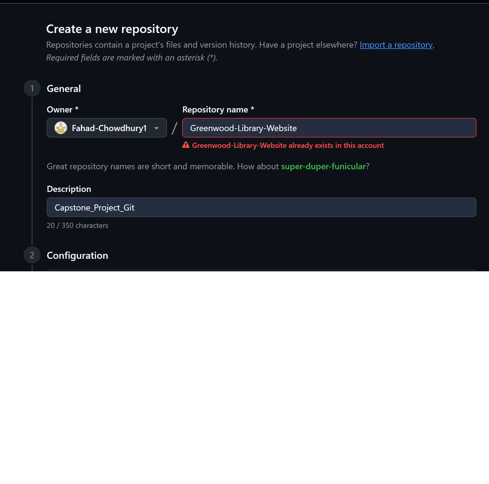

Once i'm happy with my repository name and description i have gone ahead and finalised the repository creation

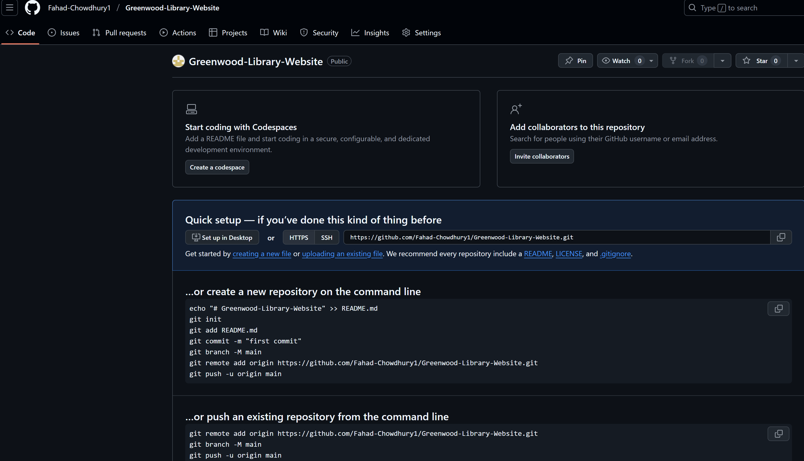

Once the repository is created my next task is to locally clone it to a designated location, in this case it would be my "Work_Space" folder. This is done via GitBash after grabbing the HTTPS of my repository from GitHub.

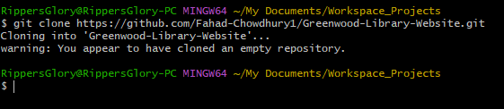

---

### Creating Repository Main Branch Content

My next step is to open up the repository through GitBash using the "code ." command and creating a README.md file.

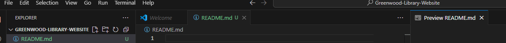

After successfully cloning the repo and opening it on VSC the next step is to add content to the main branch including html files to do with Home, About Us, Events and Contact Us.

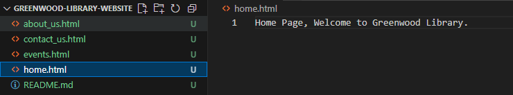

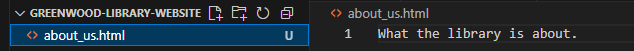

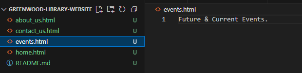

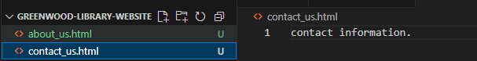

---

### Stage, Commit & Push

Once the main branch has some base content the next step is to stage, commit and push these changes to the online repository.

Below you will see me stage the changes.

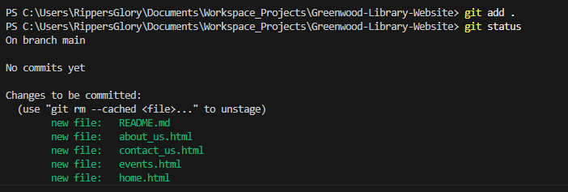

Below here you can see the changes being comitted.

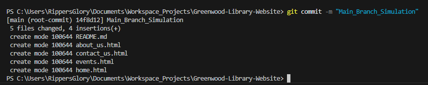

Finally using the "Git Push" command i push the changes to the online repository.

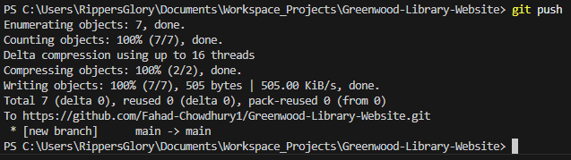

---

### Morgan's work: Adding Book Reviews

For this part of my project i'll be creating a branch for morgan named "add-book-reviews" and switching to that branch to continue a simulation of his work.

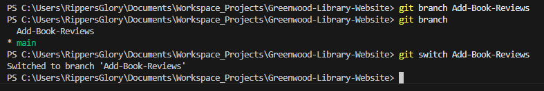

I will then implement a html file called "book_reviews" to represent the book reviews section with random text content in the file:

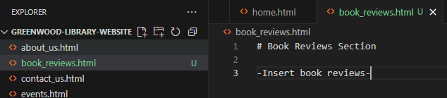

Once this part is completed the next step is to stage, commit and push the changes.

The below image shows me my changes are pushed to staging as well as which changes specifically.
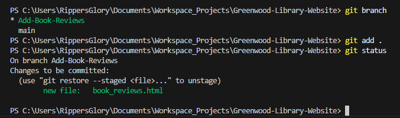

Once i'm happy with the above i push to initiate the commit command to lock them in place.

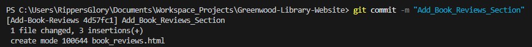

Finally i push the changes to the online repository to get ready to raise a pull request.

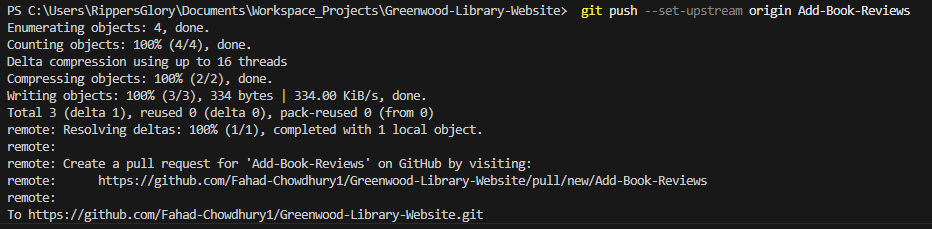

The next step was for me to raise a PR (Pull Request) for Morgans work.

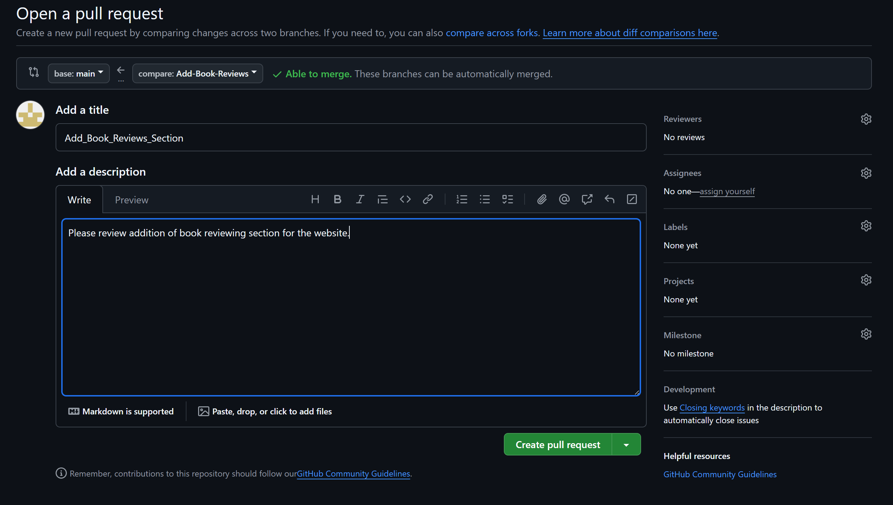

And finally having the pull request accepted and merged into the main branch.

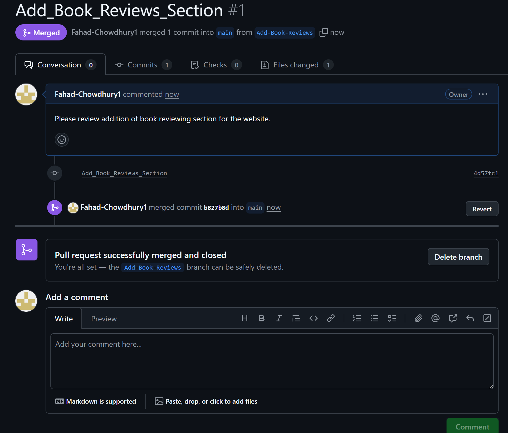

---

### Jamie's Work: Updating Events Page

Long story short the same has to be repeated for Jamies work as i did for Morgans, but on the "Events Page". I will have to create a seperate "Update-Events" branch for Jamies work, carrying out a simulation of his work and then staging, commiting and pushing the changes.

### Jamies Branch Creation

First step would be to create a seperate branch from the main branch for Jamies work

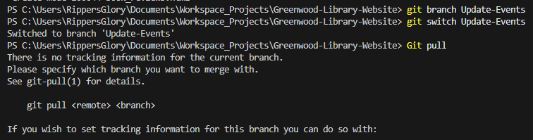

We will then progress to creating the "update-events" file that Jamie will be working on.

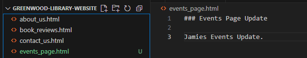

Once content has been inserted and Jamie has wrapped up his work it's time to Stage, commit and push the changes to our remote repository.

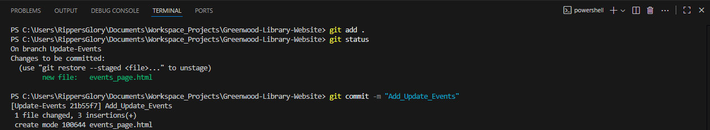

Once we're happy with our staging and commit stage we progress to pushing our changes to our remote repository.

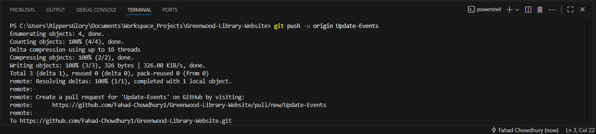

### Jamies Pull Request

We finally move on to raising our PR request via GitHub for review.

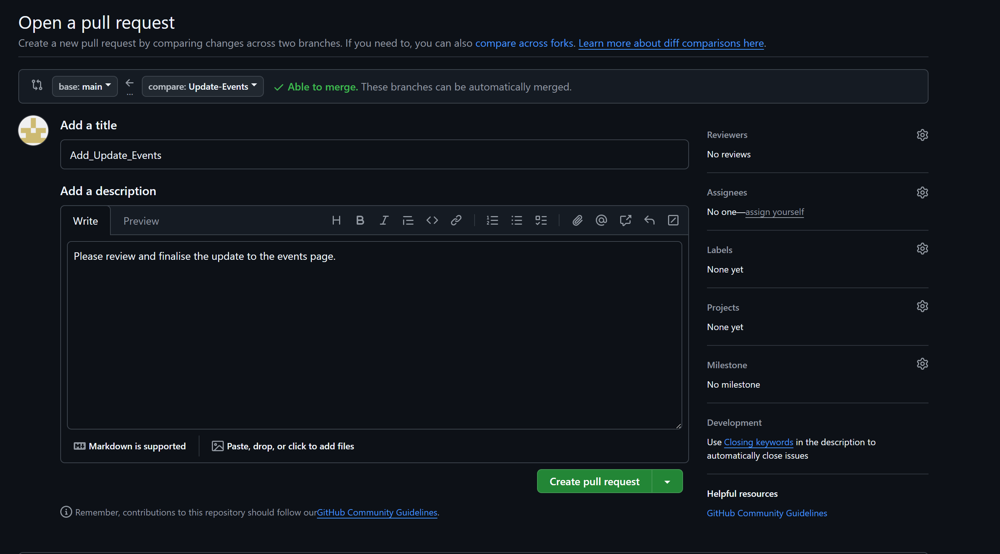

Once the pull request is raised, it will be reviewed by another team member for bugs.

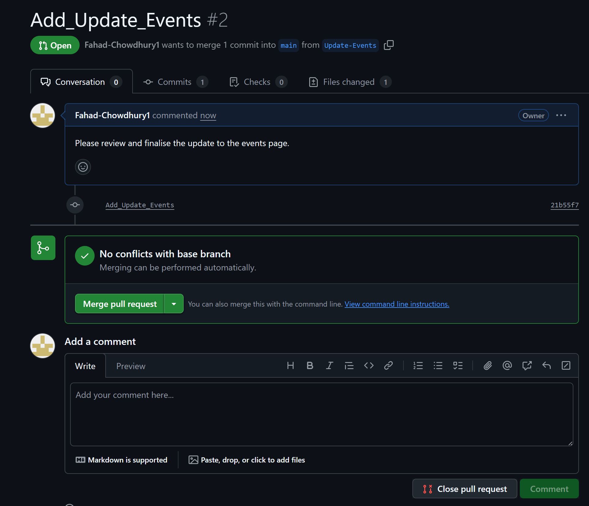

and finally once the review is successfully passed it will merge the changes into the main branch.

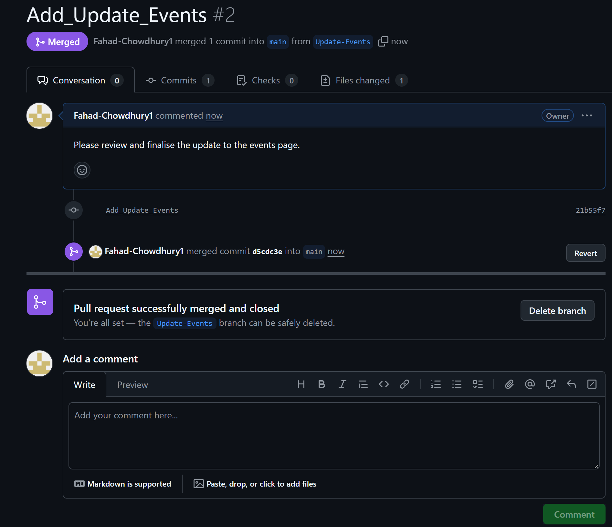

We then proceed to pull the latest changes from main branch to our branch Jamie was working on.

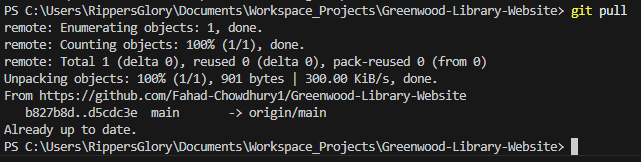