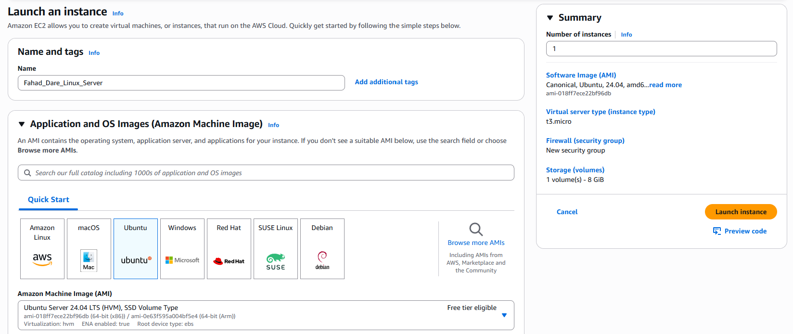
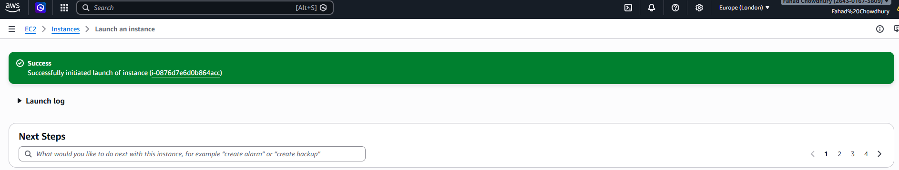
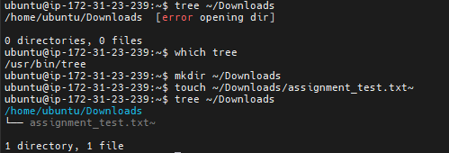

# Remote EC2 server creation on AWS

## Introduction
Within this mini-project my aim is to set up a virtual remote server using AWS on their EC2 instance and I will gain access to it via my local environment. I will then proceed to connect to that server in the cloud, remotely straight from my computer.

### AWS Instance Configuration
After creating my AWS account I have navigated to the AWS dashboard where i will begin to configure and launch my instance to get it ready.

I have navigated into the "Launch Instance" option where i have named my server, selected which OS i wanted my server in (Ubuntu) as well as the image version among other configurations.

I have also created a Key Pair which will allow me to connect to the server securely.

I have also configured the storage and increased it from the base 8GiB to 16GiB

After finishing up all my configurations the instance is now ready to be launched. As you can see in the image below, after launching my instance i was notified the instance launch was a success.

Now that i have my remote server up and running i will need a client tool to connect to the server to communicate to it and give it comnands. I have opted to go with MobaXterm as i am using Windows 11.

### Connecting Using SSH Command
Now that i've installed MobaXTerm, i can use an SSH session to connect to the server remotely using the key pair and the IPV4 IP Address for the instance.

Now that i've inserted my Private Key and the IP address of the server i am able to successfully create a remote session to the server where i am prompted for a username. After inserting my userame i have connected to the session.

### Installing, Updating and Removing Software
My first step before installing new software or updating existing packages was to refresh the package lists for Debian based systems.

#### Installation of Software Packages
My next step is going to be to install a command called 'tree', this command is used to visually see the file system structure on a linux server. I will do this by using the command line 'sudo apt install tree'

#### Installed Package Verification
To confirm that the tree command has been installed correctly, i will use the tree command to specify the path i want to see and the tree structure.

#### Updating Installed Packages
To ensure my systems are up to date i will run the command line 'sudo apt upgrade' that will insure installed packages are up to date and if not then the system will install the necessary upgrades.

#### Removing Software Packages
Earlier I installed the 'tree' package, i will run the command line 'sudo apt remove tree' to uninstall the software package.

