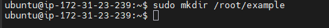
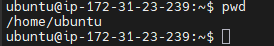
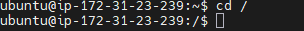
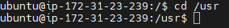
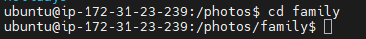
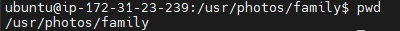

# Executing Basic Linux Commands

### <u>Summary</u>

In this part of my project i will be executing basic linux commands inside the client terminal after successfully connecting to my remote server. I will be using commands such as Sudo, mkdir, ls, pwd and many more.

### <u>Creating a folder with Sudo</u>
Sometimes superuser privileges are required to create a folder in certain locations on the system, in this instance i will use the 'sudo' command along with 'mkdir' to create a folder called "example"

As you can see below, i try to create a folder within the root directory without the sudo command and promptly get denied as i don't have superuser access. 

Now observe as i use the 'sudo' command to create a folder within the root directory.

Now that i've created the "example" folder within root using the sudo command it's time to check if this was successful by carrying out the 'ls' command to list all folders and files within root.

As you can see above 'example' and 'snap' are listed within the 'root' directory, which means i was successful in creating the 'example' folder within root.

Next i'll use the 'pwd' command to find the path of my current working directory, this can be achieved by simply entering the 'pwd' command and this will return the full current path.

Navigating through the Linux files and directories will require the 'cd' command. for example if i wanted to navigate to the root filesystem on my server i would use the 'cd /' commandline. With '/' being windows equivelent of 'C' or 'D' drive.

To confirm i have reached the root successfully i'll carry out the pwd command again to check where i am.

As seen by the '/' representation in the above image this confirms i am now at the root directory.

Now if i wanted to list the files and directories in the root filesystem, i would simply use the 'sudo ls -1' command line.

Now if i wanted to navigate to any of the directories in the output, for example the 'usr' directory, then i can again use the 'cd' command to enter that directory.

As you can see in the above screenshot, the directory changed after the ip address in the terminal from just '/' to '/usr' this small change lets me know i am now within the usr directory.

I will now create another directory within the 'usr' directory called 'photos' as the usr directory is within the root directory, i will be required to use the 'sudo' command to make any changes.

I will now proceed to navigate inside the 'photos' directory and create 3 more random directories.

Now to make sure i've created the directories within photo i will use the ls -1 command.

As you can see above i can correctly observe the newly created directories within the photos folder.

Now i will navigate into one of the 3 directories using the 'cd' command again.

with the pwd command i will retrieve the 'absolute path'

