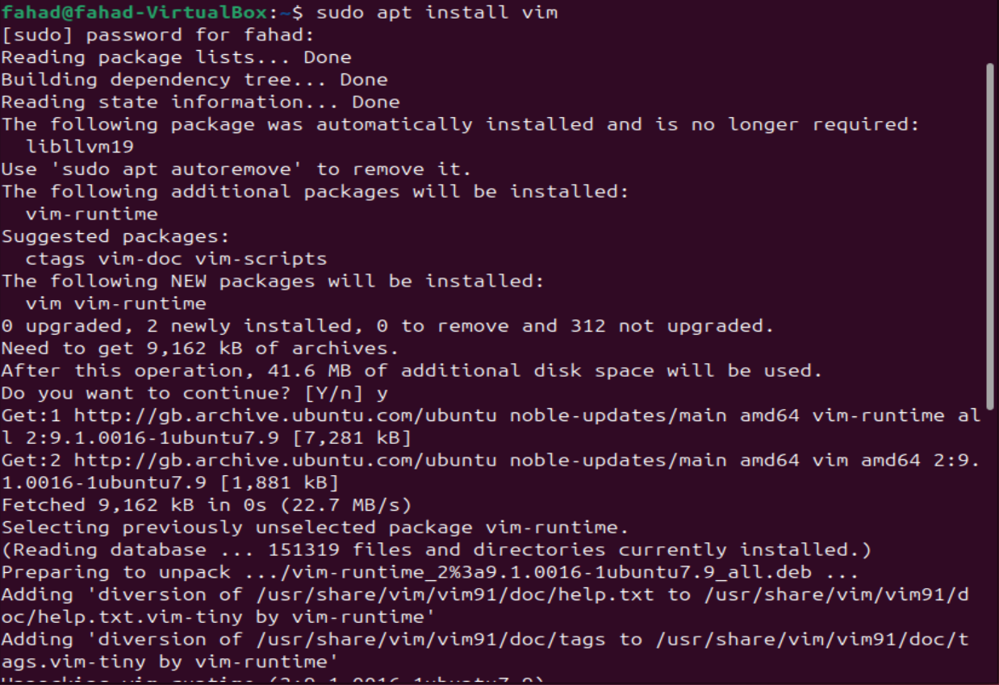
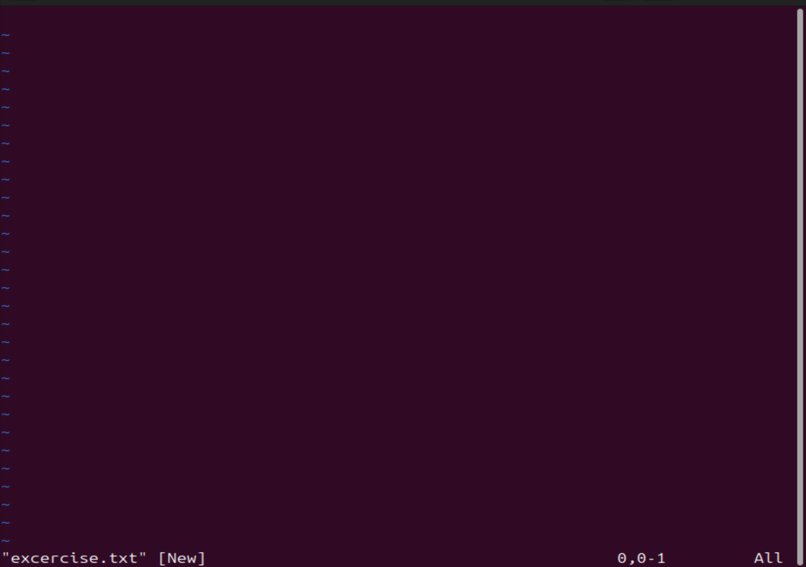
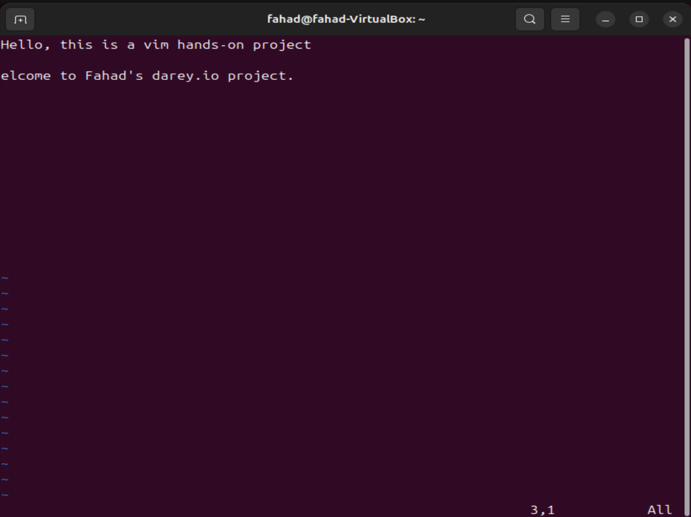
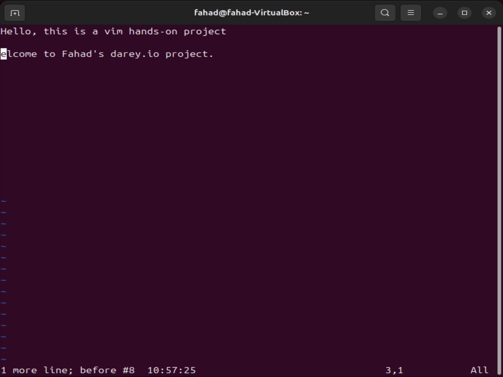
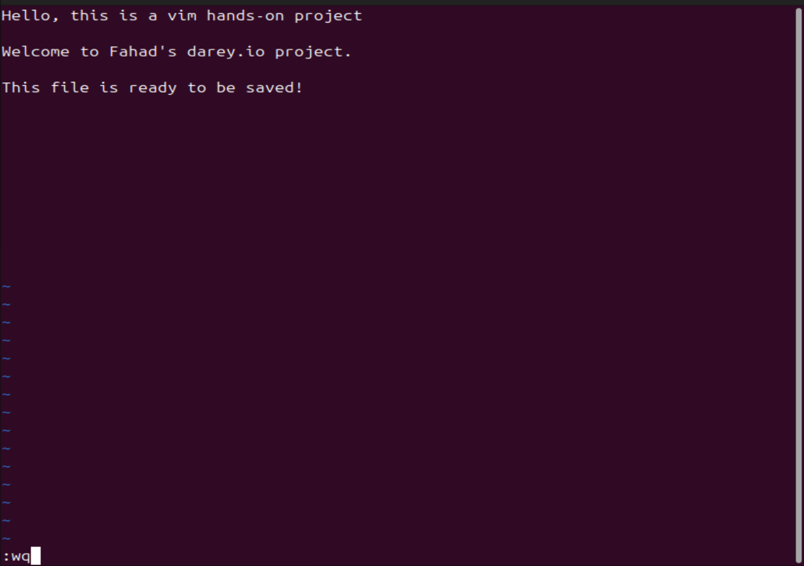
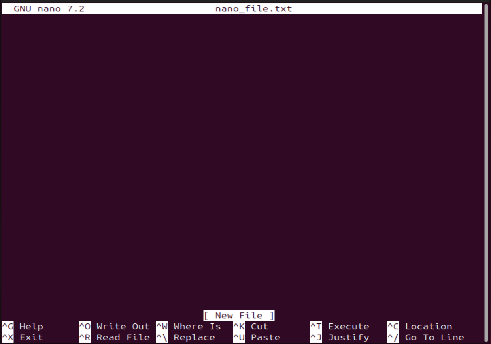

# Linux_Text_Editor
 
 
 

### <u>Summary</u>
In this project i will be exploring text editing in the Linux environment with VIM as the specialised program. I will include a detailed introduction to VIM which is considered to be one of the most powerful and versatile text editors through my hands-on project. The text editor is specifically designed for creating, modifying and managing text files on Linux based operating systems.
 
 
 

### <u>Working with VIM Editor</u>
First i have to get my hands on the VIM editor, this will be done using the 'sudo apt install vim' command to install VIM. the will be done by opening a new file named 'exercise.txt' using the command line 'vim exercise.txt'

I'll then be opening a new file named 'exercise.txt' and using the command line 'vim exercise.txt' to edit the file. Even if the file does not exist the above command 'exercise.txt' will create one, this will open the file up so that we can start writing into the file as if we're opening up notepad or onenote on windows.

As you can see in the above image we're inside the file in an editing view.
 
 

### <u>Entering Insert Mode</u>
To enter insert mode to start editing the file i'll need to press 'i' to enter insert mode. The way to know you're in 'insert mode' is you will see the word 'insert' at the very bottom of the file after pressing 'i'.

### <u>Navigation</u>
To navigate and move around through the text file i can use arrow keys on the keyboard or the letters h(left), j(down), k(up) and I(right). You'll see in the image below that I have navigated to the middle of the text file using the arrow keys which is present by the highlighted row.

### <u>Deleting a character & a Line</u>
Firstly to delete a character or a line I have to exit insert mode. This is achieved by pressing 'esc' on the keyboard, the next step is so place my curose on the character i want to delete and then i simply press 'x' on the keyboard. In this case i've deleted the character 'W' from the word 'Welcome'

The same can be achieved with deleting a line, but slightly different, again i will have to exit insert mode, but instead of pressing 'x' on the keyboard i place the cursor on the line i want to delete and simply press 'd' twice on the keyboard to delete the entire line. In the instance below i've deleted the entire line where i had my welcome message.

 

### <u>Undoing & Saving Changes</u>
To make changes to my file (adding or deleting text) in Insert or Normal Mode, i have to first enter normal mode, this is achieved by pressing 'esc' and then pressing 'u' to undo my last change. In this instance, I've undone deleting my entire sentence from my previous image.

Saving the file - After i have finished writing into the file, i have to exit insert mode again by pressing 'esc' and then typing ':wq' and hit 'enter' key on the keyboard. This will save my file, the 'w' in the command stands for 'write' and 'q' stands for 'quit'. By carrying out this command it will save and quit and brind me back to the terminal.

In the event i wish to quit the file without wanting to save my progress or changes i simply have to press 'esc' and then type out ':q!' as previously mentioned the 'q' stands for 'quit' so this will quit the text file on the VIM editor without saving and will return me to the terminal once more.

 

### <u>Working with Nano Text Editor</u>
Within Linux text editors there is also Nano text editor, this editor stands out as a user friendly and straightforward tool which makes it an excellent choice for users who are new to the command line.

Below i will carry out the same commands the i performed on the VIM editor, but this time on the NANO editor.

Opening a File: Like i did with VIM by using the 'VIM exercise.txt' command to make a file, i will do the same with Nano this time using the 'nano nano_file.txt' command

Now that i'm inside the Nano editor interface I'll be carrying out a few changes, the first one being entering and editing the text. Unlike VIM editor i don't need to press any keys to enter into 'insert' mode, i can just start typing away.

Saving Changes - Saving my changes it pretty straight forward as you can see at the bottom of the nano editor it shows you all the commands you can perform and how to perform them with '^' meaning 'ctrl' key on the keyboard, so by pressing ctrl + O on the keyboard it will save my progress.

As you can see above i am being prompted to comfirn the filename that i wish to save. By pressing Enter to confirm i have saved my progress and this is confirmed with an update at the bottom of the Nano editor 'wrote 2 lines' as seen in the image below.

Exiting Nano - If i wish to exit nano without saving the file, i simply press 'Ctrl + X', if i have any unsaved changes i will be prompted by Nano to save before exiting.

Opening an existing file - If i want to open an existing file i only have to use the following command 'nano existing_file.txt'

