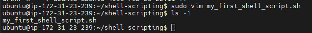
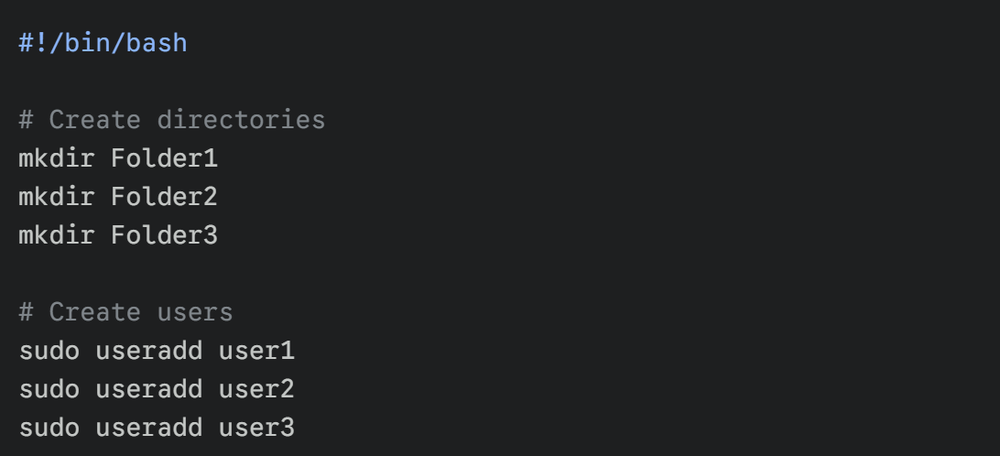
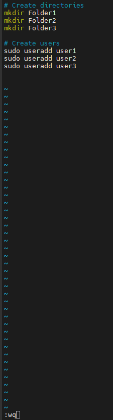
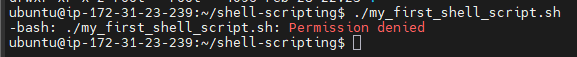
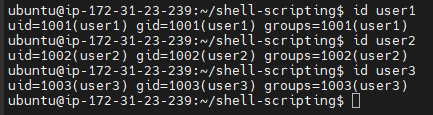
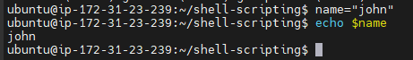

# 
Linux Shell Scripting

### <u>Introduction</u>
This Project is going to be a compreensive guide to mastering Linux Shell Scripting which will be designed to automate repetitive tasks and streamline system administration workflows. I will cover everything from basic command line operations to advanced script logic for efficient DevOps automation.

 

### <u>What is Shell Scripting</U>
Shell scripting is the process of writing and executing a series of isntructions in a shell to automate tasks. A shell script is essentially a script or program written in a shell language, such as sh (bourne Shell), Bash (Bourne Again Shell), zsh (Z Shell) or PowerShell.

Tasks to complete for this Project:

1) Create a folder on an ubuntu server and name it shell-scripting

 
 

2) Using the vim editor, create a file called 'my_first_shell_script.sh'

 
 

3) Put the below shell script code into the newly created file.

 
 

4) Save the file.

 
 

5) Use CD command to change into the shell-scripting directory and use the 'ls -latr commmand to confirm that the file is indeed created.

As you can see above from the screenshot regarding the file permissions the owner of the file has read & write privileges (r+w), whereas the members of the file group and other users only have read permission (r), however no one has the execute (x) permission.

generally to execute the script i would use the command line:

'./my_first_shell_script.sh'

breaking down the command line above this prefix of './' indicates that the command should look for the file in the current directory.

the period (.) represents the current directory and the forward slash (/) is a directory seperator.

You'll see below of an example of what happens if i try to run this command without superuser privs or without the appropriate execute permissions.

As you can see above i am receiving a permission denied error, this can easily be resolved by giving the user/groups the necessary permissions to execute the file.

Tasks to carry out:

1) Add the execute permission for the 'owner' to be able to execute the shell script.

As you can see above the 'owner' now has read, write & execute (rwx) permissions.

2) Run the shell script amd Evaluate and ensure that 3 folders are created.

I will now be running the shell script again to see if the command will execute correctly this time or whether i will receive another permissions denied error.

As you can see above, i still received permission denied errors even after giving the 'owner' read, write and execute permissions, the reason for this is since i used the sudo command when making the file the 'owner' was the 'root' user and not 'ubuntu'. So i had to change the owner from root to myself (ubuntu) using the 'chown' command.

4) Evaluate and ensure that 3 users are created on the linux server.

As you can see above the users have been created successfully with their own unique user id's.

### <u>What is Shebang</u>
As you may have noticed earlier when i put the automation script in the vim .sh file the command started with '#!/bin/bash'. The importance of defining 'shebang' (#!/bin/bash) is that this line acts as a pointer for the operating system, specifying that the Bash interpreter located in '/bin/bash' should be used to execute the commands within the file.

Without this absolute path, the system may not know how to interpret the script leading to execution errors as it doesn't know whether to use .sh, bash, zsh or powershell.

### <u>Automation Logic: Variables and Commands</u>
The script i used was designed to automate two primary administrative tasks:

Directory Creation: Using the mkdir command to generate a structured folder hierarchy (Folder1, Folder2, Folder3).

User Management: Utilizing sudo useradd to provision three new system users.

Variable Usage: Data is stored in variables using the = operator and accessed using the $ sign, allowing the script to remain dynamic and reusable.

Lets explore another example regarding variables for example if i wanted to assign the variable 'name' to a user called 'John' using the command line:

name="john"

After assigning a value to a variable, as showin the the previous example, i can utilise this variable in various ways in my script or program. One of the most straightforward methods to use or retrive the value stored in a variable is by echoing it back to the console using the 'echo' command.

using 'echo $name' i've instructed shell to print the value of the name to my screen, which in my case was 'john'