# 
Linux Shell Scripting Control Flows

### <u>Introduction</u>
This project explores how to use logic and loops to move past manual tasks and build automation that is truly reliable. Control flow is what turns a basic list of commands into a script that can actually think for itself.

#### <u>Control Flow in Shell Scripting</u>

Control flow statements are the backbone of making decisions in programming. In scripting, these statements let my scripts decide what to do or how to proceed based on conditions, loops or user inputs.

Bash and other shell interpreters provides control flow statements like:

<b>if-else</b>

<b>for</b> loops

<b>while</b> loops

<b>case</b> statements to control the flow of execution in my scripts

#### <u>What is Control Flow?</u>
In simple terms, control flow directs the order in which commands or instructions are executed in a script. It's like a roadmap that decides which path to take based on certain conditions or how many times to visit a place.

For example i'll examine an 'if-else' statement in Bash to understand how it makes decisions based on user input.

#### Task:

My script asks for a number and then tells me if that number is a positive, negative or zero.

Script to use:

#!/bin/bash

read -p "Enter a number: " num

if [ $num -gt 0 ]; then

    echo "The number is positive."

elif [ $num -lt 0 ]; then

    echo "The number is negative."
else

    echo "The number is zero."
fi

1) Create a file and name it "control_flow.sh"

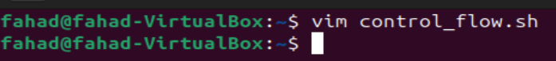

2) put the below code and execute the script to see what happens.

    read -p "Enter a number: " num 

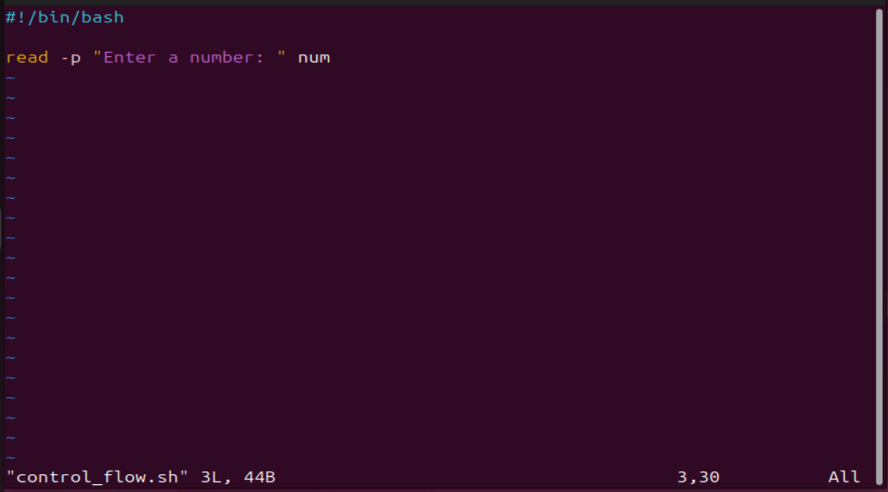    

3) Execute the script.

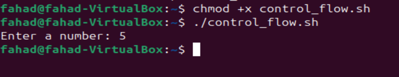

As you can see above, when i execute the script, it just asks me for  number to enter. Even after typing a number and hitting enter, it takes the number, but i am not able to visibly see what it did with the number. This is because the 'read' command in the script has its own way of taking inputs from the user, and storing the value into a variable passed onto the 'read' command.

The 'read' command is used to capture user input and store it in a variable. When i use 'read' followed by a variable name(in the case of my script a num), Bash waits for the user to enter something into the command line (stdin). Once the user presses enter, read assigns the input to the variable.

Now i will update the code to the below and execute it to make more sense of the script.

#!/bin/bash

read -p "Enter a number: " numecho "You have entered the number $num"

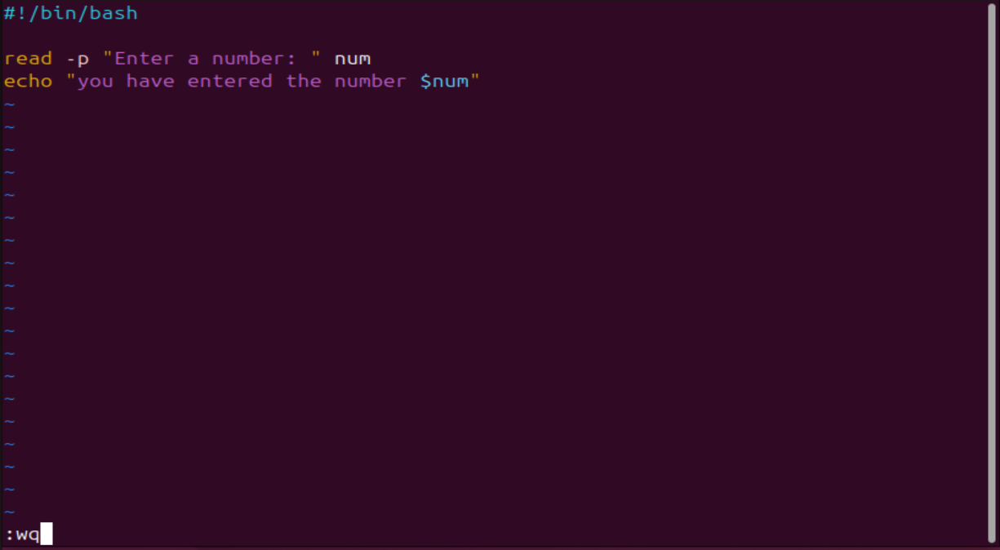

If you notice now, i have used 'echo' to return back to the screen the value stored in the '$num' variable.

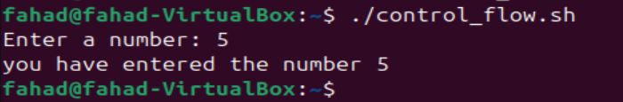

 
 

### <u>if statement</u>

The <b>if statement</b> in Bash scripts allows me to execute commands based on conditions. The basic syntax is:

if [ condition ]; then

    commands
fi

<b>if:</b> This keyword starts the conditonal statement.

<b> [ condition ]:</b> The condition to evaluate. Brackets[] are used to enclose the condition being tested.

<b>then:</b> Iof the condition is true, execute the commands that follow this keyword.

I will now bring the below into my code.

if [ $num -gt 0 ]; then

    echo "The number is positive."
fi

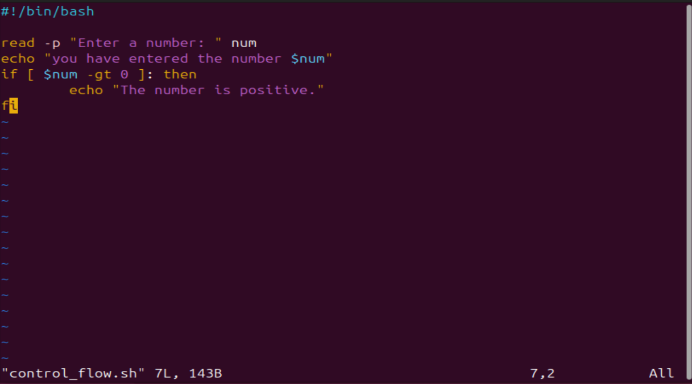

The above code tests if the value in $num is greater than 0, then most likely i have entered a positive number.

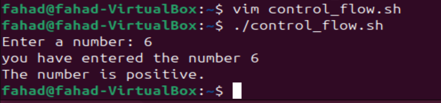

If you ntice i use the keyword -gt in the condition. These are called 'operators' that are used within the condition block to perform numeric comparisons between values.

### <u>elif statement</u>
After understanding the 'if' statement, i'll now be moving to the elif part of control flow in Bash scripts. elif stands for 'else if', allowing me to test additional conditions if the previous 'if' conditions were not met.

I'll be adding the following script to my existing script:

if [ condition ]; then

commands1

elif [ condition2 ]; then

commands2

fi

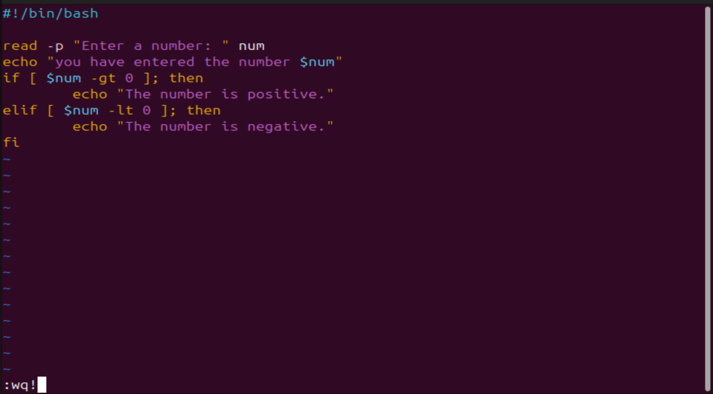

<b>elif:</b> This keyword is used right after an 'if' or another 'elif' block. It allows me to specify an alternative condition to test if the previous conditions were false.

<b> [ condition2 ]:</b> The new conditioni want to evaluate. like the 'if' statement, this condition is encloused in square brackets.

<b>then:</b> if the <b>elif</b> condition is true, execute the commands that follow this keyword.

Now i will execute the command again with this new addition to my script.

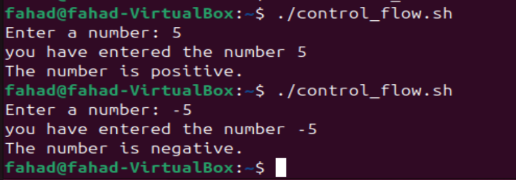

In this updated version of the script:

The 'if [ $num -gt 0 ]; then part of the script checks if the 'num' is greater than 0 and prints "the number is positive." if true.

If the first condition isn't met, for example a number below 0, the 'elif [ $num -lt 0 ]; then' checks if num is less than 0. If this condition is true, it prints "The number is negative."

This way, the script can differentiate between positive and negative numbers, providing specific feedback based on the value of 'num'

Notice the <b>-lt</b> "less than" operator in the elif section.

### <u>Loops</u>

The <b>for</b> loop has two main forms:

<b>1. List Form:</b> iterates over a list of items:

Here is a basic syntax;

for item in item1 item2 item3; do

echo $item

done

<b>for:</b> This keyword initiates the loop, signaling the start of a block of code that will repeat.

<b>item:</b> This is a variable that temporarily holds the value of each item in the list as the loop iterates. For each iteration of the loop, item takes on the value opf the next item in the list, allowing the commands inside the loop to act on this value.

<b>in:</b> The keyword is followed by a list of items that the loop will iterate over. This list can be a series of values, an array, or the output command. The loop excutes once for each item in the list.

<u>Task To Complete</u>

1) Create a shell script for each type of the 'for' loop and insert the code in the file.

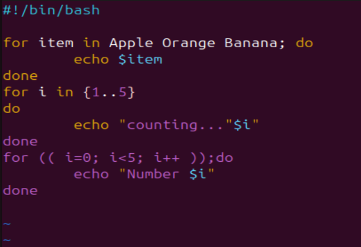

2) set the correct permission for the scripts.

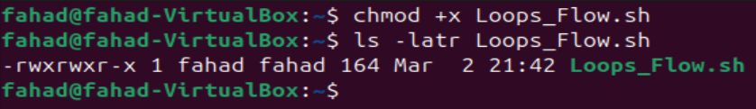

3) Execute the script and evaluate my experience.

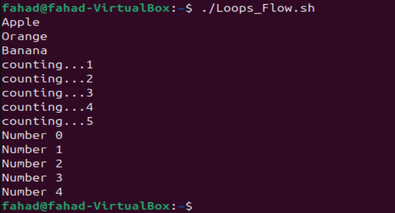

