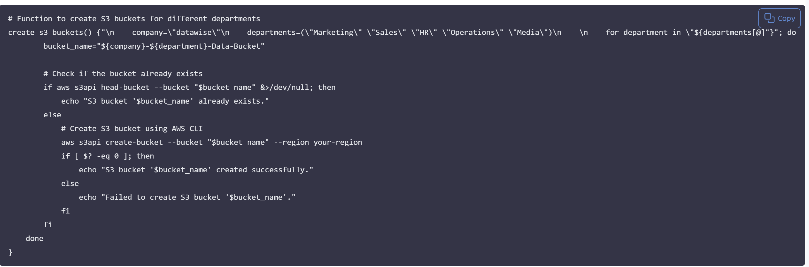

# 
 Error Handling In Shell Scripting

## Introduction

Error handling is a crucial aspect of scripting that involves anticipating and managing errors that may occur during script execution. These errors could arise from various factors such as incorrect user input, unexpected system behaviour, or resource unavailability. Proper error handling is esential for improving the reliability, robustness, and usability of shell scripts.

### <u>Implementing Error Handling</u>
When implementing error handling in shell scripting, it's essential to consider various scenarios and develop strategies to handle them effectively. Here are some key steps that i think through and implement error handling:

- <b>Identify Potential Errors:</b> I begin by identifying potential sources of errors in my script, such as user input validation, command execution or file operations. Anticipate scenarios where errors may occur and how they could impact script execution.

- <b>Use Conditional Statements:</b> I utilise conditonal statements such as 'if, elif and else' to check for error conditions and respond accordingly.

- <b>Provide Informative Messages:</b> When errors occur, the script/terminal usually provides descriptive error messages that clearly indicate what went wrong and how users can resolve the issue.

### <u>Handling S3 Bucket Existence Error</u>
In the contest of my script to create S3 buckets, an error scenario could arise if the bucket already exists when attempting to create it. To handle this error, i can modify the script to check if the bucket exists before attempting to create it. If the bucket already exists, i can add a script display a message indicating that the bucket is already present.

If i try to run my script more than once, i will end up creating more EC2 instances than required, and S3 bucket creation will fail because the bucket would already exist.

Here's an updated version of the create_s3_buckets function with error handling for existing buckets: 

### <u>Conclusion</u>
Working through this project was a huge eye-opener on how much "thinking" a simple script can actually do. I started with the basics, like setting up the shebang and using read -p to get user input, but the real challenge was getting the Control Flow logic right. I spent a lot of time debugging common syntax traps—like mismatched quotes and identifier errors—which taught me that Bash is incredibly picky but also very powerful once you understand its rules. By the end, I wasn't just writing lists of commands; I was building smart scripts that use if/else statements and for loops to handle repetitive tasks and check for existing resources, like S3 buckets, to prevent errors before they even happen. This experience really showed me how vital Error Handling is for creating automation that is actually reliable and professional.