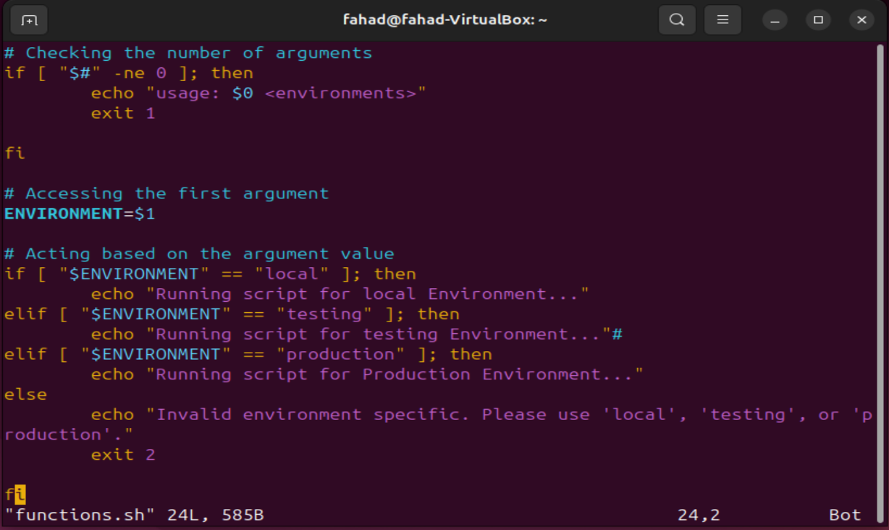
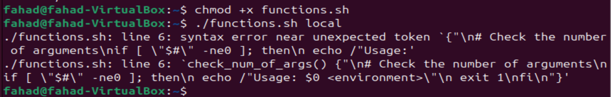
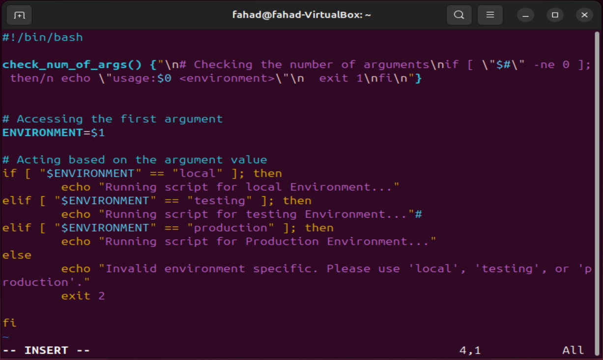
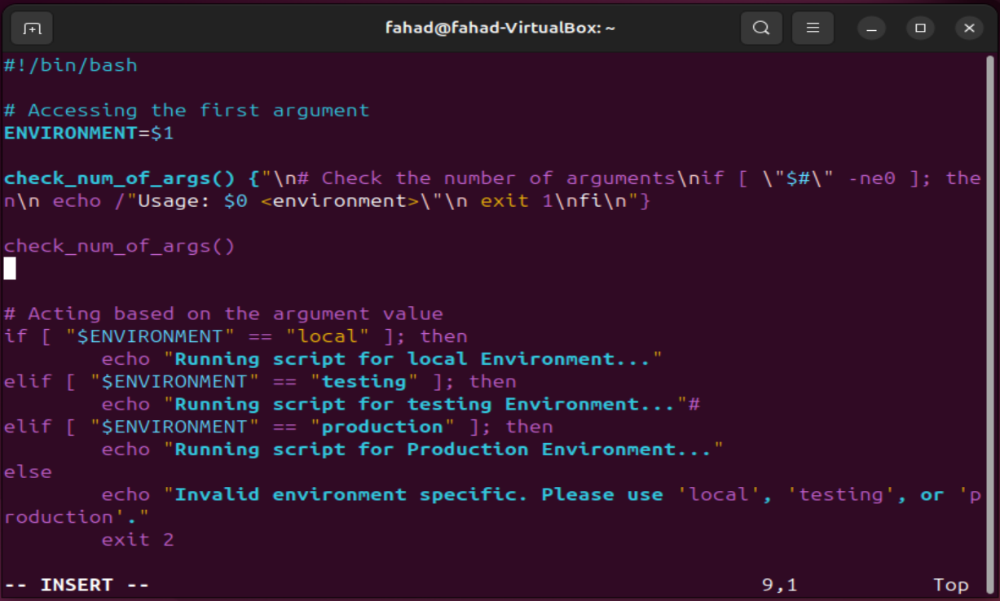
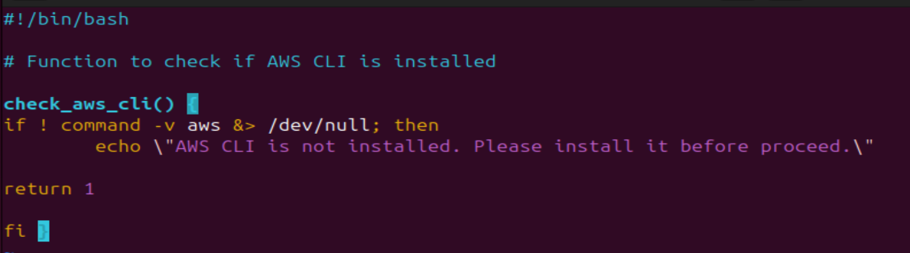

# 
Working With Functions

### <u>Introduction</u>
In this project, I am stepping up from basic scripting to building a professional automation tool for DataWise Solutions. The core objective is to develop a robust shell script that automates the setup of EC2 instances and S3 buckets, ensuring that the client's cloud infrastructure can be deployed quickly and consistently.

### <u>Functions</u>
Organising my code is key to maintaiing clarity and efficiency. One powerful technique for achieving this is through the use of functions.

By encapsulating specific logic within functions, i can streamline my scripts and improve readability. In this project i will be creating functions for every piece of requirement to setup an EC2 instance and S3 buckets.

To create a function in a shell script, i have to define it using the following syntax:

function_name() {"\n    # Function body\n    # You can place any commands or logic here\n"}

Here's a breakdown of the syntax:

- <b>function_name:</b> This is the name of your function. The purpose is to choose a descriptive name so i know what the purpose of this function is.

- <b>():</b> Parentheses are used to define the function. They can be omitted in simpler cases, but it's good practice to include them for clarity.

- <b>:</b> Curly braces enclose the body of the function, where you define the commands or logic that the function will execute.

### <u> Function: Check if script has an argument</u>
I'll take the same code from my previous mini-project and encapsulate it in a function. 

Here is the below code without a function.

As you can see above, if i try to run the script right now, it will likely fail and show me the "usage" message, this is because of the code 
"if [ "$#" -ne 0 ]" What this basically does is it tells the script to stop if i provide any argument at all, so if i were to run the script count $#becomes 1 and since 1 is not equal to 0, the script triggers the "usage" error and exits.

It would look like this with a function called <b>check_num_of_args.</b>

When a function is defined in a shell script, it remains inactive until it is invoked or called within the script. To execute the code within the function, i must place the function where it logically fits within the flow of my script which ensures that it is available and ready to be executed when needed.

With a refactored version of the code, i now have the flow like this; 

1. Environment variable moved to the top
2. Function defined
3. Function call
4. Activate based on infrastructure environment section

### <u>Checking is AWS CLI is installed</u>

Breaking the code down:

- !: This is the logical negation operator. it reverses the results of a command, so ! command means "if not".
- commnd -v aws: Thios command checks if the aws command is available in the system. it returns the path to the aws executable. if it exists, or nothing if it doesn't. If i run this on my system, it will tell me the path to the aws cli that i installed previously.

