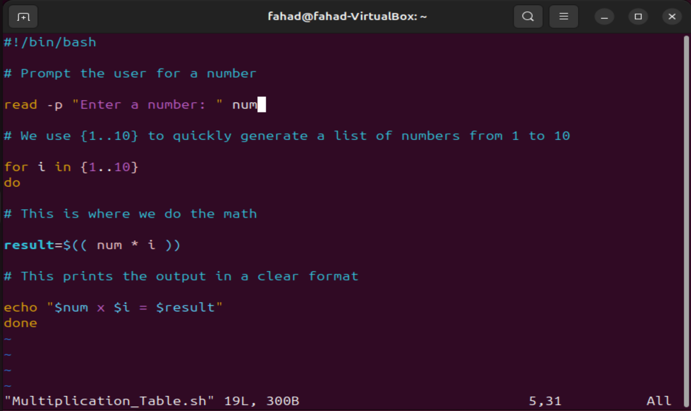
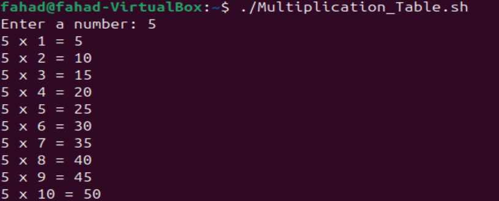
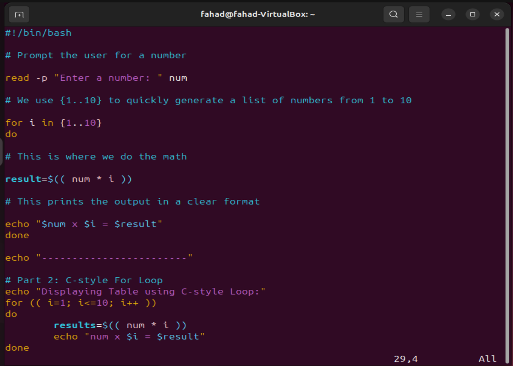
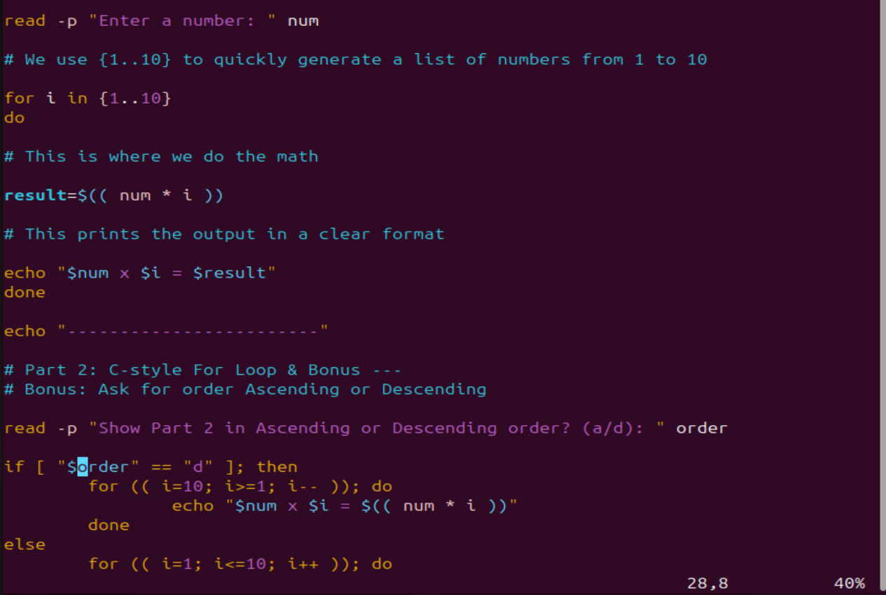
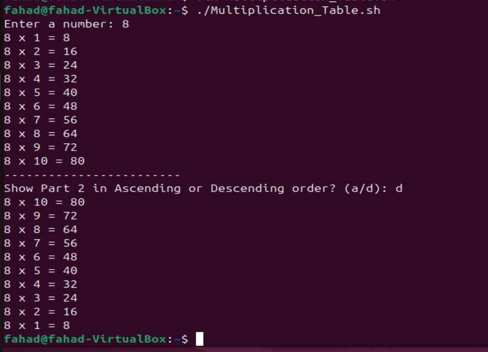

# 
 Capstone Project Linux Shell Scripting

 

### <u>Bash Script for Generating a Multiplication Table</u>

Objective: My objective for this project is to create a Bash script that generates a multiplication table for a number entered by the user. This project will help me practice using loops, handling user input, and applying conditional logic in Bash scripting.

 

### <u> Project Descriptin</u>
My script will be prompt the user to enter a number and then ask if they prefer to see a full multiplication table from 1 to 10 or a partial table within a specified range. Based on the user's choice, the script will display the corresponding multiplication table.

### <u>Project Requirements</u>
- User input for Number: The script will first ask the user to enter a number for which the multiplication table will then be generated.

- Choice of table Range: Next, i will ask the user if they want a full multiplication table (1 to 10) or a partial table. If they choose partial, it will prompt them for the start and end of the range.

- Use of Loops: Implement the logic to generate the multiplcation table using loops. I will use eitehr the list form or C-style for loop based on which one is appropriate.

- Conditional Logic: I will be using if-else statements to handle the logic based on the user's choices (full vs partial table and valid range input)

- Input Validation: I will Ensure that the user enters valid numbers for the multiplication table and the specified range. Feedback will be provided for invalid inputs and default to a full table if the range is incorrect.

- Radable Output: The multiplication table will be displayed in a clear and readable format, adhering to the user's choice of the range.

- Comments and Code Quality: My script will be well commented, explaining the purpose of different sections and any important variables or logic userd. I will ensure hte code is neatly formatted for easy readability.

Part 1: Using List Form For Loop Prompt the user: First, my script will ask the user to input a number. Using the 'read' command to capture this input into a variable.

Genereating the Multiplication Table: Using a list form for loop to iterate through the numbers 1 to 10. in each iteration, calculate the product of the user's number and iterator variable. then print the result in a clear format.

PArt 2: Using C-Style For Loop. Repeat the prompt: i don't need to ask the user again if i'm making this a single script. I will just proceed wit hthe C-style loop using the same variable.

- Commenting on my code to expain which part is using the list form and which part is using the C-Style.

- Bonus: ask the user if they want to see the table in ascending or descending order, and implement this feature using if-else statements combined with my choice of loop.

