# 
AWS Account Creation

### <u>Introduction</u>
This mini project is designed to walk me through the process of creating an Amazon Web Services (AWS) account. providing step by step guidance and insights into the intricacies of setting up your AWS ccount. Before delving into the specifics of account creation, it's important to emphasize the fundamental principles of cloud computing, which serve as the foundation for this project.

### <u>Project Goals and Learning Outcomes:</u>
- Understand the basics of AWS Cloud and it's importance for business and individuals.

- Successfully create an AWS account and navigate through the setup process.

- Learn how to access the AWS management console using newly created account credentials.

- Gain practical experience using AWS services effectively for future projects or business needs.

### <u>Setting Up My AWS Account </u>

1) First i will open and create an AWS account on the AWS Amazon website.

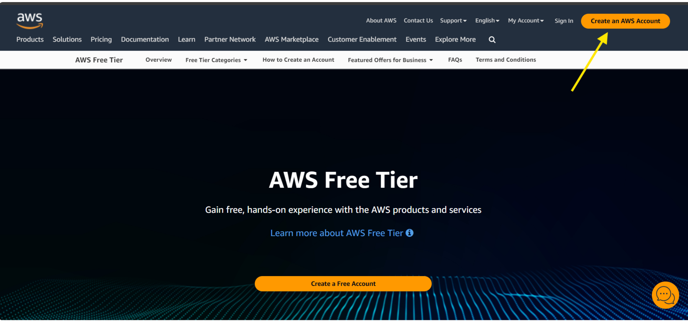

2) I will Enter valid required details such as an email address, password and AWS account name and then click "Verify email address"

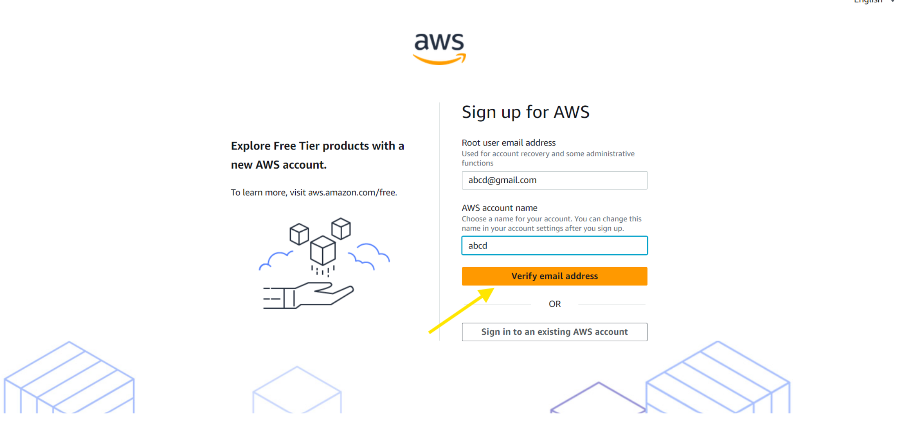

I will then receive a verification code to my email to verify my email address is truly mine.

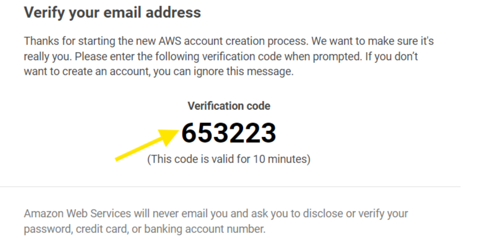

Next i will paste the verification code in the prompt box on the AWS Amazon website.

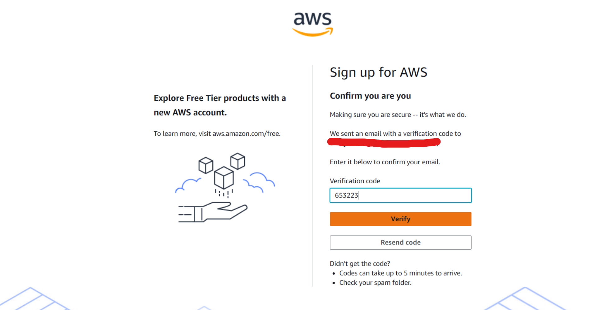

Once my email address have been successfully verified the next step is to set up a Root user password.

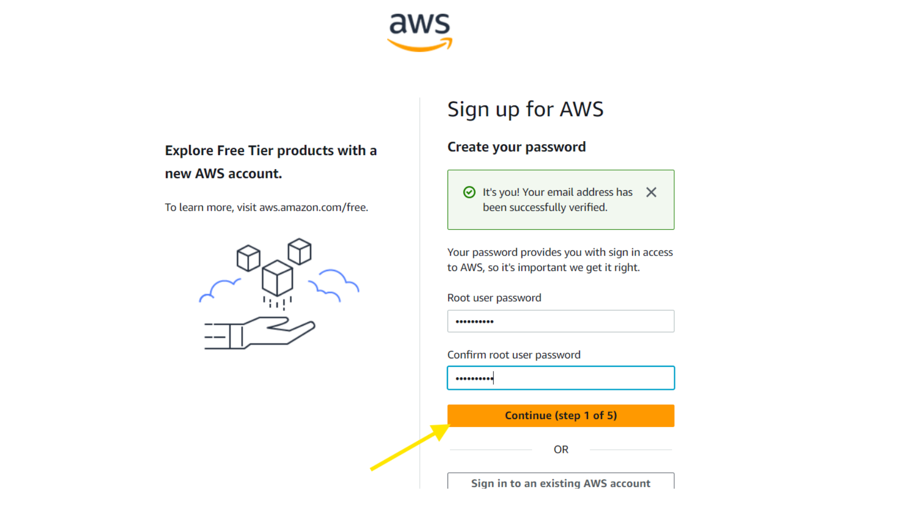

Next i'll be prompted for payment information, although i have chosen AWS Free Tier, payment is still required in the event i go over the free free tier credit of $100 or the free tier expires, which is usually in 6 months time.

After verification of payment method a one time password (OTP) will be sent to the respective phone number for verification purposes.

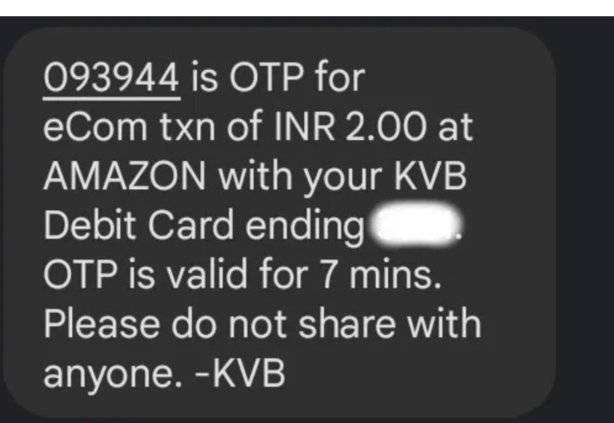

Once my identity has been verified i will then sign up for my plan, in this case will be the "Basic Free" plan. The reason for me selecting this plan is due to the primary "bonus" being the ability to build and test real world applications (like hosting a website or running a database) without an upfront financial commitment.

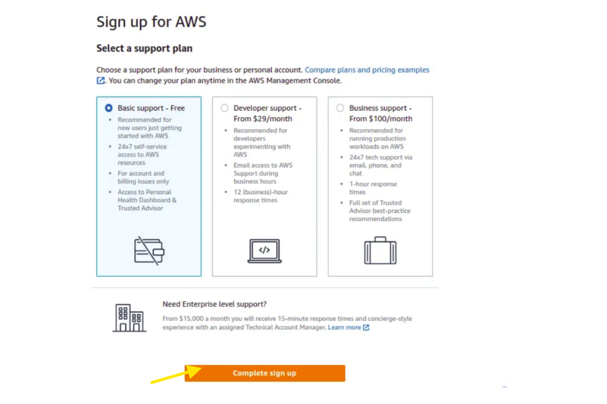

Once i've completed my sign up i will be greeted by the following message

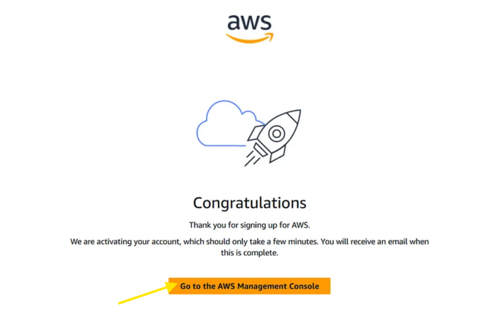

next i will be navigating to the "AWS Management Console"

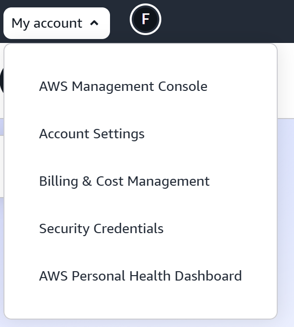

Here i will be prompted to sign in where i will use the "Sign in using root user email" option

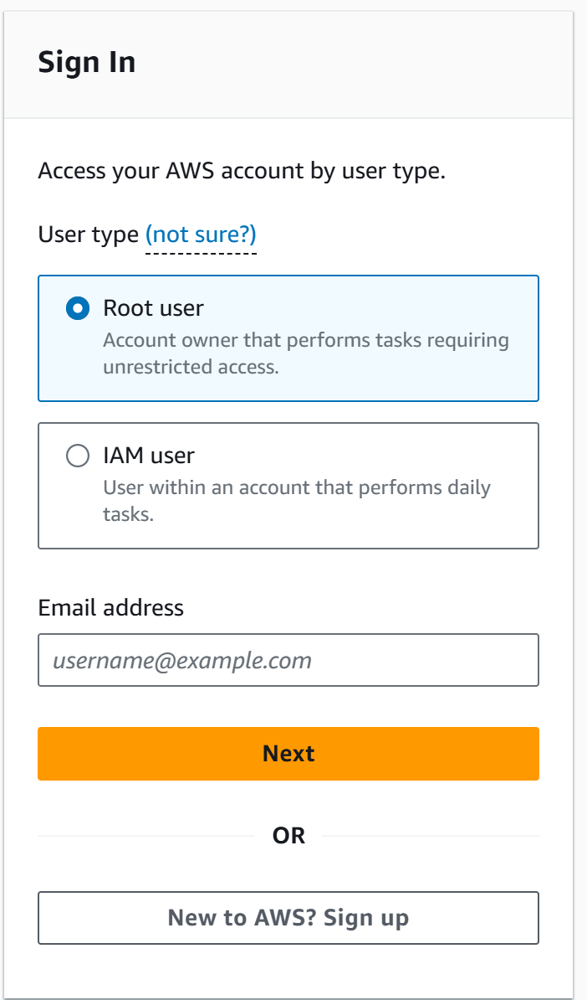

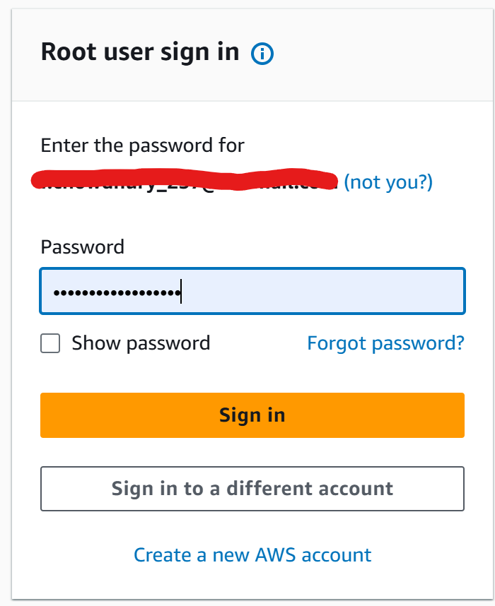

Once i've successfully signed in i'll be greeted by the Console Home.

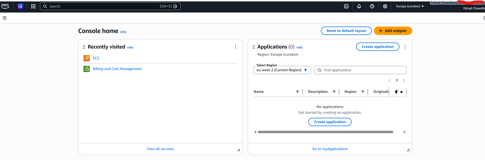

That's it, this is what it entails to create an AWS Account through Amazon Web Services.

