# 
AWS Identity and Access Management

### <u>Introduction</u>
In this project i will be learning about AWS Identity and Access Management (IAM), which helps to control who can access what in Amazon Web Services (AWS). I'll be covering things such as users, roles, policies and groups. I'll also be documenting how to actually set them up and to keep my AWS resources safe.

#### <b>Project Goals:</b>

- Understand AWS Identity and Access Management (IAM) principles and components.

- Learn to create and manage IAM policies for regulating access to AWS resources securely.

- Apply IAM concepts practically to control access within AWS environments.

- Explore best practices for IAM implementation and security in IAM.

#### <u>What is IAM?</u>
IAM is a security framework of policies and technologies that ensures the right individuals have the appropriate access to technology resources. It acts as a digital gatekeeper by authenticating a user's identity and authorizing their specific level of permission within a system.

#### <u>What is IAM User?</u>
An IAM user is a unique identity within an AWS account that represents a person or service, granting them specific permissions to access and interact with AWS resources under controlled and customsable security policies.

#### <u>What is IAM Policy?</u>
An IAM policy is a formal document that defines the specific permissions or restrictions applied to a user, group, or role. It acts as a set of rules that tells the system exactly which actions are allowed or denied for a particular resource.

#### <u>What is IAM Role?</u>
An IAM role is an identity with specific permissions that is intended to be assumed by anyone or anything that needs it for a temporary period. Unlike a user, a role does not have long-term passwords or access keys; instead, it provides temporary security credentials for a specific task.

#### <u>What is IAM Group?</u>
An IAM group is a collection of IAM users who share common permission requirements. Instead of assigning policies to individuals one by one, you can attach a policy to a group so that all members automatically inherit those access rights.

#### <u>Two Part Project</u>
This project will be split into two parts, the scenario given is a growth marketing consultancy company called "gatoGrowFast.com" wants to give some access to their employee "Eric, Jack and Ade" to the AWS resources.

- First Part: In the first part of the practical, i will create a policy granting full access to EC2. Then, i will create a user named Eric and attach that policy to him.

- Second Part: In the second part, i will create a group and add two more users, "Jack and Ade" to that group. Afterwards, i will create a policy for granting full access to EC2 and S3, and attach it to the group.

### <u>Part 1</u>

First i will navigate to the AWS IAM console using the search bar to locate the IAM service.

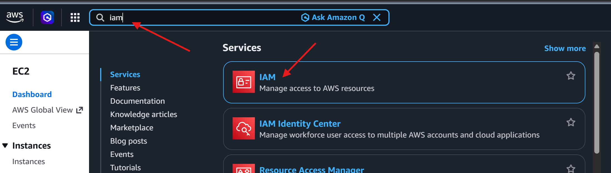

 

Now that i am on the IAM dashboard, i will navigate to the left sidebar and click on "policies". From herei will search for "EC2" and select "AmazonEC2FullAccess" from the list of policies, and will then proceed by clicking on "Create Policy" to initiate the polcy creation process.

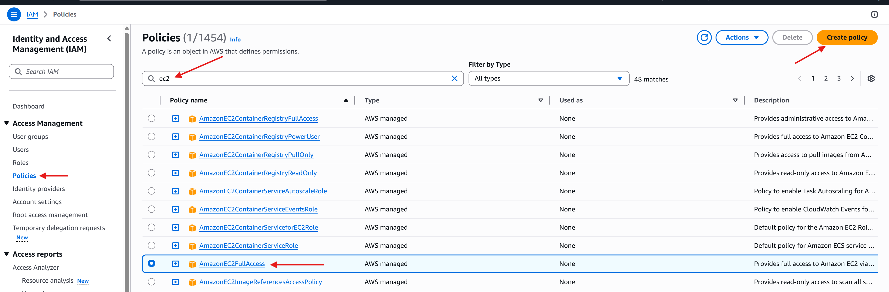

 

This will now take me into the "Specify Permissions" section where i will select the EC2 service and also click the "All EC2 Actions" option.

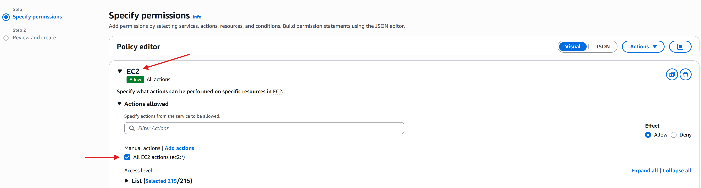

 

I will then specify "All" resources and go onto the next section.

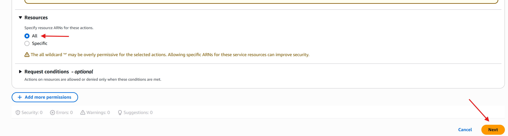

 

Now it's time to provide the policy details, such as the name and a description for the policy to finalise the creation. In this instance, i will name the policy "Eric" and provide a short description of what this policy is for.

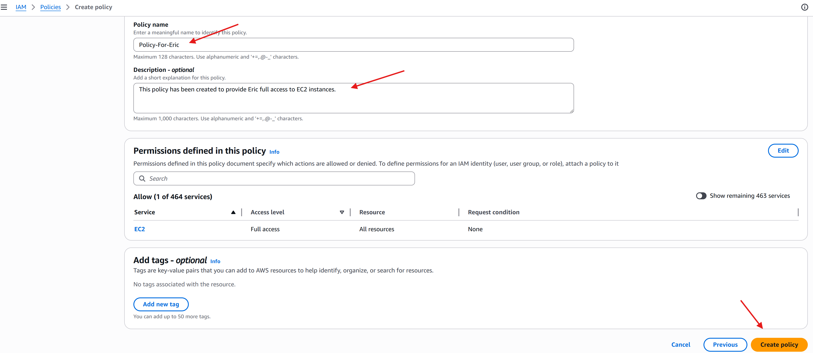

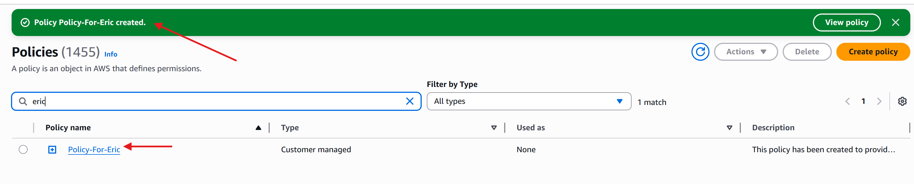

 

Now that i have created the policy for Eric, i will now navigate to the users section and select the option to "Create User"

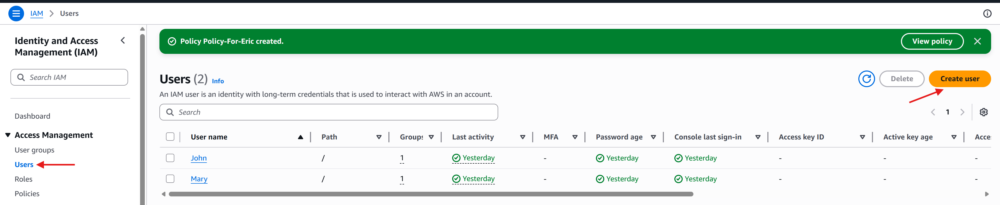

 

Here i will Enter the desired username for Eric, then i will select the option to "Provide user access to the AWS Management Console" where Eric will be granted access to the web based console interface.

I will proceed to setup a password for Eric, in this case i will be going for a custom password instead of an autogenerated password, and i will also be checking the "User must create a new password at next sign-in" So Eric can set the password to his choice.

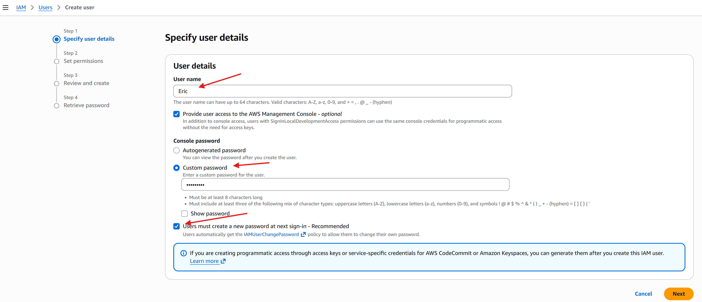

 

Once that is done, i will navigate to the next section where i will select the "Attach policy directly" option and navigate to the "Filter customer managed policies" so that i can assign the Policy for Eric that i created earlier in the project.

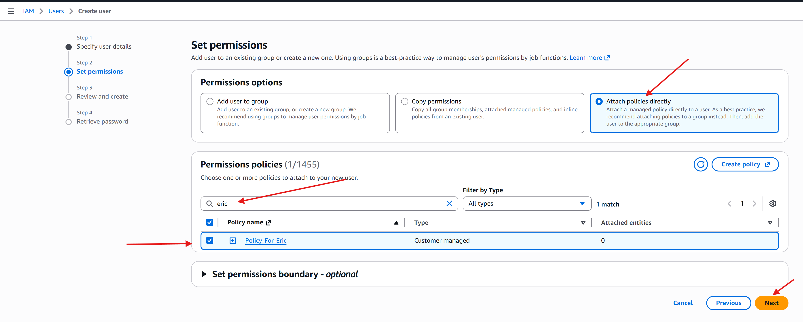

 

Once i've attached the policy and moved onto the next section it's finally time to review and create the user for Eric.

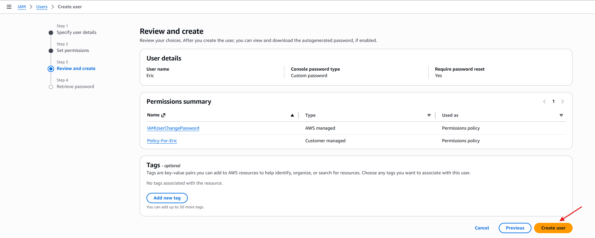

Now that the user is created successfully i have to ensure to save these details securely for future reference, in this case i went ahead and downloaded the .csv file and then returned to the users list.

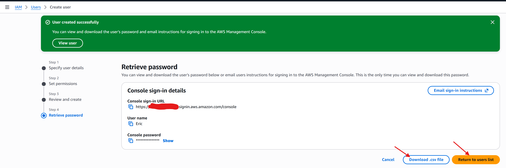

 

### <u>Part 2</u>

Now i will proceed to the second part of the project in which i will move onto the "User Groups" section and create a new user group.

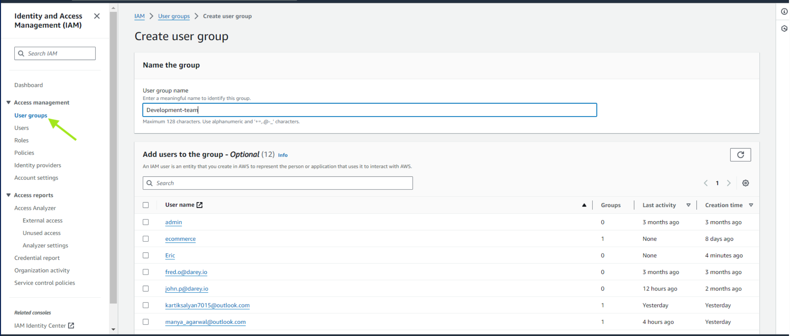

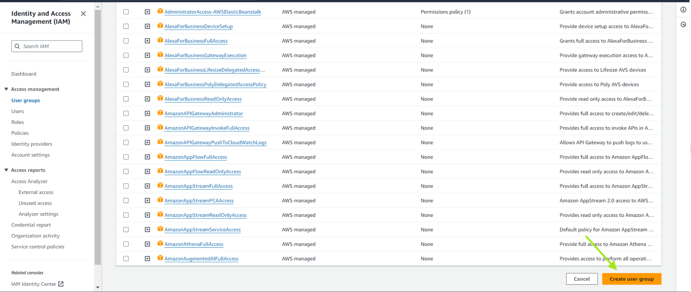

Once i've successfully created the user group, i will now be moving onto the "Users" section once more.

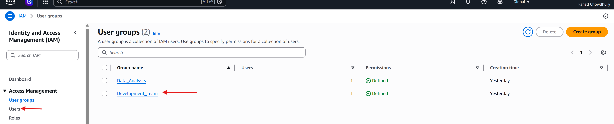

 

Now i will create a user named "Jack".

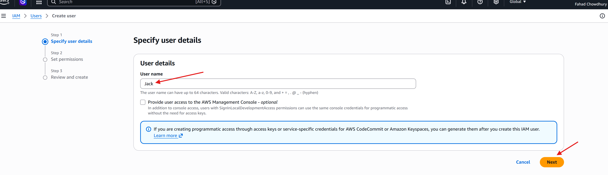

 

In the permissions options below, i will select "Add user to group". Then in the "User groups" section, i will choose the group i created earlier named "Developement_Team" and proceed to the next section.

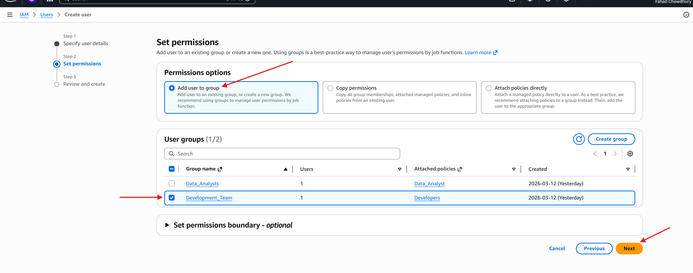

 

Once i have reviewed the details and permissions i will finalise the user creation.

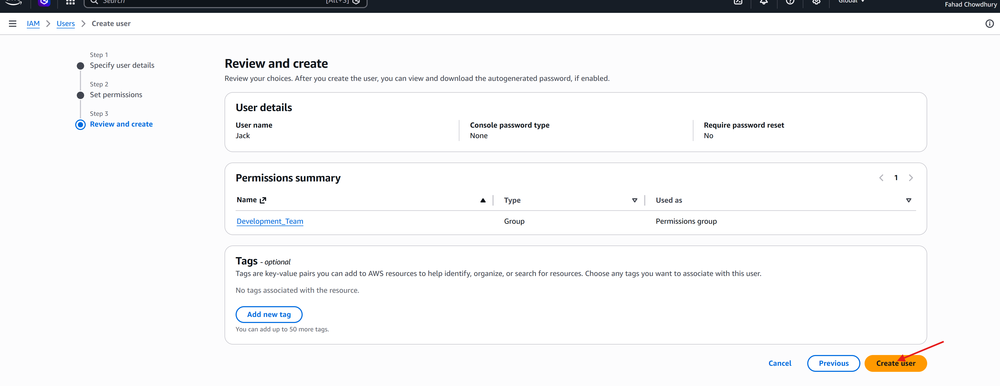

 

I will also repeat the same process for the User Ade, where i will add him to the user group "Developmental_Team".

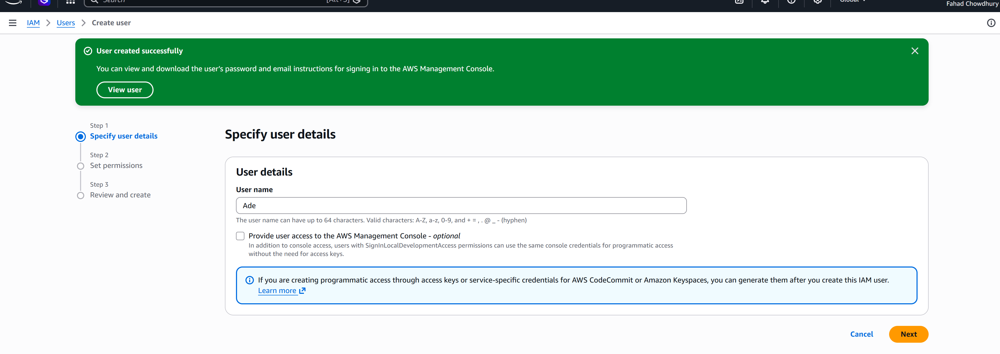

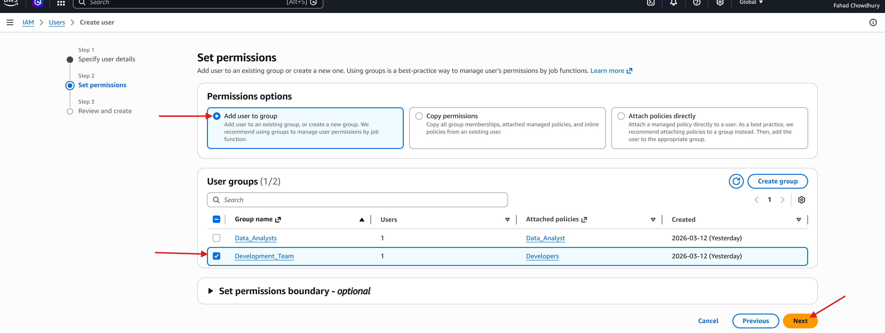

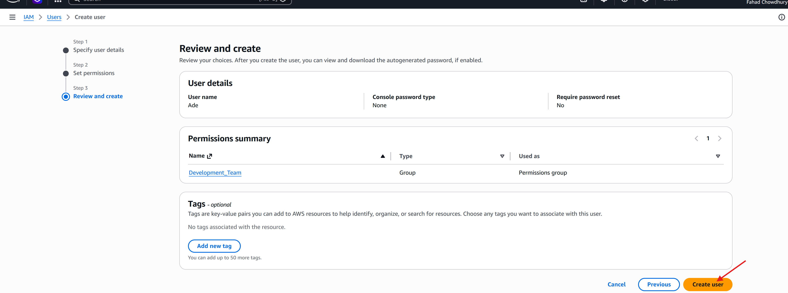

 

Once Jack and Ade have been successfully created as users, it's now time for me to navigate back to the policies section and create a policy for them.

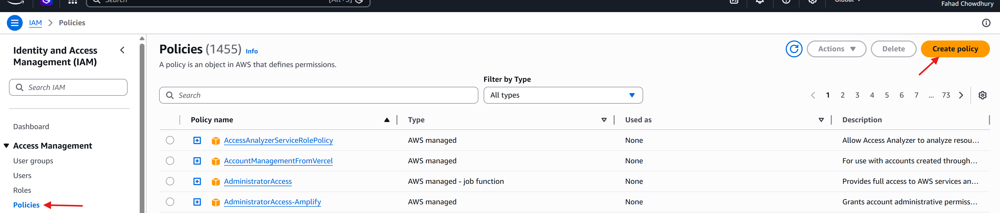

For Jack and Ade i will be granting them both Full AWS EC2 and S3 bucket access.

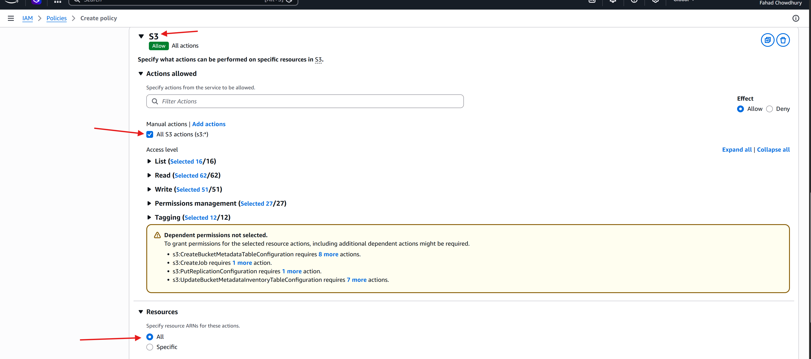

 

Once that's done i will now review the policy, create a name and a short description for the policy so i know in the future what the policy does and finalise the creation.

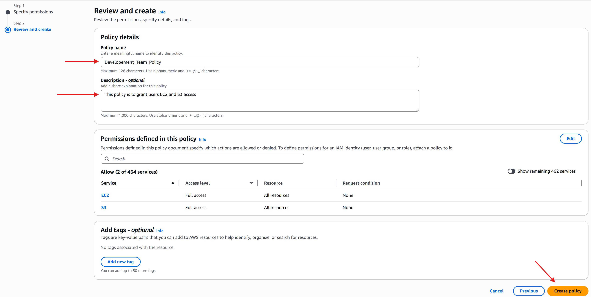

 

Now i will navigate to the "Users group" section and select the "Development_Team" group again.

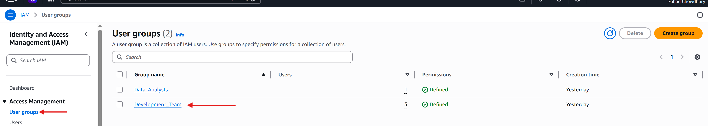

 

Once there, i will click the development team to enter the interface for the usergroup and navigate to the "Permissions section" to add the necessary permissions.

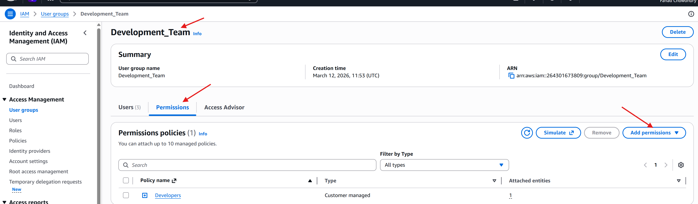

Once i click on "Add permissions" i will select the "attach policies" option.

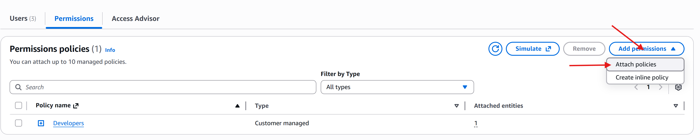

At the next interface i will select "customer Managed Policy" to filter out all the policies and only show policies created by myself. I will then choose the "development_Team_Policy" the i created and click "Attach Policy"

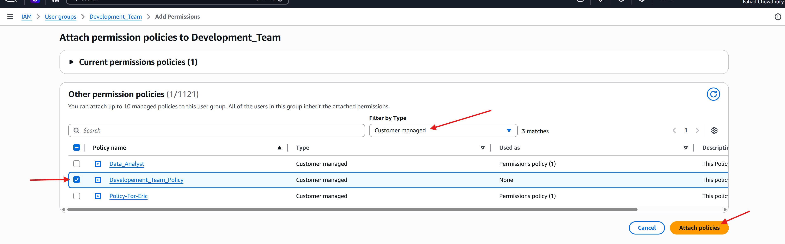

 

The Polcy is now attached to the group, granting full permissions to EC2 and S3 for the groups users.

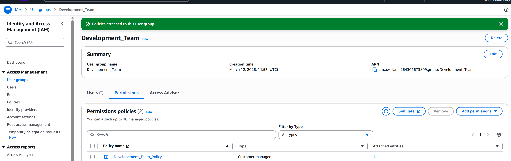

