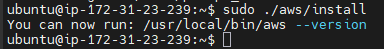
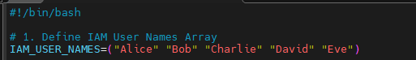
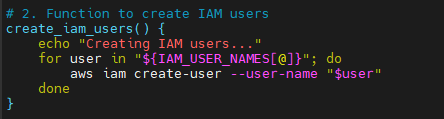
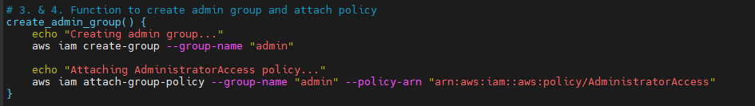
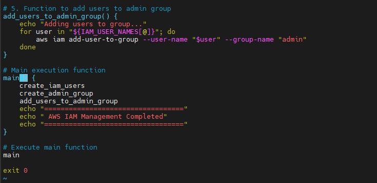
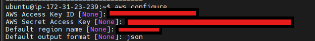
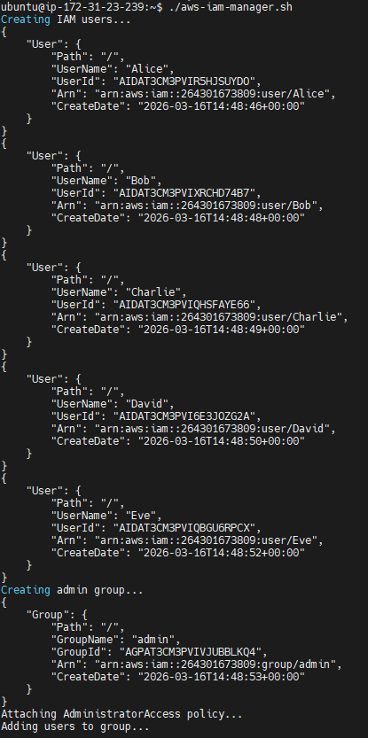

# 
Shell Script for AWS IAM Management

### <u>Project Scenario</u>
CloudOps Solutions is a growing company that recently adopted AWS to manage its cloud infrastructure. As the company scales, they have decided to automate the process of managing AWS identity and Access Management (IAM) resources. This includes the creation of users, user groups, and the assignment of permissions for new hires, especially for their DevOps team.

### <u>Purpose</u> 
I will be extending my shell scripting capabilities by creating more functions inside the "aws-iam-manager.sh" script to fulfill the objectives below. I will ensure that i have already configured AWS CLI in my terminal and the configured AWS account have the appropriate permissions to manage the IAM resources.

### <u>Objectives:</u>
I will extend the provided script below to include IAM management by:
1) Defining IAM User Names Array to store the names of the five IAM users in an array for easy iteration during user creation.

 

2) Create the IAM users as i iterate through the array using AWS CLI commands.

 

3) Define and call a function to create an IAM group named "admin" using the AWS CLI commands.

 

4) Attach an AWS-managed administritative police e.g., "AdministratorAccess" to the "admin" group to grant administrative privileges. 5 iterate through the array of IAM user names and assign each user to the "admin" group using AWS CLI commands.

 

#### <b>Provided Script</b>

#!/bin/bash

(#) AWS IAM Manager Script for CloudOps Solutions
(#) This script automates the creation of IAM users, groups, and permissions

(#) Define IAM User Names Array
IAM_USER_NAMES=()

(#) Function to create IAM users
create_iam_users() {"\n    echo \"Starting IAM user creation process...\"\n    echo \"-------------------------------------\"\n    \n    echo \"---Write the loop to create the IAM users here---\"\n    \n    echo \"------------------------------------\"\n    echo \"IAM user creation process completed.\"\n    echo \"\"\n"}

(#) Function to create admin group and attach policy
create_admin_group() {"\n    echo \"Creating admin group and attaching policy...\"\n    echo \"--------------------------------------------\"\n    \n    # Check if group already exists\n    aws iam get-group --group-name \"admin\" >/dev/null 2>&1\n    echo \"---Write this part to create the admin group---\"\n    \n    # Attach AdministratorAccess policy\n    echo \"Attaching AdministratorAccess policy...\"\n    echo \"---Write the AWS CLI command to attach the policy here---\"\n        \n    if [ $? -eq 0 ]; then\n        echo \"Success: AdministratorAccess policy attached\"\n    else\n        echo \"Error: Failed to attach AdministratorAccess policy\"\n    fi\n    \n    echo \"----------------------------------\"\n    echo \"\"\n"}

(#) Function to add users to admin group
add_users_to_admin_group() {"\n    echo \"Adding users to admin group...\"\n    echo \"------------------------------\"\n    \n    echo \"---Write the loop to handle users addition to the admin group here---\"\n    \n    echo \"----------------------------------------\"\n    echo \"User group assignment process completed.\"\n    echo \"\"\n"}

(#) Main execution function
main() {"\n    echo \"==================================\"\n    echo \" AWS IAM Management Script\"\n    echo \"==================================\"\n    echo \"\"\n    \n    # Verify AWS CLI is installed and configured\n    if ! command -v aws &> /dev/null; then\n        echo \"Error: AWS CLI is not installed. Please install and configure it first.\"\n        exit 1\n    fi\n    \n    # Execute the functions\n    create_iam_users\n    create_admin_group\n    add_users_to_admin_group\n    \n    echo \"==================================\"\n    echo \" AWS IAM Management Completed\"\n    echo \"==================================\"\n"}

(#) Execute main function
main

exit 0

My first step is to install AWS CLI so that the AWS commands can work in my script.

Now that i have AWS CLI installed, i can now start working on my code.

1) I will now Define the IAM User Names Array to store the names of my five IAM users in an array for easy iteration during user creation.

2) Next i will create the IAM Users as i iterate through the array using AWS CLI commands.

3. and 4. Now i will define and call a function to create an IAM group named "admin" using the AWS CLI commands. I will also Attach an AWS-managed administrative policy such as "AdministratorAccess" to the "admin" group to grant administrativ priveleges.

5) Finally i will iterate through the array of IAM user names and assign each user to the "admin" group using AWS CLI commands.

Now i will need to configure AWS to be able to run commands and create roles on my AWS account.

Now that i've successfully configured AWS, i can now run my script and allow it to talk to AWS to get the IAM users created.

