# 
AWS S3 - Mini Project

### Introduction

During this session, i will be exploring Amazon S3 (Simple Storage Service), a vital component of AWS for storing and accessing data. I'll cover key concepts like buckets, versionining and persmissions, along with practical demonstrations on effectively managing my S3 resources.

### <u> Project Goals </u>
First i will create a new bucket in Amazon S3 to store my files. Following that, i will upload a file into this newly created bucket. Subsequently, i will enable versioning for the bucket, allowing me to retain multiple versions of my uploaded files for tracking changes over time. Next i will configure the permissions for the bucket to enable public access, ensuring that the files can be acessed by anyone with the appropriate link. Finally, i will implement a lifecycle policy to automate the management of my files.

1) first, i will navigate to the search bar on the AWS console and search for "S3"

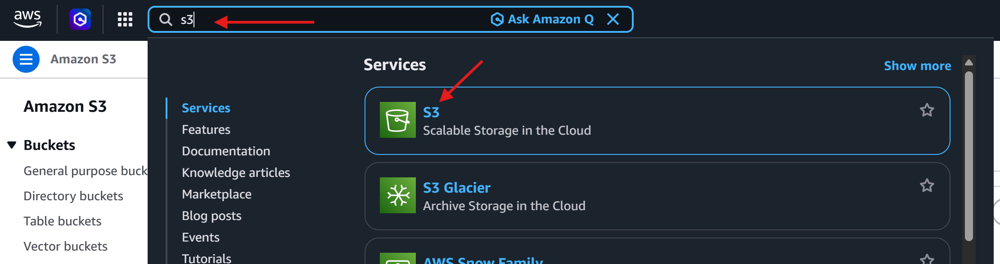

 

2) After clicking on S3 in teh search results, i will be redirected to the S3 page, from there, i will locate and click on the "Create bucket" button.

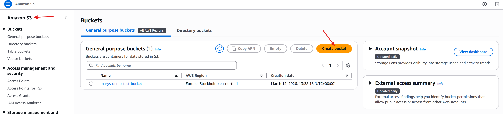

 

3) I will then proceed with creating a new bucket. I will also provide a unique name for thebucket, ensuring it's distinct from any existing bucket names. For the configuration i will be selecting the below:

- I will be disabling ACL (Access Control List) for object ownership.

- i will ensure to check the "block all public access" option.

- For the time being i will leave bucket versioning disabled.

- i will proceed with the default settings

- once the above configs are actioned i will click the "create the bucket" button to finalise the creation process.

 

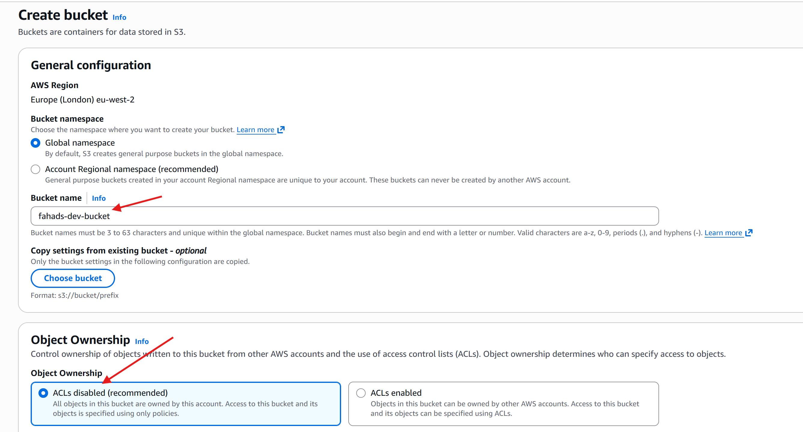

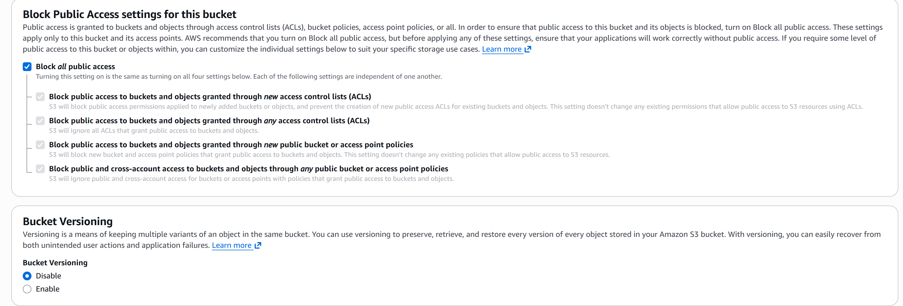

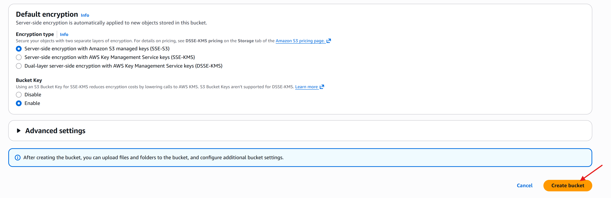

 

Now that my bucket has been created you can see below there are currently no objects sitting in my S3 bucket.

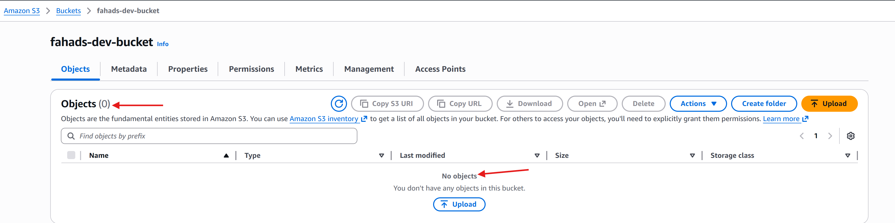

 

Now i'll move onto the next phase of my project where i wil upload an object into the bucket named 'fahads-dev-bucket'

1) Firstly i will create a file on my device with some data. I'll write 'Welcome to the AWS world' and save that file.

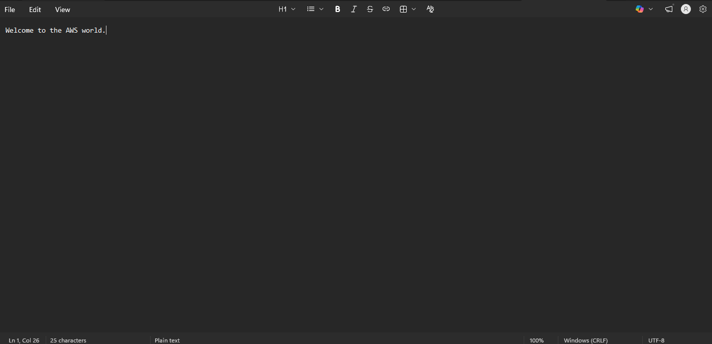

 

2) Next, i will click the "upload" button inside my bucket to upload my very first object that i have just created.

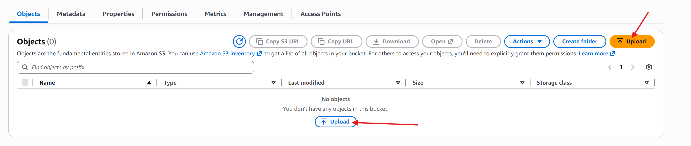

 

3) Once i'm in the upload interface, i will click on "Add file" and select the file i have just created and open it. Once the file is opened it will be visible under "Files and Folders" after which i can now press "Upload" to finalise uploading the object into my bucket.

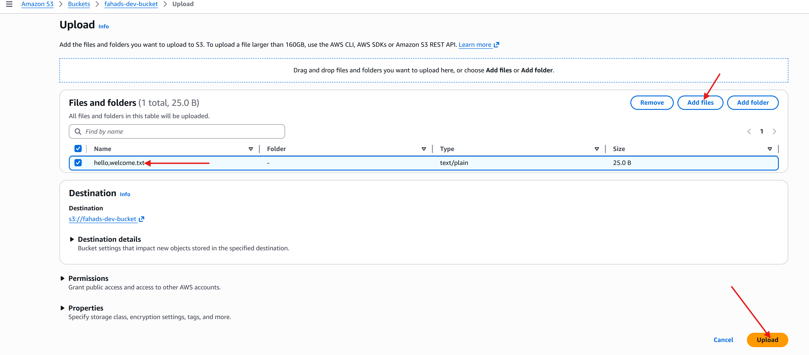

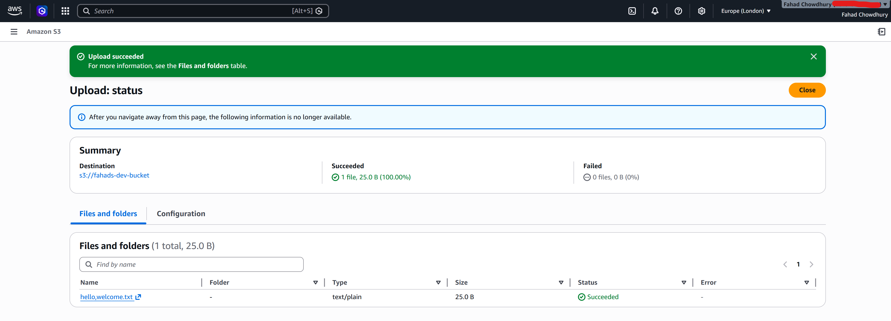

 

Now that i've successfully uploaded my first object to my S3 bucket, the next phase of my project leads me to enabling versioning.

1) In the buckets properties section on the right side, you can see that bucket versioning is currently disabled.

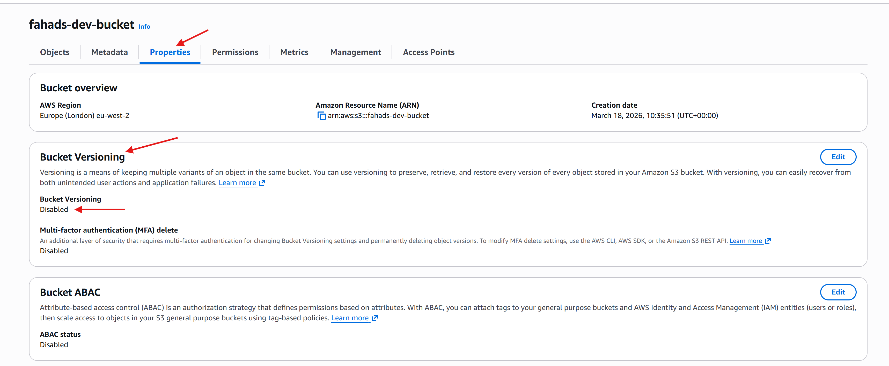

 

I will now enable it.

2) By clicking on "Edit" and selecting "Enable" and then saving my changes.

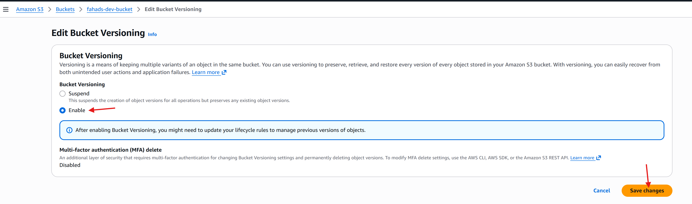

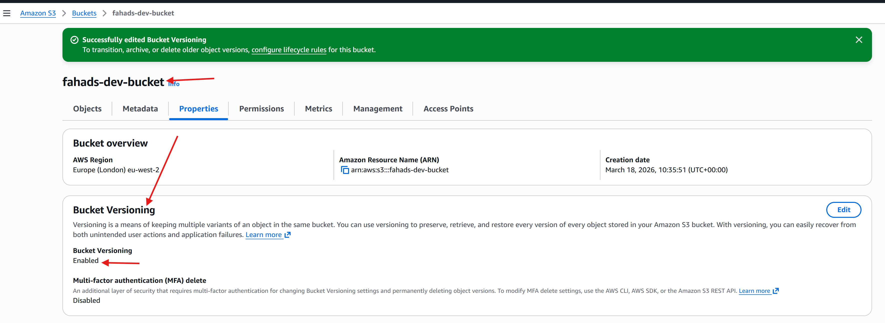

 

3) Now if i modify the contents of the file and upload it again, i will create a new version of the file. 

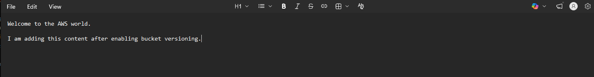

Now that i have modified the object and saved it, i will navigate to the AWS console and click on "show versions" in my S3 bucket where i will be able to see all of the versions of the file i've uploaded.

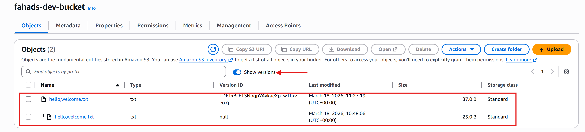

As you can see above there are now two versions. Whenever i make changes to the file and upload it again onto the same bucket, it will continue creating versions of that file for future reference.

  

Now if i wanted to view the content of both versions, this will lead me onto the next phase of my project which involves setting permissions.

1) In the permissions section of my bucket below, you will notice that "Block all public access" is enabled. I will be changing this by going into the "edit" settings.

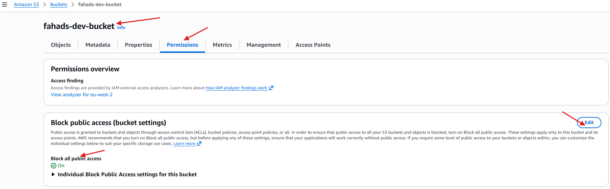

 

2) In this interface i will be unchecking the "Block all public access" box to allow public access and then save my changes.

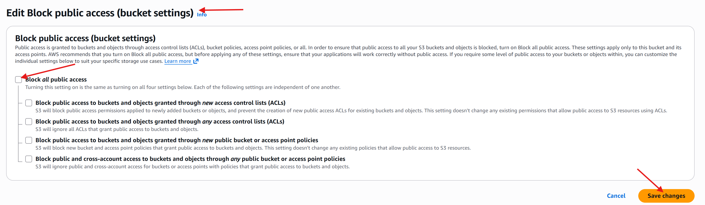

This will then prompt me to confirm the settings by typing the word "confirm" and clicking the "confirm" button to finalise my change.

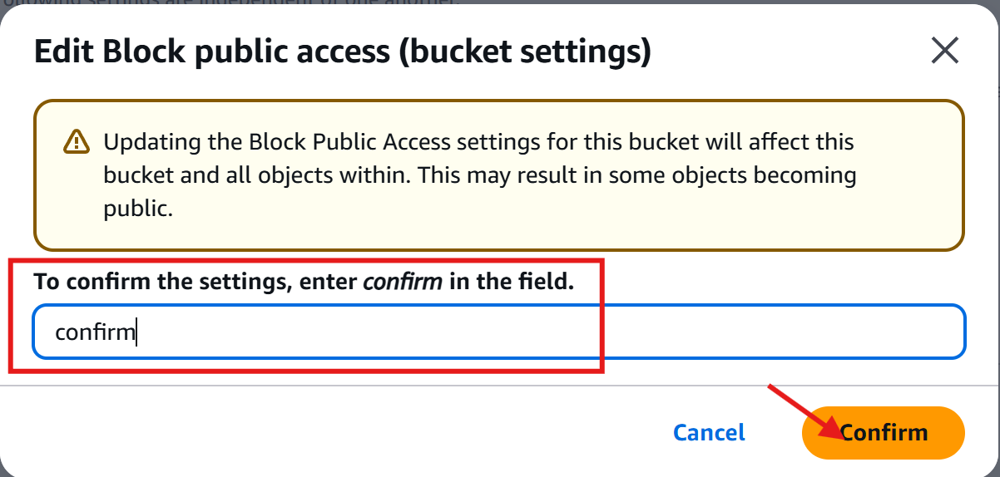

By taking this action, i am allowing my file to be publicly accessible. This confirmation step ensures that i am aware of the implications of making my file public.

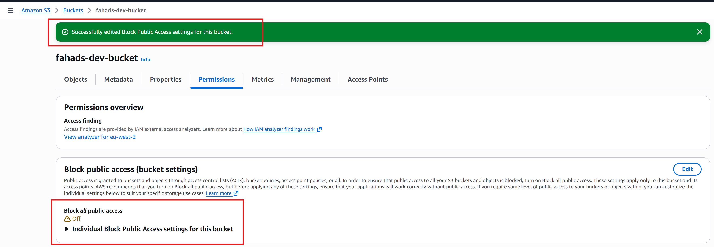

 

3) Now i will need to create a bucket policy to specify the actions i want the public to be able to perform on my file. I will again be navigating to the "Edit" option under permissions and bucket policy.

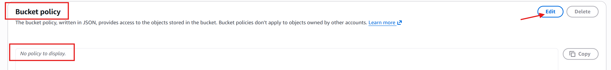

 

4) Now i will click on the "Add Statement" and fill out a 

- "Statement" this is just for myself to let me know what the purpose of this statement is for, in this case "Public Access". 

- The next option is "Principal" this is the 'Who', since i want this to be public i will be inputting "*". 

- After that i will fill out the "Actions" this is the 'What', this is where i will select "S3" as a service and "GetObject", this will allow people to see/download my files.

- Resources: This is the "Where" in this instance would be my bucket ARN.

Once all the information above has been input i will hit save and the visual editor will automatically write the JSON looking code into the main window for me.

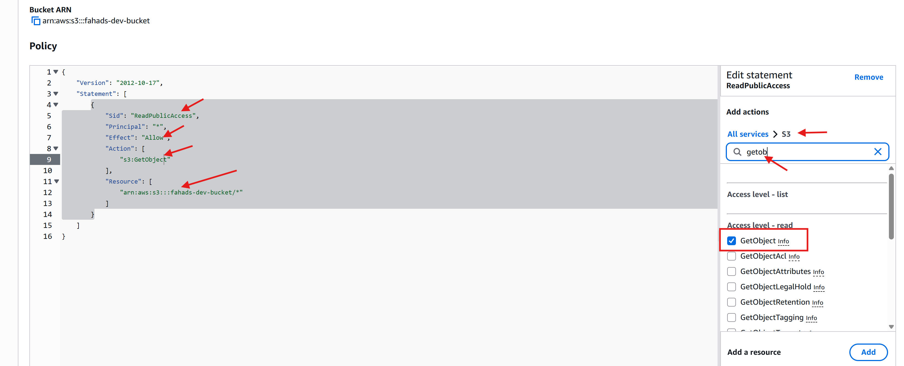

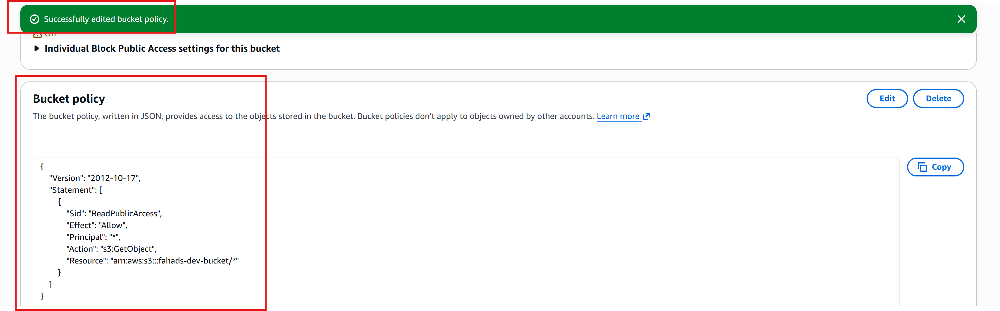

 

5) Now i will navigate to a version of my uploaded file within my bucket.

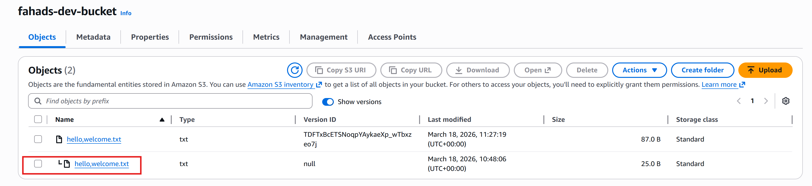

 

6) You will notice there is an "Object URL" i will be navigating into that URL.

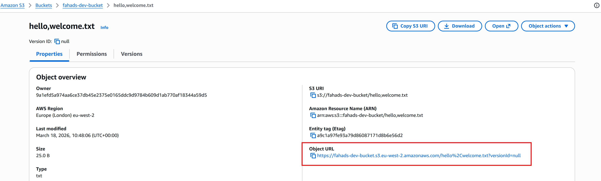

As you can see below, i have navigated to the URL and i am able to see the previous data within my browser.

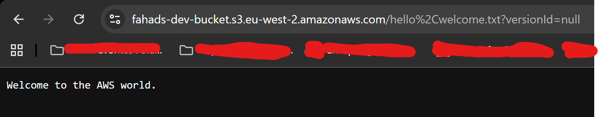

Now if i were to do the same with the latest version of the file and click the object URL for that one also you will see below i can see the latest data for that object.

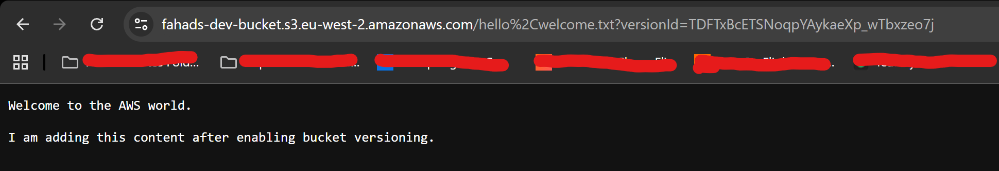

Now i will proceed to the final phase of my project which involves creating lifecycle policies.

1) For this, i will navigate to the management section of my S3 bucket and click on the "Create lifecycle rule" button.

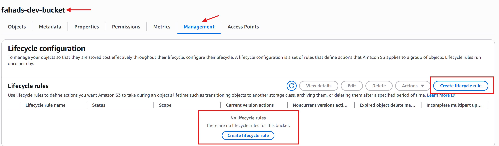

 

2) I will now provide specifications, and create the rule.

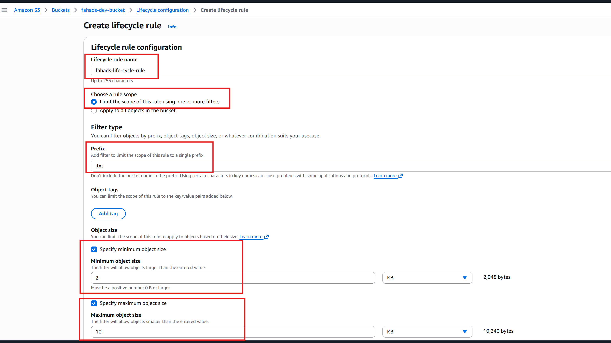

 

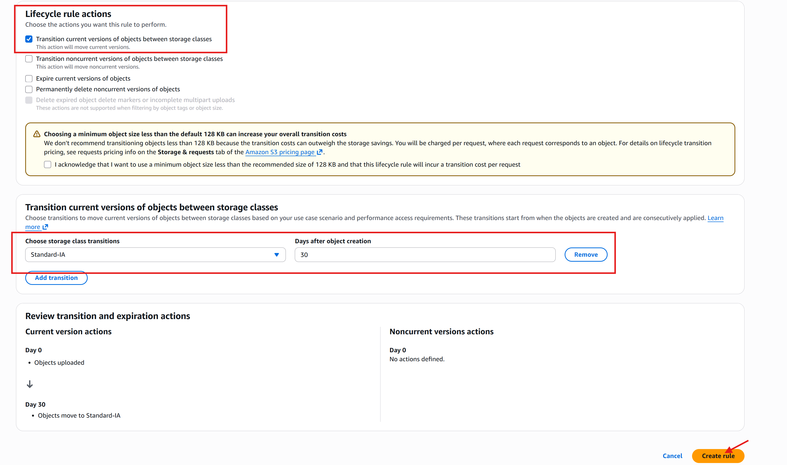

 

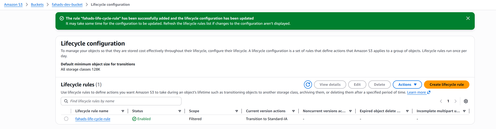

Now that i've successfully created my life cycle rule, this rule will automatically set up to move my files from one type of storage to another within my S3 bucket. Specifically it moves files to a storage type called "Standard-IA" after they've been sitting in my S3 bucket for 30 days without being accessed. 

The purpose of this is to save money because storage for Standard-IA is cheaper than the default storage option. So if i have files that i don't access very often, but still want to keep, this rule helps me save costs by storing them in a cheaper storage class after a certain period of time.