# 
AWS VPC - Virtual Private Cloud 

 

### <u>Introduction</u>
In this project i will be exploring the core concepts of AWS, focusing specifically on Virtual Private Clouds (VPCs). My objective is to understand the fundamental components of VPC infrastructure, including subnets, gateways, and routing tables. Through practical demonstrations and interactive exercises, i'll navigate the AWS management console to deploy and manage these critical components effectively.

 

#### What is VPC, Subnets, internet Gateway and NAT Gateway?

- VPC (Virtual Private Cloud): Is a private, isolated section of a cloud network where you can launch resources in a virtual environment that is defined by you. A simple way to look at it is the VPC is your Private Estate. Inside this wall, you define all the rules. You decide who can enter and where the buildings go and how the internal roads are laid out. Nothing from the outside world can see inside unless you build a specific entrance.

- Subnet: This is a range of IP addresses within your VPC that allows you to group resources based on security and operational needs e.g. public vs private. Sticking with my earlier Estate analogy subnets are divided into zones inside my walls, a public subnet is like my front lobby and is designed for guests whereas my private subnet is like the back office, it has no windows and is tucked away where only authorised staff can go.

- Internet Gateway: This is a horizontally scaled, redundant and highly available VPC component that allow communication between the VPC and the internet. In simpler terms, the Internet Gateway is the Main Entrance Gate at the edge of your property. It’s a two way door. If a visitor has an invitation (route), they can drive through the gate to reach the Lobby (Public Subnet). Likewise, people in the Lobby can drive out of this gate to go to the city (the Internet).

- NAT Gateway: This is a Network Address Translation service that enables resources in a private subnet to connect to the internet while preventing the internet from initiating a connection with those resources. A non technical way to explain this would be like myself sending a letter with no return address from the source and it's sent to the post office who then deliver that letter to you, the only thing you know is that this the return address is the post office and this letter came from there.

 

I will now be conducting the practical part of my project, the below are steps i plan to carry out in my project below and document all my steps and procedures carried out.

1) Setting up a VPC

2) Configuring Subnets within the VPC

3) Creating Internet Gateway and attaching it to VPC

4) Enabling Internet Connectivity with the Internet Gateway by setting up Routing tables.

5) Enabling Outbound Internet Access through NAT Gateway

6) Establishing VPC Peering Connections.

 

Right, now that i've stated my steps this will bring me to my first step which involves setting up a Virtual Private Cloud (VPC)

### Part 1

1) I'll be navigating to the search bar on my AWS console management and typing "VPC" in the search bar. Upon locating the relevant result, i will then proceed to navigate into the result which should direct me to the VPC page.

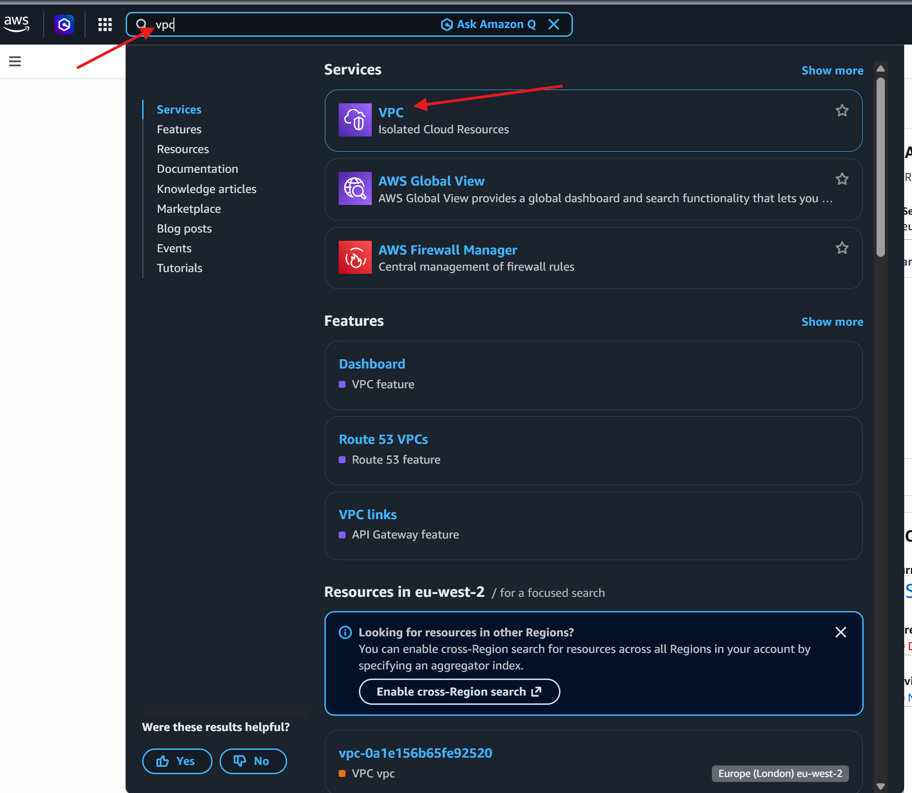

 

2) Once i'm on the VPC page, i will then navigate to the "Create VPC" option and select it.

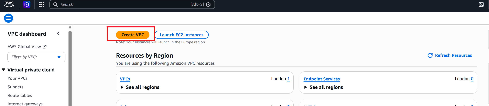

 

3) Once i am in the VPC creation interface, i will select "VPC Only" option in the VPC settings and specify the IPv4 CIDR block, and proceed by clicking on the "Create VPC" button.

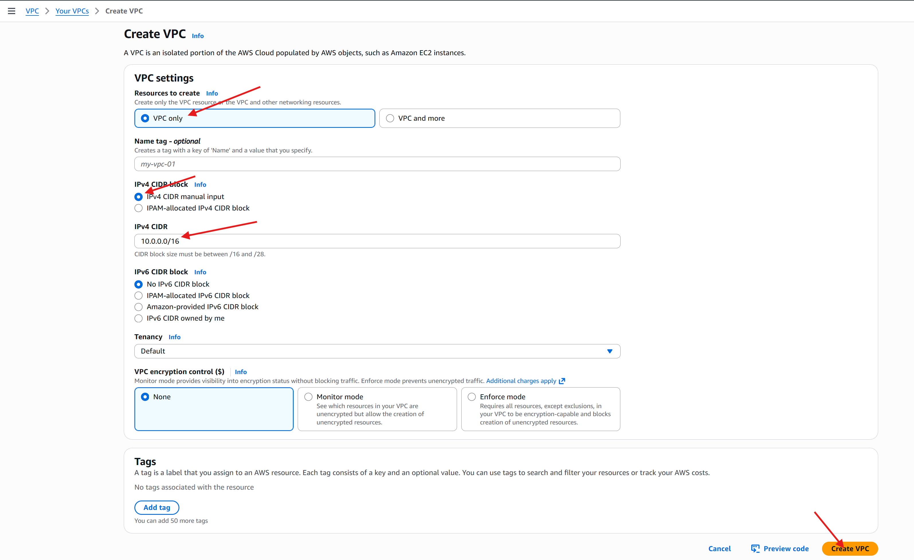

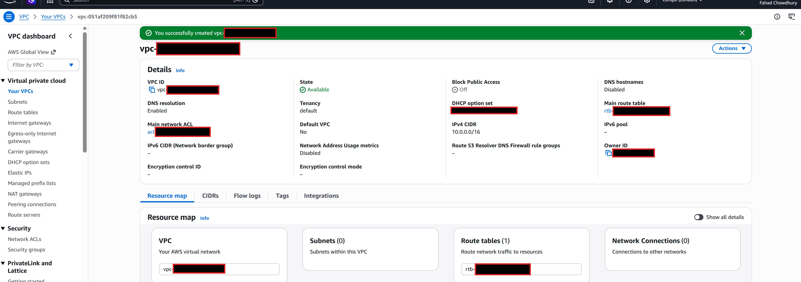

 

### Part 2

1) Now that my VPC has been successfully created i will now navigate to the "Subnets" option which is located on the left sidebar. Once i've navigated to the "Subnets" page from there i will proceed to click on the "Create subnet" button.

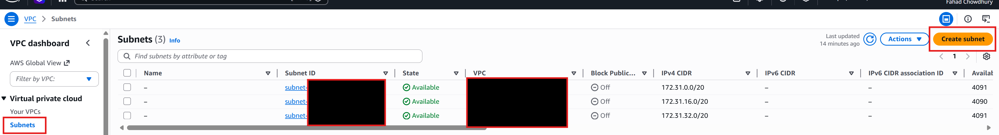

 

2) Once on the "Create Subnet" interface i will be selecting the Id of the VPC that i created previously.

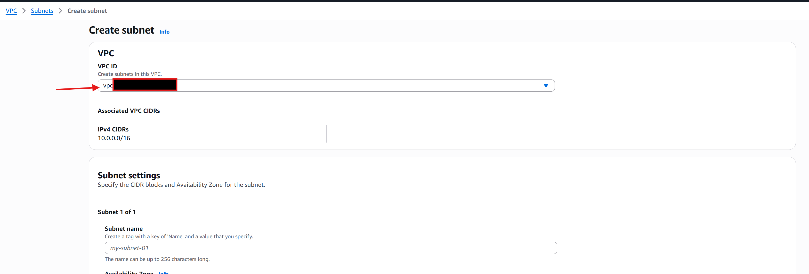

 

3) Now, i will enter the subnet name and specify the IPv4 CIDR for the subnet, as well as choosing the availability zone, and creating another subnet by clicking on the "Add subnet" button.

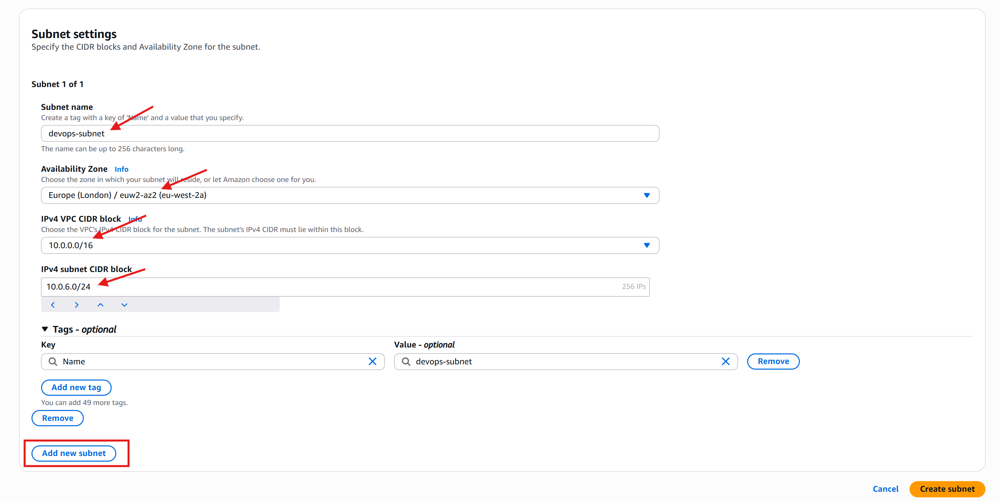

 

Once my public subnet settings are inserted i will then repeat the same steps as above for my private subnet, ensuring to specify the subnet name, availability zone and providing the IPv4 CIDR. Once that is done for the Subnet 2 i will proceed to finalise the subnet settings by clicking the "Create" button to create the subnet.

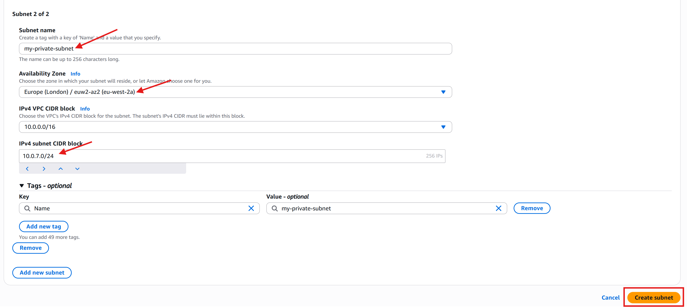

 

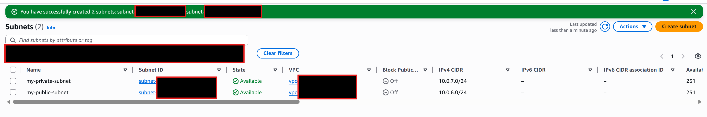

With the creation of the subnets, the second part of the project is now completed. I will now preceed to the third part, which involves creating an Internet Gateway and attaching it to the VPC.

 

### Part 3

1) Firstly i will navigate to the "Internet Gateway" option on the left sidebar., after navigating to the page, from there i will proceed to click on the "Create Internet Gateway" button.

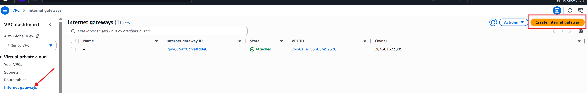

 

2) Once on the Internet Gateway creation settings, i will create a name for the internet gateway and then finalise it by pressing the "create Internet Gateway" option.

 

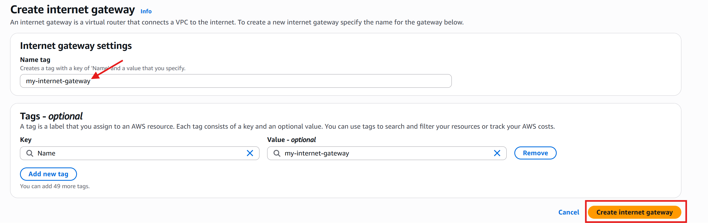

 

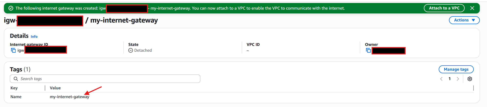

 

In the above screenshot you can see the gateway was successfully created, however you will also notice the status is displayed as "detached", indicating that it is not associated with any VPC. So to enable internet connectivity, i need to attach the internet Gateway to the VPC that i have previously created.

This will be done by checking the internet gateway box and selecting the "Actions" button at the top and then selecting "Attach to VPC" from the options that pop up.

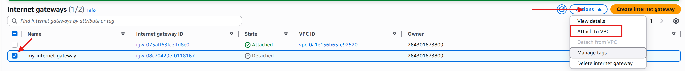

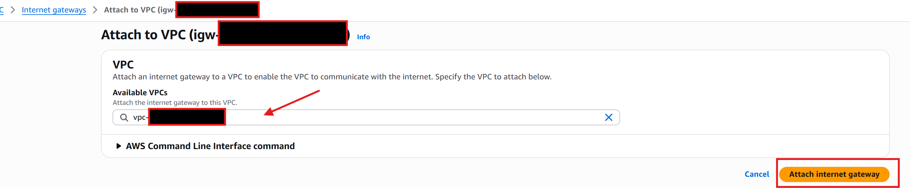

Now you'll notice in the screenshot below that the Internet Gateway has successfully been attached to my VPC.

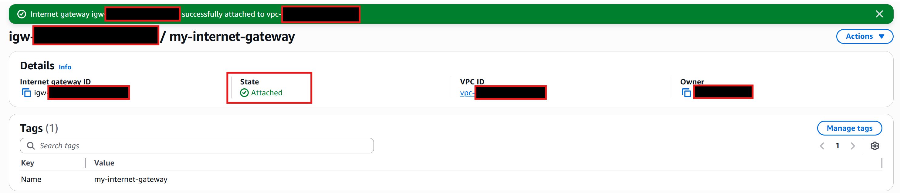

 

Now comes the next part which entails enabling the internet connectivity with the internet gateway by setting up a routing table.

### Part 4

 

1) Now i'll set up the "Route Table" and to do that i'll first navigate to the route table section on the console on the left side bar. Once i'm in the route table interface i'll be clicking the "Create route table" button.

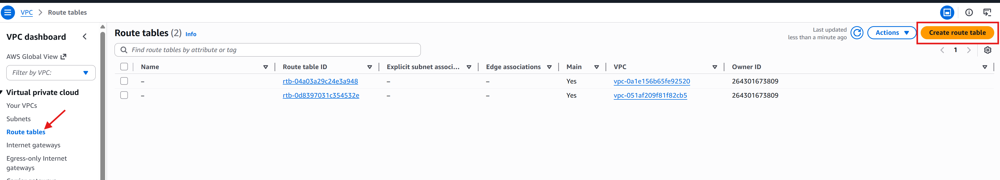

 

2) I'll now be entering the name of my routingtable and selecting the VPC i previously created and finally finalise the routing table settings by clicking the "Create route table button" to proceed.

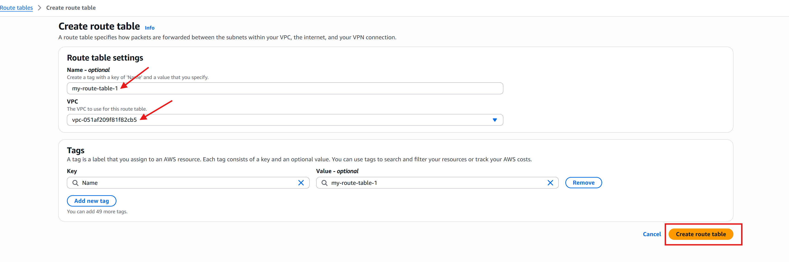

Once my route table has been generated, i will then be navigating to "Subnet associations", followed byu "dit subnet associations" to associate the subnet with the route table i've just created. In this instance i will associate the public subnet with the route table.

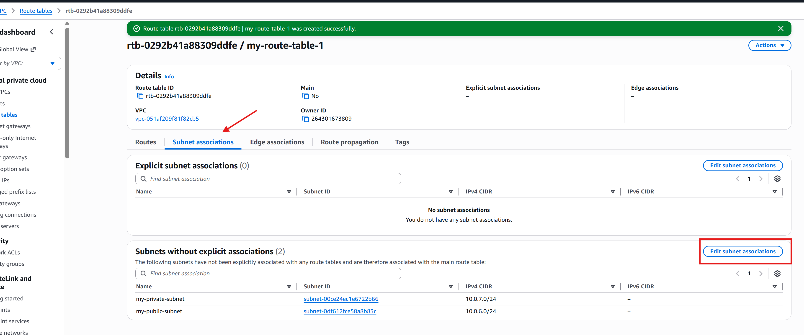

 

3) Here i will be choosing the public subnet as mentioned previously and then saving this association.

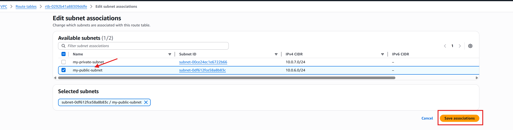

 

4) Now it's time to navigate to the "Routes" section and edit my route.

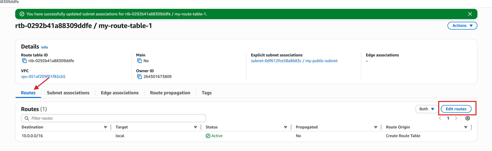

 

5) Here i will click to "Add route" and select the "Destination" as "0.0.0.0/0", indicating that every IPv4 address can access this subnet. In the "target" field, i will choose "Internet Gateway" and then select the internet gateway that i created earlier and finally save my changes.

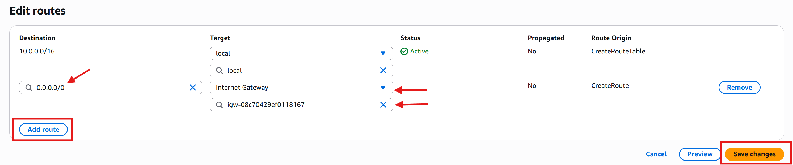

To explain the above, the route table has now been configured to route traffic to the internet gateway, allowing connectivity to the internet, since only the subnet named "my-public-subnet-1" is associated with this route table, only resources within that subnet can access the internet.

In the next part of my project i will enable outbound internet access through the NAT gateway (Network Address Translation) by attaching the NAT gateway to the subnet and attaching the route table.

### Part 5

 

1) First i will navigate to the "NAT Gateways" section, and then click on "Create NAT Gateway"

 

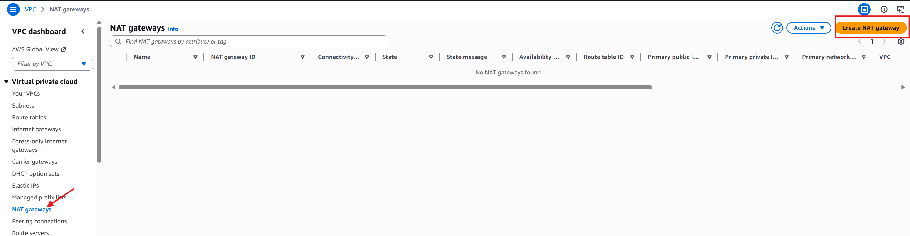

 

2) Now that i am in the Nat Gateway Creation settings, i will provide a name and value for my NAT Gateway, and then selecting the private subnet i created earlier in my project whilst setting the connectivity type to "Private". Once that is set i will finalise the creation by clicking "Create NAT gateway"

 

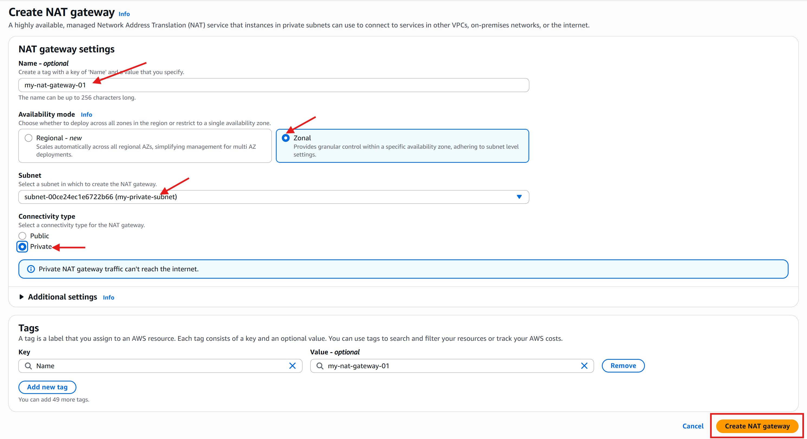

 

3) Now that my NAT Gateway has been successfully created, the next step is to navigate to my gateway and go into the "Details" panel. From here i will locate the "Subnet ID" and click on it.

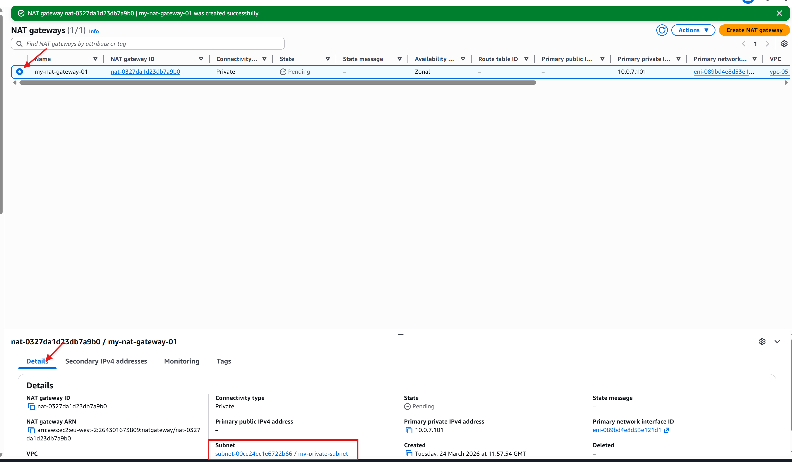

 

4) In the subnet page, i will now navigate to the "Route Table" section and then click on the "route table ID" which in my case is rtb-0d8397031c354532e

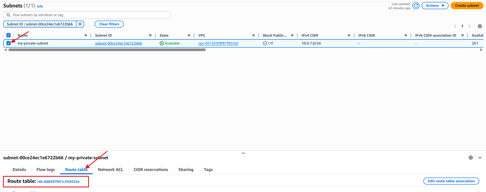

 

5) Now i will proceed to the "Routes" section, then click on the "Edit routes" like i previously did.

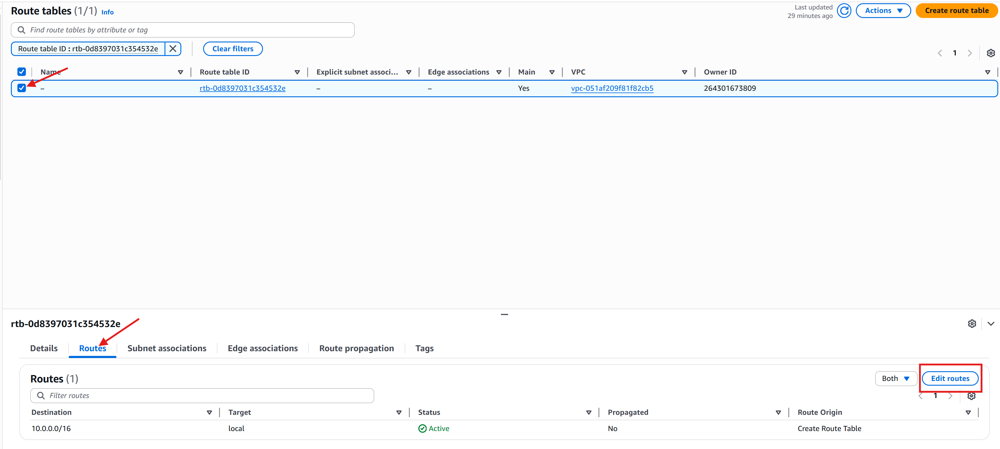

  

6) Here i will add another route, and select the destination as "0.0.0.0/0" as i did for the public route, however for the "Target" field instead of selecting internet gateway like i did for the public route, the private route will require the "NAT Gateway", followed by saving my changes.

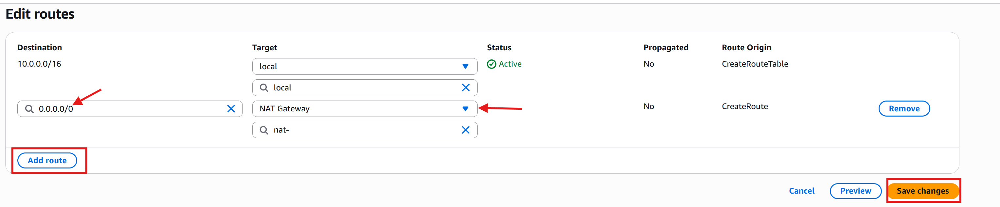

 

7) Now that i've successfully updates the route for my private subnet, i will navigate to the "Subnet associations" panel and click on the edit subnet association.

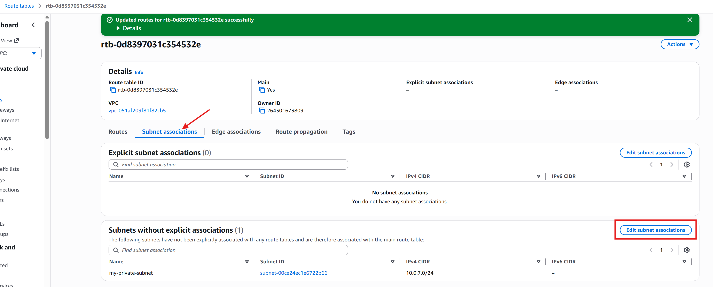

8) Here i will choose my private subnet and click on "Save associations"

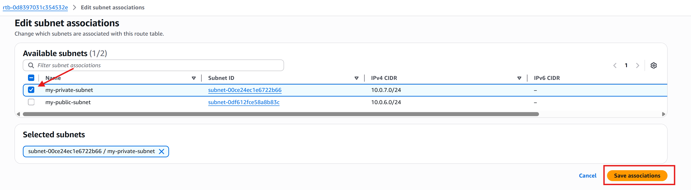

 

Now the subnet has been successfully attached with the route table.

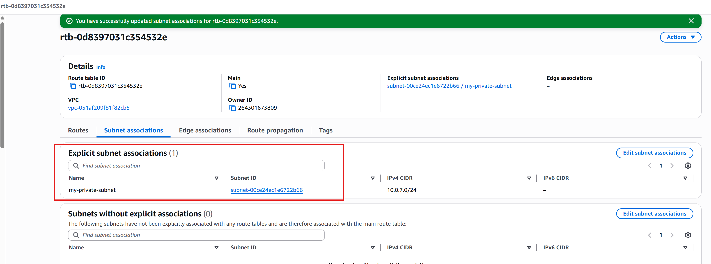

 

Now comes the final part of my project which involves establishing VPC Peering Connections. A little about what VPC Peering actually is.

#### What is VPC Peering?
So VPC Peering is like connecting two virtual offices in a cloud so they can talk to each other directly. For example two neighboring offices sharing files and chatting without going through a middleman.

- By Default, EC2 instances in different VPCs cannot communicate with each other.

- To enable communication between EC2 instances in different VPCs, you can set up VPC peering, VPN connections, or AWS Direct Connect.

- VPC peering establishes a direct network connection between the VPCs, allowing EC2 instances in one VPC to communicate with EC2 instances in the other VPC

### Part 6

1) I'll begin by creating two VPC's in the same region.

This VPC will be my "Requester" VPC

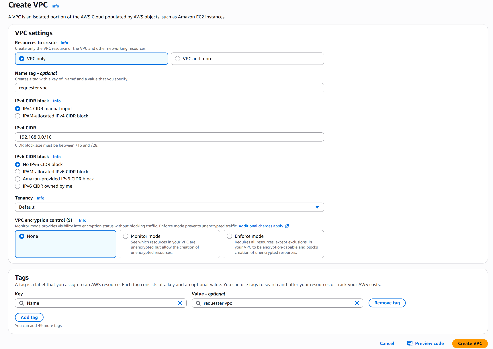

And this VPC will be my "accepter" VPC.

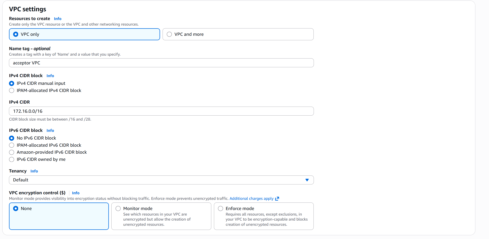

 

2) Now that i've created my two VPCs i will navigate tot he "Peering Connections" option on the left sidebar on my AWS console. upon clicking the option i will then be directed to the VPC Peering page. From there i will proceed to click on the "Create Peering Connection" button.

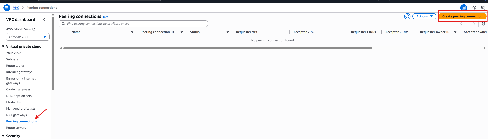

 

3) From here, i will provide a name for my VPC Peering Connection and:

- Select the requester VPC.
- Choose the account "My account" since the VPC is in my own AWS account.
- Ensure to use the same region as the VPCs were creating in.
- select the accepter VPC
- Proceed by clicking on the "Create Peering Connection" button.

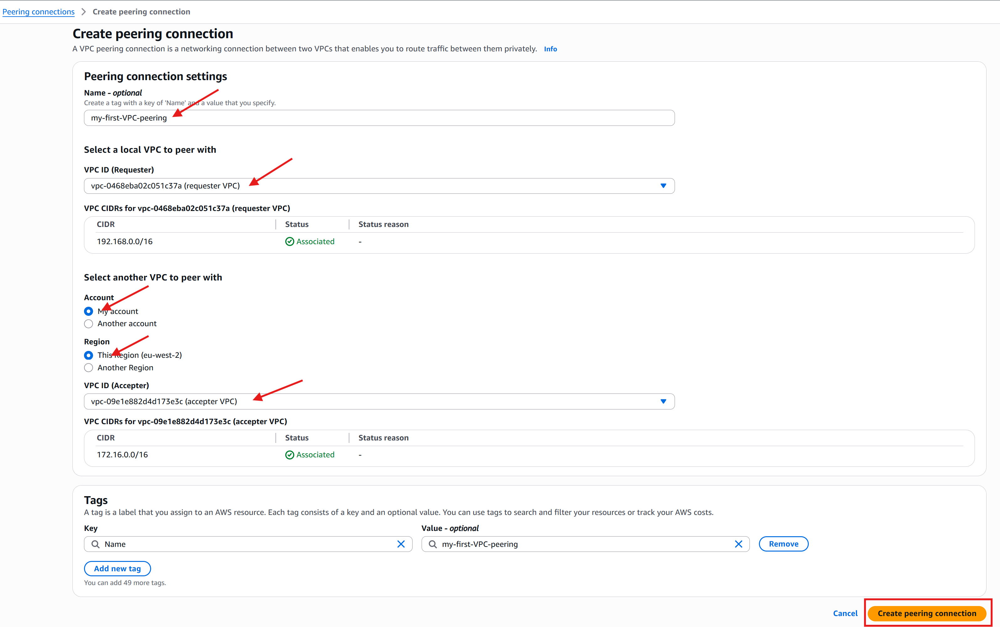

4) Once i click the "Create Peering Connection" it will send a request, to accept this request i have to navigate back to peering connections, click the VPC connection i just created and select "Actions" and then "accept request"

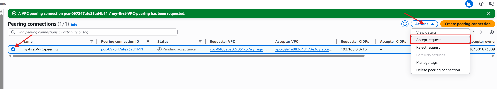

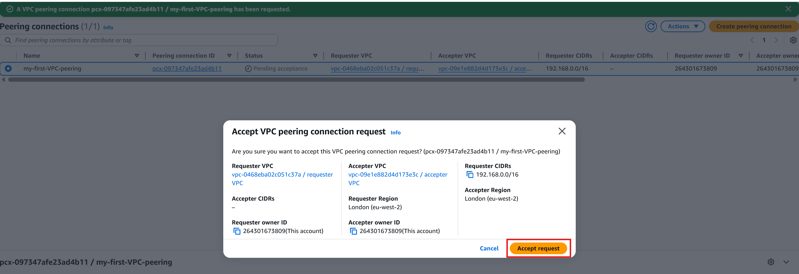

 

5) Now i will navigate back to the main route table ID of the acccepter VPC

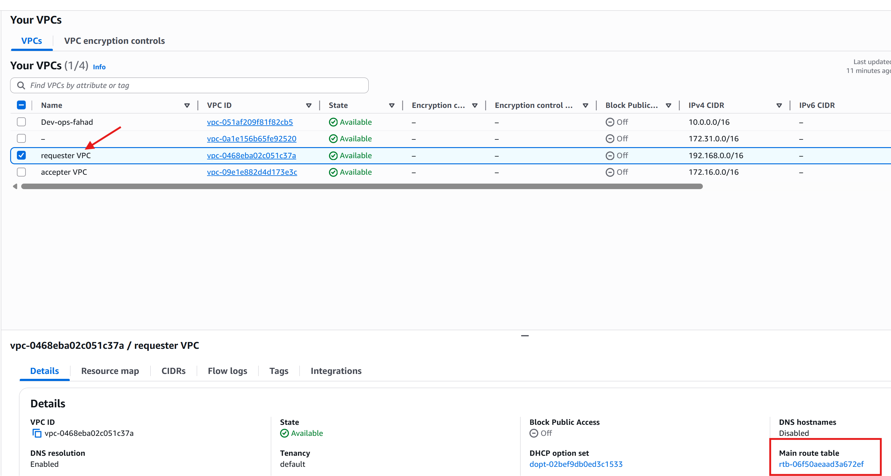

 

6) From here i will select the route table id, and navigating to the "Routes" section, where i will click on "Edit Route"

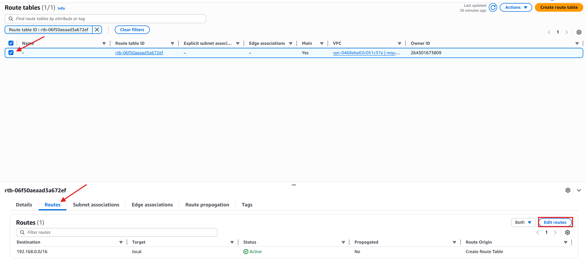

 

7) Once in the "Edit routes" section, i will add a route into the requester VPC and do the following:

- select the accepter VPC.
- in the details tab, find IPv4 CIDR.
- Copy this CIDR and paste it in the "Destination" field when adding a route.
- In the target i will be choosing VPC peering and then choosing the peering connection i created.
- Saving my changes.

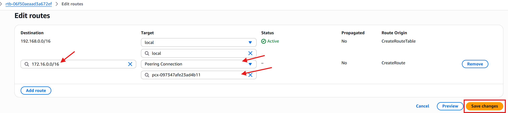

 

8) Now i will do the opposite where i will select the accepter VPC and edit the route on that using the requester CIDR IPv4.

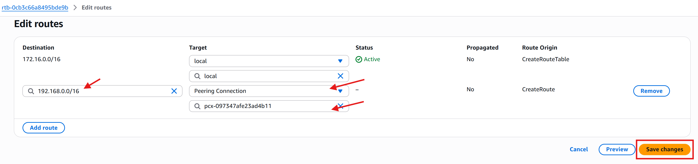

