# 
Security Groups and NACLs

 

### <u>Introduction</u>
In this project i will be exploring the core concepts of AWS, specifically focusing on Security GRoups and Network Access Control Lists (NACLs). My Objective is to understand these fundamental components of AWS infrastructure, including how security groups control inbound and outbound traffic to my EC2 instances, and how NACLs act as subnet level firewalls, regulating traffic entering and exiting subnets. Through practical hands on demonstrations i will navigate the AWS management console to deploy these critical components effectively. 

 

#### <u>Security Groups (SG)</u>

- <b>Inbound Rules:</b> Rules that control the incoming traffic to an AWS resource, such as an EC2 instance or an RDS database.

- <b>Outbound Rules:</b> Rules that control the outgoing traffic from an AWS resource.

- <b>Stateful:</b> Security groups automatically allow return traffic initiated by the instances to which they are attached.

- <b>Port:</b> A communication endpoint that processes incoming and outgoing network traffic. Security groups use ports to specify the types of traffic allowed.

- <b>Protocol:</b> The set of rules that governs the communication between different endpoints in a network. Common protocols include TCP, UPD, and ICMP.

 

#### <u>What is a security Group?</u>
A Security Group(SG) acts as a virtual firewall for the EC2 instance, controlling incoming and outgoing traffic at the "doorstep" of the server itself. Unlike a network wide firewall, it is stateful, meaning if you allow a request to come in for example a web visitor, the security group automatically remembers and allows the response to go back out.

 

#### <u>What is NACL?</u>
A Network ACL (NACL) is a stateless, subnet level firewall that acts as the first line of defense for all traffic entering or leaving an entire subnet. Unlike Security Groups, it requires you to explicitly allow both the request coming in and the response going out, and it supports "Deny" rules to block specific malicious IP addresses.

### Part 1

So in my previous project i created a VPC and configured subnets, in the public subnet i have created an EC2 instance that is currently running and hosting my website. Now i will try to access he website below using it's public address.

Here is the EC2 that is hosting my website.
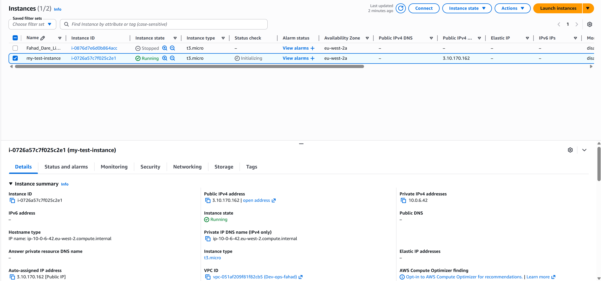

 

Here you will find my security group configs for the instance. In the inbound rules, only IPv4 SSH traffic on port 22 is permitted to access this instance.

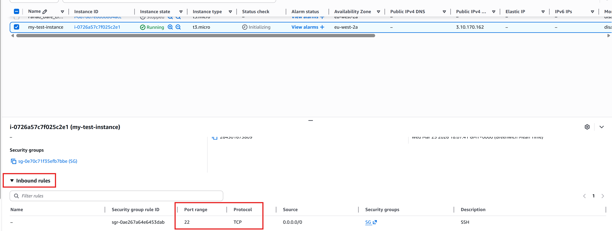

 

For the outbound rule, you'll notice that all IPv4 traffic with any protocol on any port number is allowed, meaning this instance has unrestricted access to anywhere on the internet.

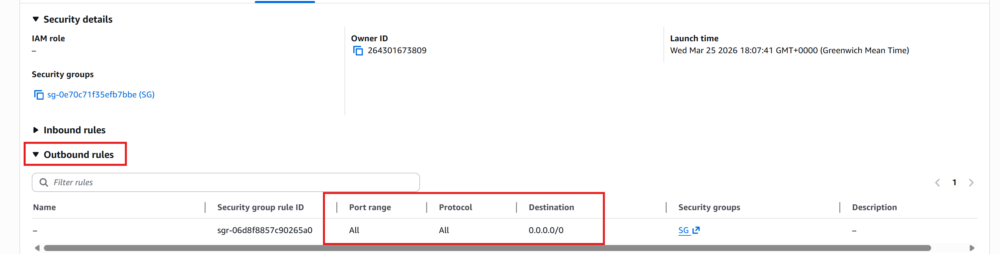

 

Now i will test it's accessabiolity to the website using the public IP address assigned to this instance.

First i will need to retrieve the public IP address which can be found in the "Details" section of my EC2.

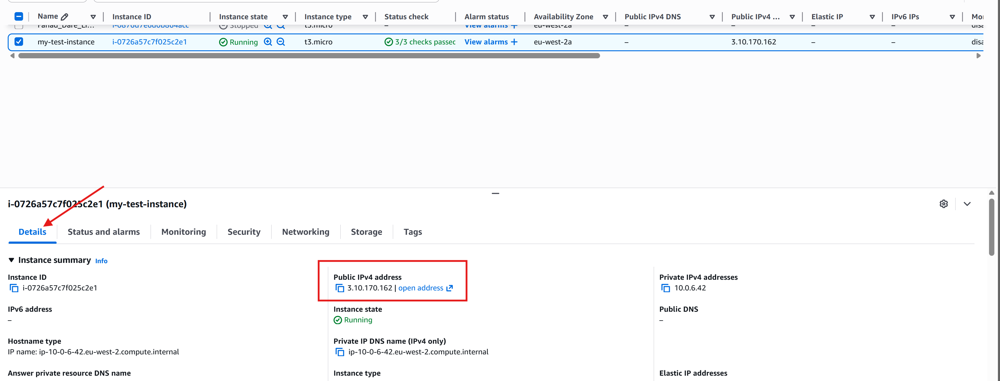

 

Now i'll try to enter the ip address in my browser and to no surprise i can see that it won't load as it is stuck in a "attempting to connect" loop, however after a little while i will see the below page which will indicate that the site can't be reached.

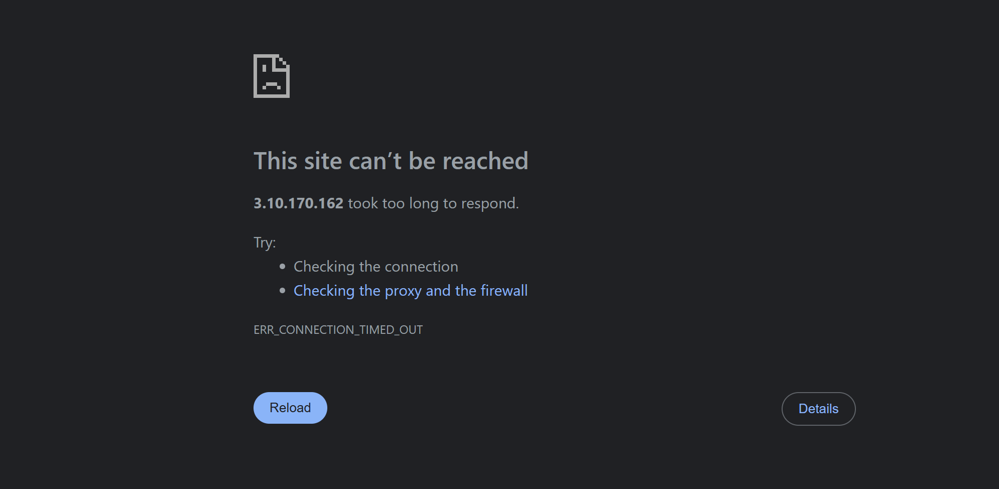

 

I expected this outcome, due to the security group, this is because i haven't defined a HTTP protocol on port 80 to allow internet traffic in the security group. So whenver anyone from outside is trying to go inside my EC2 instance and trying to get the data, security group is restricting it and that's why i am unable to see the data.

Now to resolve this issue, i'm going to create a new security group that will allow HTTP (Port 80) traffic.

 

1) First i will navigate to the "Security Groups" section on the left sidebar and then click on "Create Security Group".

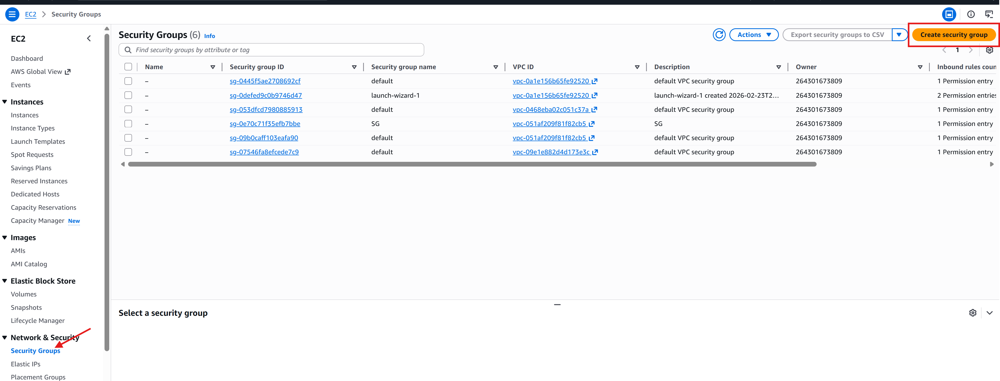

 

2) Here i will provide a name and description for my security group and to also make sure i select my VPC from my previous project. After that i will select "Add rule" and select "HTTP" as the type which will automatically set the port range to 80. I will be selecting 0.0.0.0/0 as the CIDR block which will allow every CIBR block by using CIDR. Once this is actioned i will create the security group.

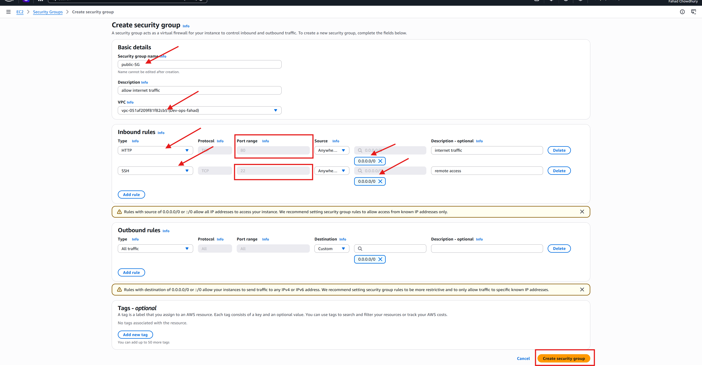

 

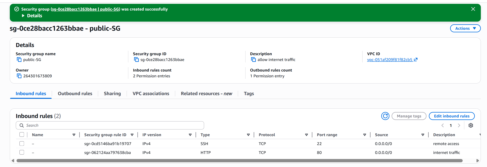

 

Now that i've successfully created an security group for my instance, i now need to attach this SG to my EC2.

3) Firstly i'll navigate back to my EC2 instance section from the left side bar. Then i'll click on "Actions" on the top right and choose "Security", and then "Change security group"

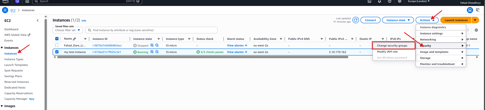

 

4) Once i select the above option, i will be navigated to another page where i will have to select my SG that i created earlier and then finalise it by pressing "Add security group" This will show my Sg being added, to which i then proceed to saving my changes.

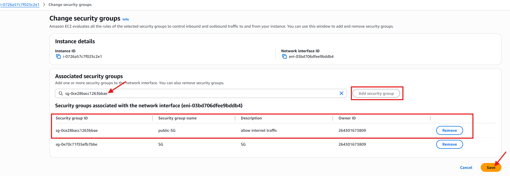

 

Now that the security change was successful i will try the IP in my browser again to see if it will work.

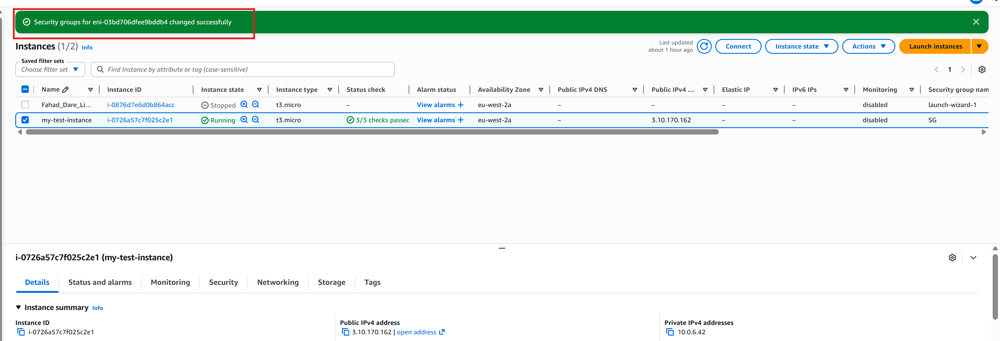

 

As you can see below, i can now see the data of my website.
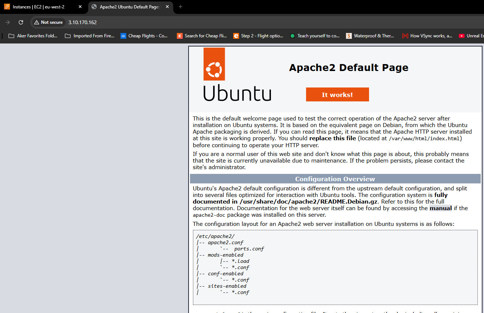

 

Now i will remove the outbound rule to see how this affects the instances connectivity. This means now no one can go outside to this instance.

To do this i will head over to the outbound tab and edit the outbound rules.

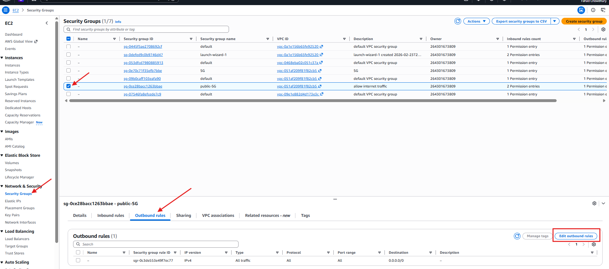

 

Here i will click Delete and save rules.

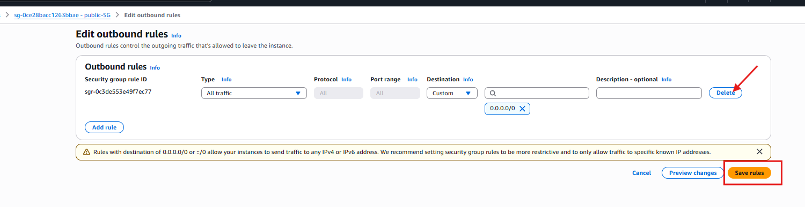

 

after deleting the rule i'll now test accessing the website again to see what happens.

As you can see below, even though i deleted the outbound SG, i'm still able to access the website. 

Even though we deleted the outbound rules, the website stays accessible because AWS security groups are inherently stateful. This means that once a user's request is permitted through an inbound rule, the security group automatically remembers that connection and allows the response to flow back out.

7) Now i will delete the inbound rule the same way i deleted the outbound rule to see what happens with the website.

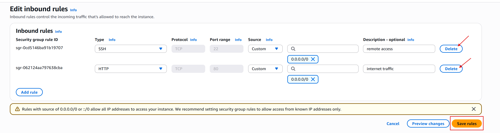

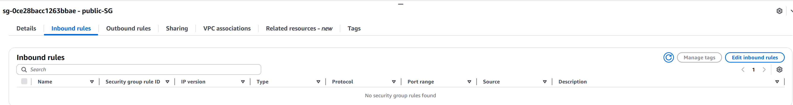

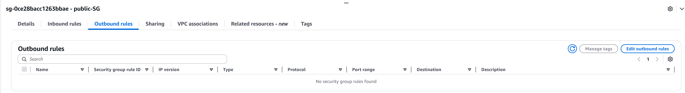

 

Now that there are no inbound or outbound rules, i will once again try to access the website.

 

In my next scenario i'm going to add a rule specifically allowing HTTP traffic in the outbound rules. This change will enable the instance to initiate outgoing connections over HTTP.

8) First i'm going to edit the outbound rule in the outbound tab and do the following:

- add rule

- choose protocol type

- choose destination

- choose CIDR

- save rule

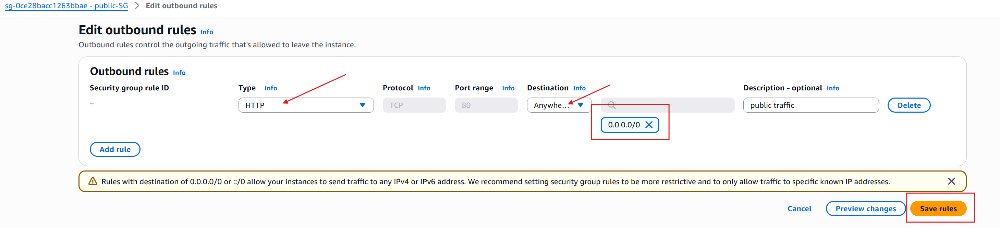

Now i'm going to try to reach the website again with only outbound rules configured and no inbound rules. 

As you can see above, i'm still unable to access the site.

### Part 2

Now it's time to work on NACL.

1) Firstly i'll navigate to the VPC management console by searching for it in the search bar.

 

2) Next i will navigate to the "Network ACLs" section in the left side bar and then i will create a network ACL.

 

Now that i'm in the creation panel, i'll provide the following information:

- Providing a name for the ACL.

- Choosing the VPC that i created.

- finalising the creation of the ACL Network

 

4) Now i'm going to select the ACL that i just successfully created and navigate to the "inbound" tab. By default this should be denying all traffic from all ports.

 

Similarly the same will be for the outbound rules this should also be denying all trafic on all ports by default.

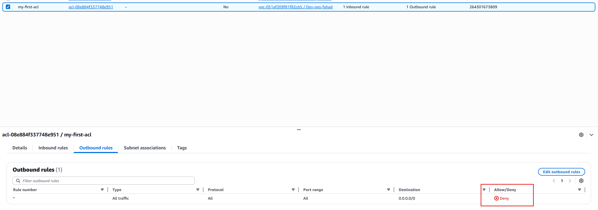

 

5) To make changes to my NACL i'll have to go into the "inbound" tab as i previously did and click on the "Edit inbound rules". From here i will click the "Add new rule" option and will have to specify the following:

- Choose rule number.

- Specify the type.

- Select the source.

- Determine whether to allow or deny the traffic.

- Save my changes.

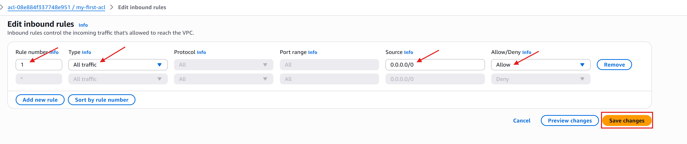

 

At the moment my NACL is currently not associated with any of the subnets in the VPC. So first i'll have to associate it by carrying out the following actions:

- Selecting the NACL i want to associate.

- select "Actions" button

- Choose the "Edit subnet association" option.

- Selecting my public subnet as my instance resides in the public subnet.

- Save my changes.

Now that I have enabled inbound traffic to my NACL. If i try to access my website again, you will see below i am still unable to access the site. This is because despite permitting inbound traffic in the NACL, the NACL are stateless. They don't automatically allow return traffic. As a result, i need to explicitly configure rules for both inbound and outbound traffic.

 

Now i'm going to duplicate the process i did for inbound rules, but for my outbound rules to allow traffic to go out.

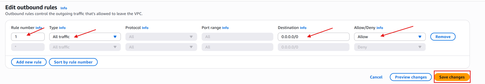

Now that i successfully have Inbound and Outbound traffic set to "allow" i should in theory be able to access my website site now.

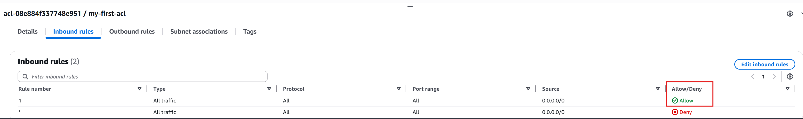

As you can see above, i can now access the site without any issues.

