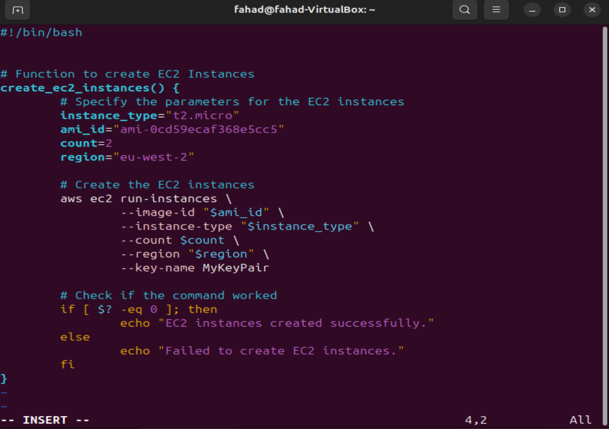
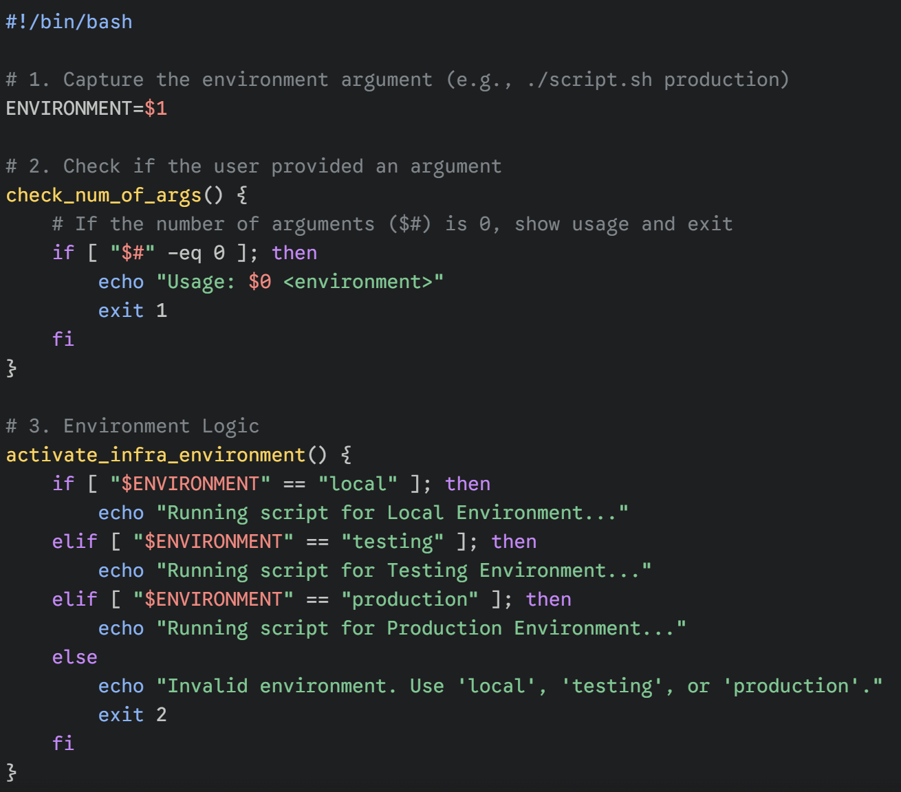
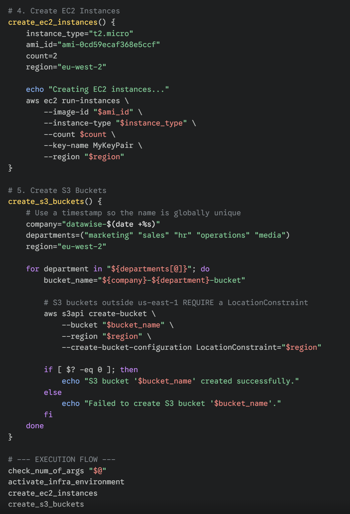

# 
Creating AWS Resources with Functions & Arrays using Shell Scripting

 

### <u>Introduction</u>
In this Project i will be creating two functions, one will be for provisioning EC2 instances and another for setting up S3 buckets. These functions will streamline the process of resource creation and enable me to automate tasks effectively.

To automate this process i will create an EC2 instance using amazons official documentation to understand how to use aws cli to create instances which can be found here https://docs.aws.amazon.com/cli/latest/reference/ec2/run-instances.html

 

For this purpose i will use shell scription to create a function that will be responsible for creating EC2 instances.

 

Now that i've created a shell script for automating the creation of an EC2 instance. My next objective will be to create five distinct S3 buckets, each designated for storing data related to Marketing, Sales, HR, Operations and Media.

To achieve this i will utilise a fundamental structure in shell scripting known as an "Array" this is because i need one single variable holding all the data, and then have the capability to loop through them.

Below is what my script will look like:

