# 
Load Balancer and Auto Scaling Group in AWS 

 

### Introduction
In this project, i will be learning how to configure auto scaling in AWS with an application load balancer (ALB) using a launch template. The project itself aims to demonstrate the automatic scaling of EC2 instances based on demand, while leveraging the benefits of a launch template.

 

### <u>Ojbectives</u>

<b>1. Create Launch Template:</b>
- Learn how to create a launch template with the required specifications

 

<b>2. Set Up Auto Scaling Group:</b>
- Configure an Auto Scaling group to manage the desired number of EC2 instances using the Launch Template.

 

<b>3. Configure Scaling Policies:</b>
- Set up scaling policies to adjust the number of instances based on demand.

 

<b>4. Attach ALB to Auto Scaling Group:</b>
- Connect the Auto Scaling group to an existing ALB

 

<b>5. Test Auto Scaling:</b>
- Verify that the Auto Scaling group adjusts the number of instances in response to changes in demand.

#### <b>Task 1: Create Launch Template</b>

1. Log in to the AWS Management Console and Navigate to the EC2 service.

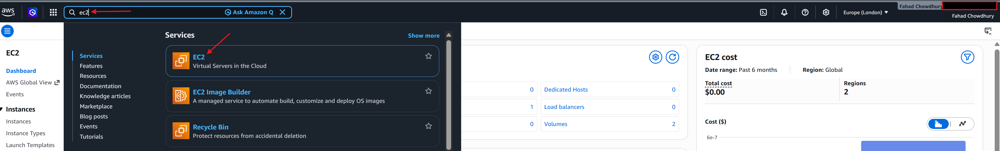

 

2. Once in the EC2 service, in the left navigation pane, i will click on "Launch Template"

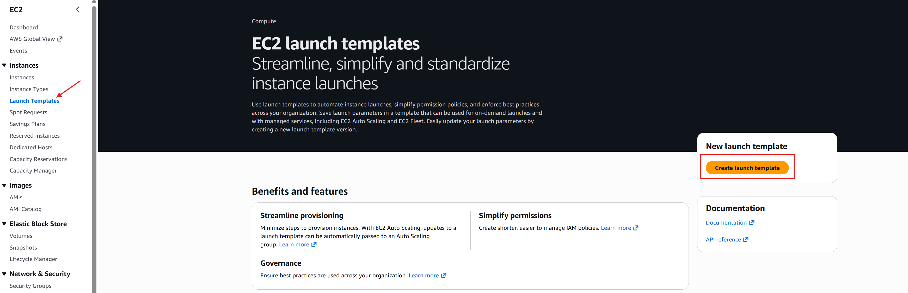

 

4. Now i will create a Launch template and configure the template settings, including the AMI, instance type, and user data.

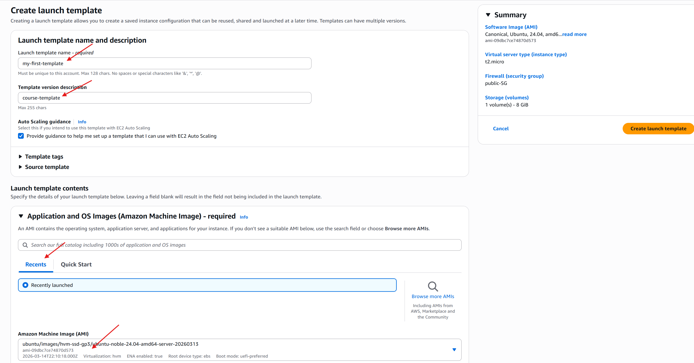

 

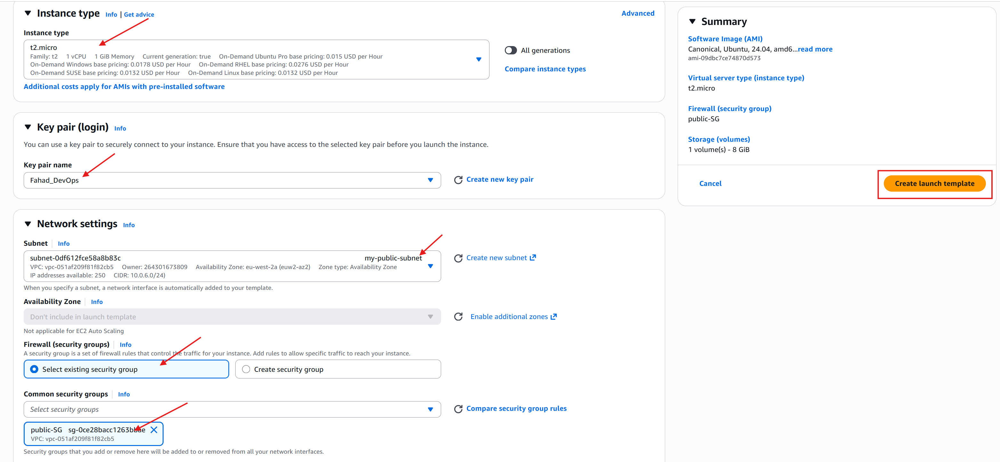

 

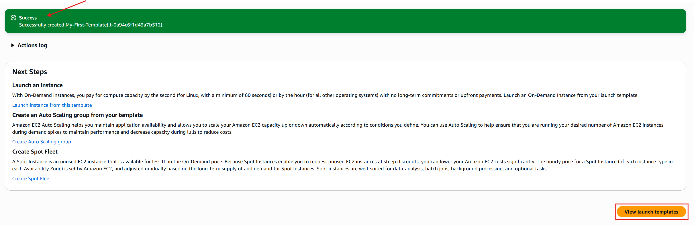

 

#### <b>Task 2: Set Up Atuo Scaling Group</b>

1. In the AWS Management Console, i will navigate once again to the EC2 Service and in the left navigation pane, i will this time select "Auto Scaling Groups"

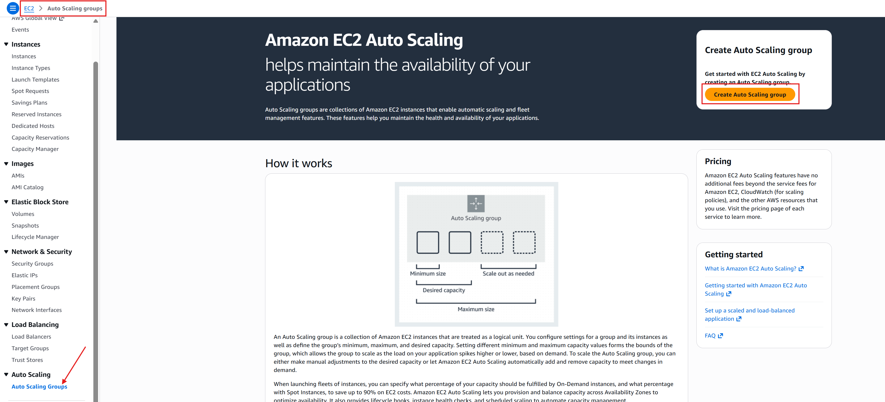

 

2. After clicking on "Create Auto Scaling Group" button as shown in the above image, i will choose the "Use Launch Template" and select the launch template i have just created.

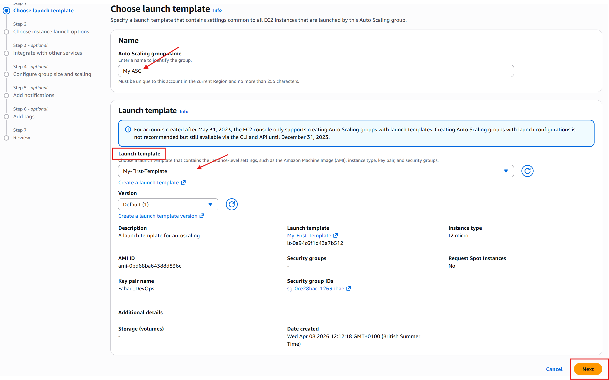

 

3. Now i'll configure the auto scaling group settings, including the group name, desired capacity and initial instances.

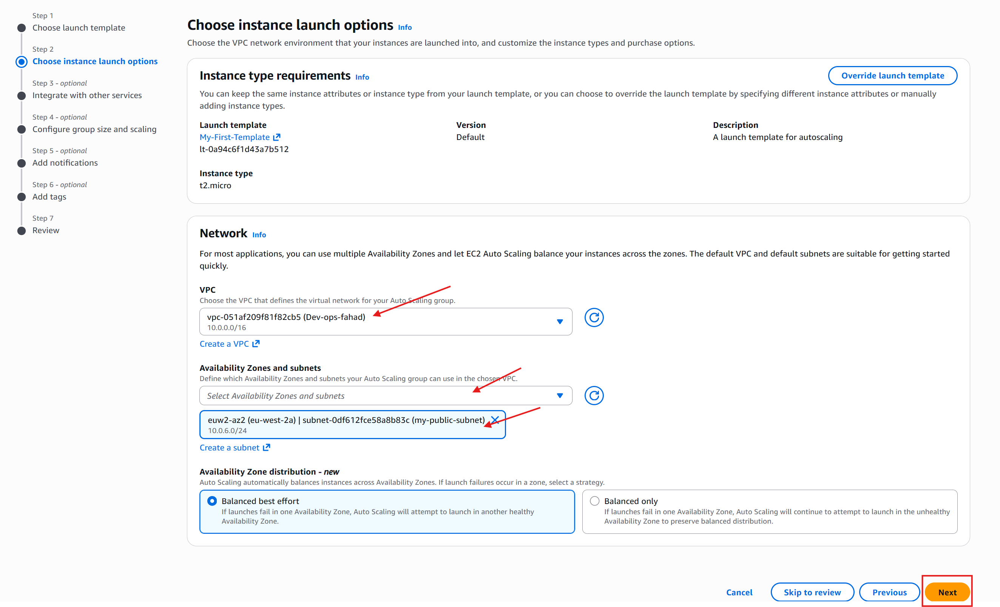

 

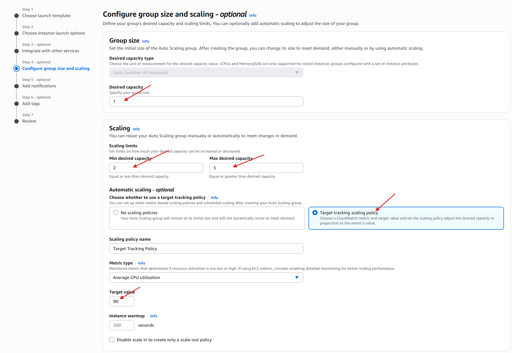

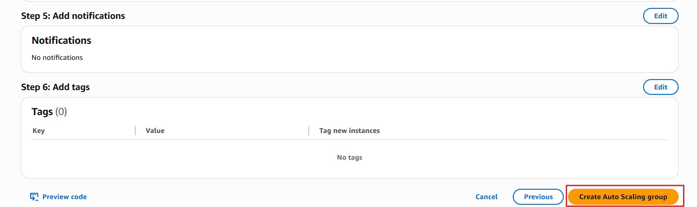

 

Task 3: Configure Scaling Policies

1. In the Auto Sclaing Group Configuration i will now navigate to the "Scaling Policies" section and create a scaling policy and configure the policies for scaling in and scaling out based on demand.

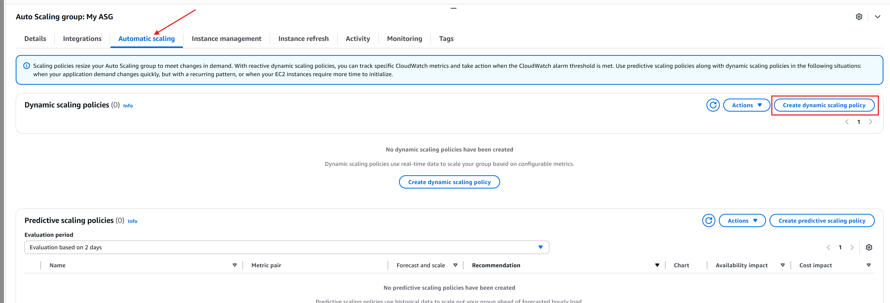

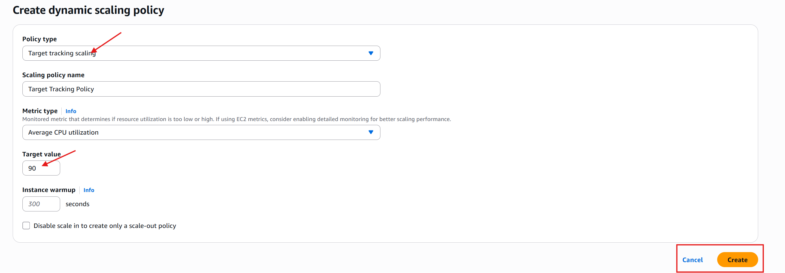

 

Task 4: Attach ALB to Auto Scaling Group

1. In the Auto Scaling group config, i will navigate to the "Load Balancing" section and from there i will edit and select the ALB to associate with the Auto Scaling group.

Firstly i have to create my load balancer by navigating to the "Load Balancer" pannel and then creating a fresh load balancer.

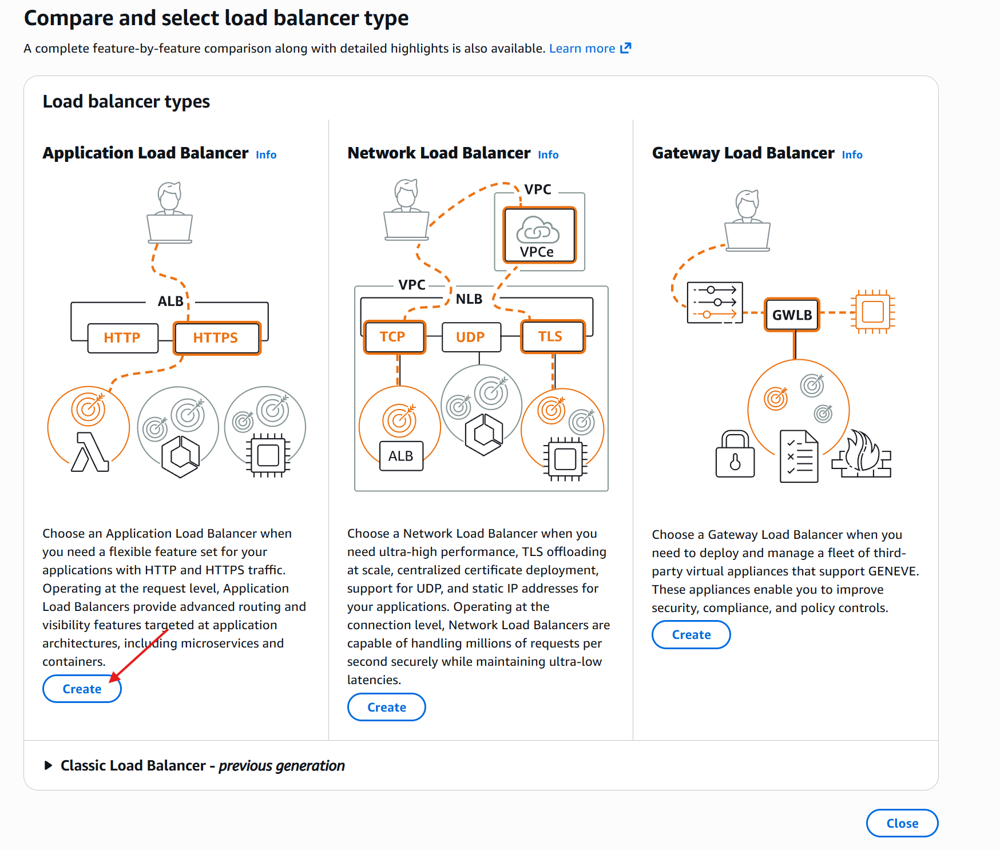

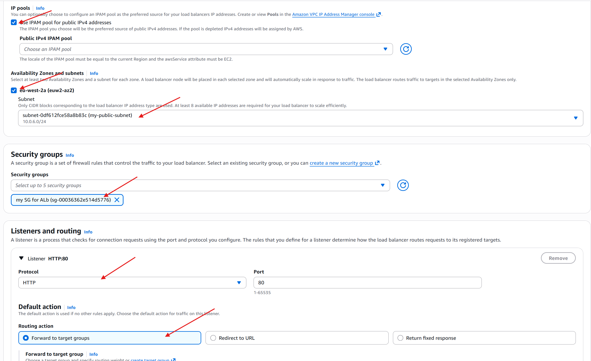

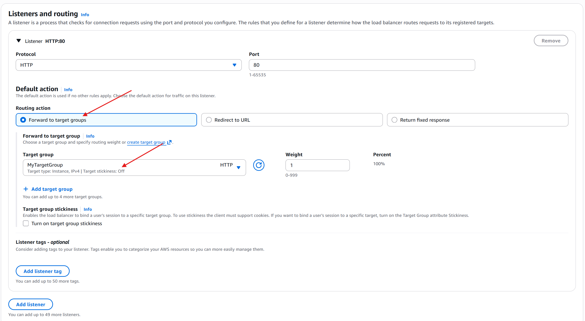

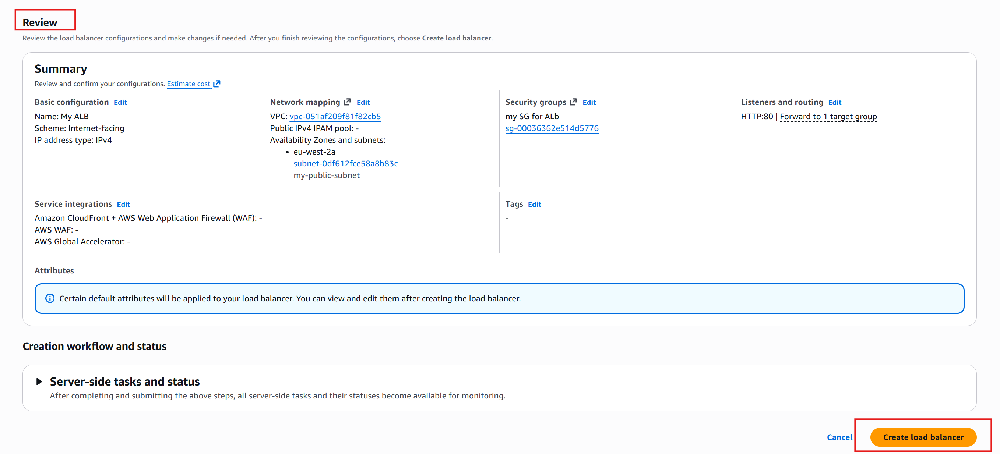

Now that my load balancer has been successfully created, it's time to attach it to my auto scaler.

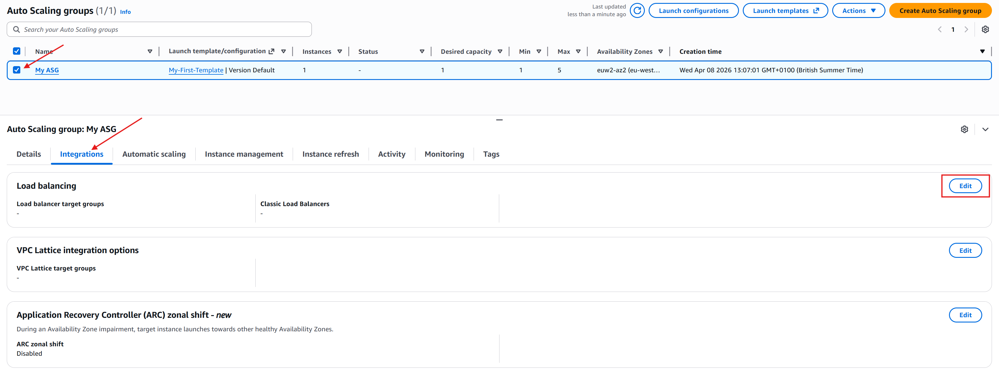

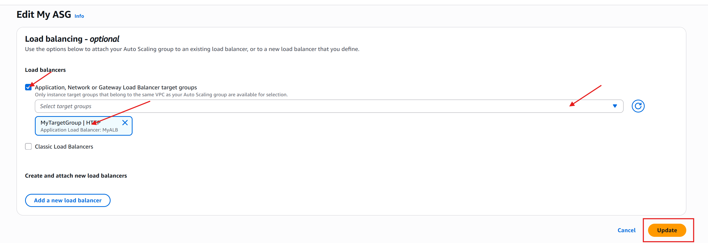

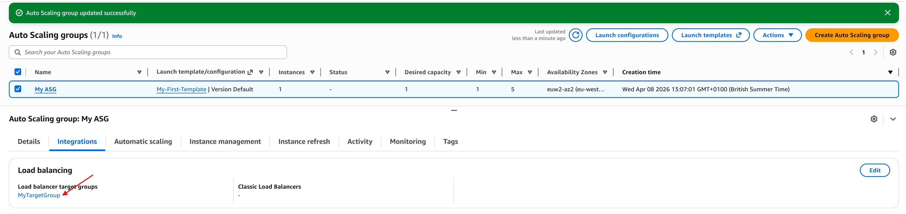

 

Task 5: Test Auto Scaling

1. Now it's time to Generate traffic to trigger scaling policies using the below command.

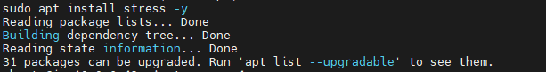

Now that i've installed the stress package, i will run the command to stress the instance.

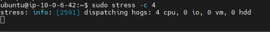

2. Now I'll monitor the auto scaling group and verify that the number of instances adjusts based on demand.

The number of instances adjusted and autoscaler created a new instance to adjust for the load.

