# 
Setting up Secure Authentication to AWS API 

 

### <u>Introduction</u>
Following on from the requirement detailed in my previous project, the initial step in my crafting of my script it to ensure i have the necessary AWS account setup for authentication and rescue management in the cloud. This setup is crucial for enabling the script to create EC2 instances and S3 buckets efficiently.

Below are the following tasks i will be carrying out for this project that are required of me:

1. Create an IAM Role: Begin by establishing an IAM role that encapsulates the permissions required for the operations our script will perform.

2. Create an IAM Policy: Design an IAM policy granting full access to both EC2 and S3 services. This policy ensures our script has the necessary permissions to manage these resources.

3. Create an IAM User: Instantiate an IAM user named automation_user. This user will serve as the primary entity our script uses to interact with AWS services.

4. Assign the User to the IAM Role: Link the automation_user to the previously created IAM role to inherit its permissions. This step is vital for enabling the necessary access levels for our automation tasks.

5. Attach the IAM Policy to the User: Ensure that the automation_user is explicitly granted the permissions defined in our IAM policy by attaching the policy directly to the user. This attachment solidifies the user's access to EC2 and S3 resources.

6. Create Programmatic Access Credentials: Generate programmatic access credentials — specifically, an access key ID and a secret access key for automation_user. These credentials are indispensable for authenticating our script with the AWS API through the Linux terminal, allowing it to create and manage cloud resources programmatically.

 

 

Step 1: Creating an IAM role.

Firstly i'll start by creating an IAM role for EC2.

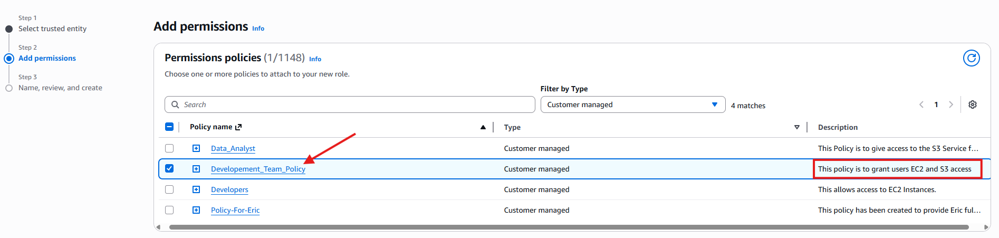

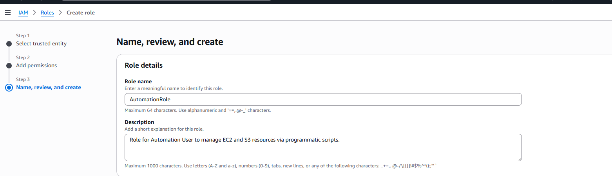

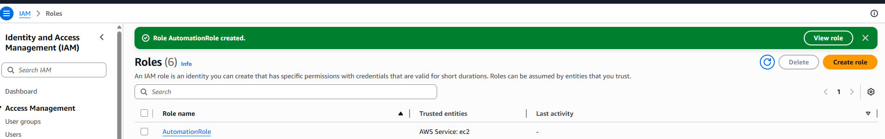

 

Step 2: I am requested to create a policy granting EC2 and S3 full access, however i have already created this policy in a previous project, so i won't need to make a new one, i have decided to use that same policy when assigning it to the IAM role as seen below.

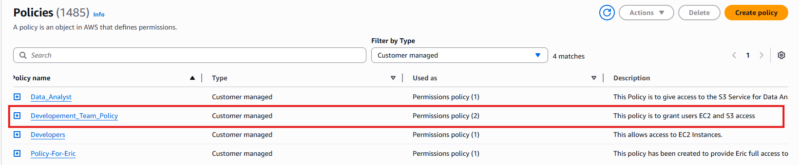

 

Step 3: Creating an IAM user named Automation_User that will be allowed to run script through EC2 and S3.

To do this i will first navigate to the IAM dashboard and go to the "User" panel located on the left hand side, whereby i will then click "Create" once i am in the "User" UI.

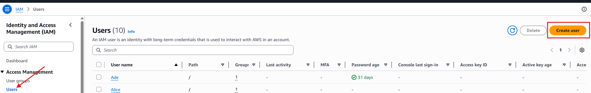

 

Now i will name the user, i will not provide the Automation User with AWS console access as this user is for automation access for a script or CLI to talk to AWS using an access key or secret key, the AWs access if only for a human to log into the website with a username and password which won't be needed in this instance.

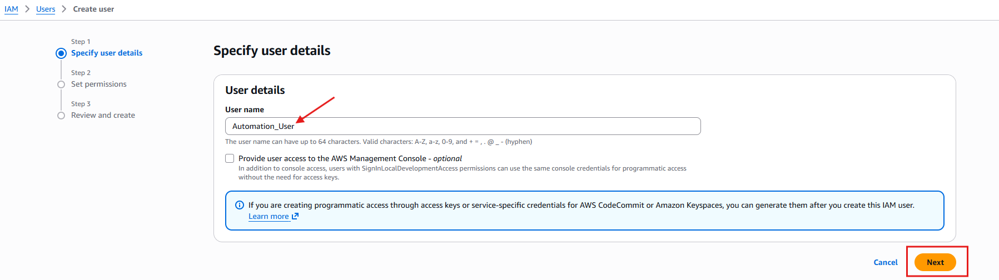

 

Next is to attach the policy that grants full access to EC2 and S3.

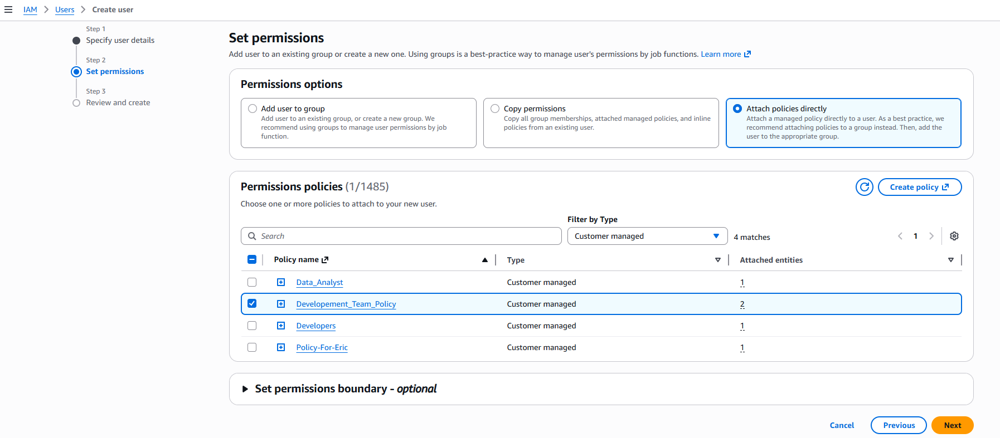

 

Once i have reviewed all my additions i will click "create" and the user will be successfully created as seen in the screenshot below.

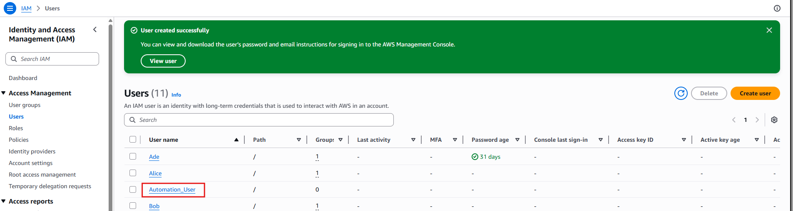

 

Step 4: Now i will be assigning the IAM user to the IAM role.

To carry out this step i have to navigate to the roles tab located in the left handside panel and select the "AutomationRole" that i created earlier.

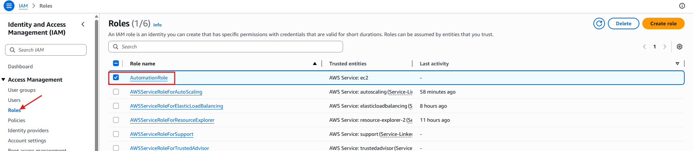

 

Once i'm in the settings of the role, i then have to navigate to the "Trust Relationships" section and "Edit Policy", Here is where i will specify to trust the IAM role "AutomationUser"

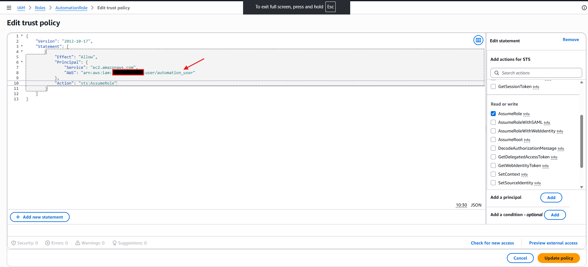

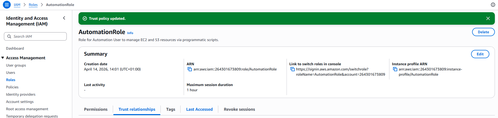

Step 5: Assign the IAM Policy to the IAM User.

I have already pre-emptively carried out this step when i was creating the Automation_User, I attached the policy during the user creation process as seen here.

 

Step 6: Creating Credentials

Here i will generate my programmatic access credentials, specirfically my access key ID and my secret access key for Automation_User.

First i will navigate back to the IAM Users dashboard and go into the Automation_User i created.

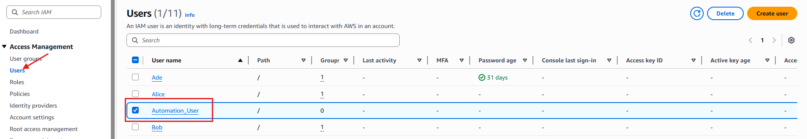

 

From here i will navigate into "Security Credentials" and scroll down to "access key" and finally "create access key"

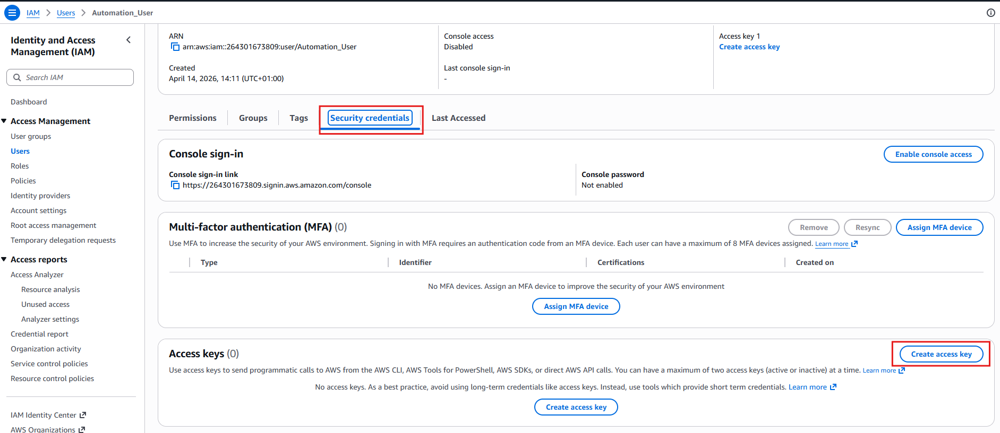

 

From here i will select the Command Line Interface (CLI) as the use case and continue to the next part.

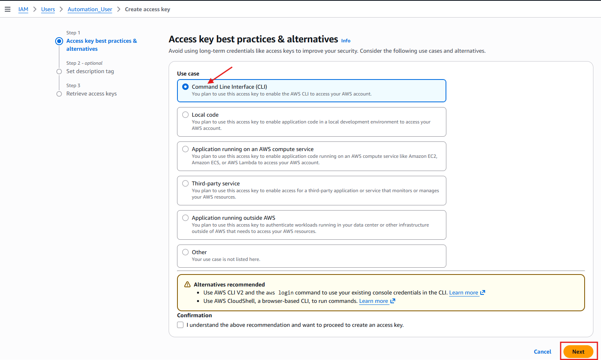

 

Finally i will give the key a brief description and finalise the creation of the key.

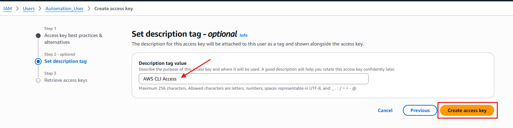

 

As i already have CLI installed on my EC2 instance from previous projects i do not need to go through the trouble of installing it again, i can go straight to "AWS Configure", after inserting my access key id and my secret key i will then run the "aws ec2 describe-regions --output table" command.

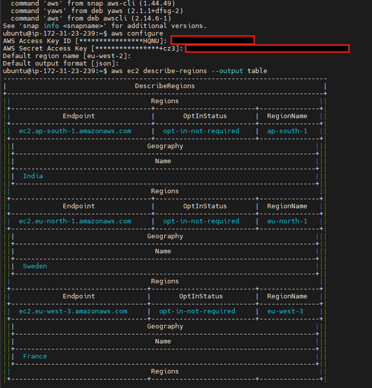

