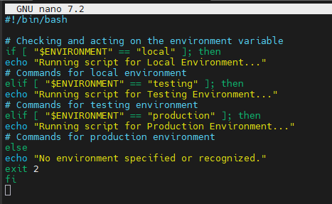
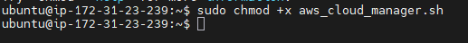
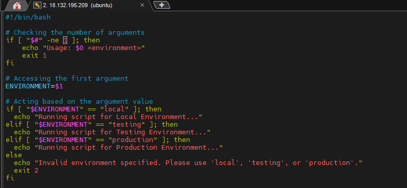
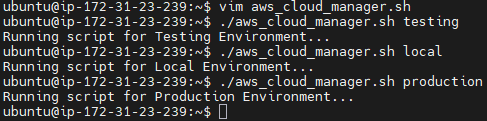

# 
Understanding Environment Variables & Infrastructure Environments

 

### <u>Introduction</u>
In this project, I’m diving into the differences between Infrastructure Environments and Environment Variables, two concepts that sound similar but actually do very different things in tech. I’ll be breaking down how we move code through different stages like local dev and production, and how we use specific settings to keep that code flexible and secure.

 

#### <u>Infrastructure Environments</u>

Infrastructure environments refer to the various settings where software applications are developed, tested and deployed, each serving a unique purpose in the software lifecycle.

For example if i were working with a dev team to build a FinTech product. The have 2 different AWS accounts. The pathway would be something like:

1. VirtualBox + Ubuntu: The dev environment where all local development is done on my laptop.

2. AWS Account 1: The testing environment where, after local development is completed, the code is pushed to an EC2 instance here for further testing. 

3. AWS Account 2: The production environment, where after tests are completed in AWS account 1, the code is pushed to an EC2 instance in AWS account 2, where the customers consume the Fintest product through a website.

Each of the steps i have listed above are considered as an "Infrastructure Environment" 

 

#### <u>Environment Variables</u>
I'll use Fintech as an example again here for Variables, imagine Fintech product needs to connect to a database to fetch financial data. However, the details of this database connection, like the database URL, username, and password differ between my development, testing, and production environments.

 

First i'll begin by creating an environment variable to determine if the script is running for local, testing or production environments.

As i'm on windows i will be loging into my Ubuntu desktop in virtual box and opening up the terminal whereby i will create a shell script with the name "aws_cloud_manager.sh" and will input the following code as seen below in my screenshot:

 

A breakdown of what the script above is doing is it's checking whether the environment is local, testing or otherwise Production. If so then the relevant message will be displayed for each environemnt for example for "local" it will display the message "Running script for local Environment" same goes for the other two enviroments. However if it is neither of any of these enviroments then the message "No environment specified or recognized" will be displayed.

 

I have also granted execute permission so that i can run this script on my local terminal.

I will now run the "export ENVIRONMENT=production" command in my terminal and then run my script to see the output i get, as you can see below i recieve the echo message associated with "ENVIRONMENT == production" which is "running script for production environment"

Inside my script, I’m adding ENVIRONMENT=$1. The $1 part is basically a placeholder, it's a positional parameter that gets swapped out for whatever argument I type when I run the script. Since you can pass a bunch of different arguments at once, the dollar sign just tells the script which "position" to look at; in this case, it’s grabbing the very first word I type after the script name.

 

I’ve also added a check at the start to make sure the script actually gets the input it needs. I’m using $# to count how many arguments are passed; if that number isn't exactly what I'm looking for, the script will stop, throw an error code, and tell the user exactly how to run it properly. It's a simple way to keep things from breaking if someone forgets to include the environment name.

What’s happening in the code:

- $#: This is a special variable that keeps track of the total number of arguments.

- -ne: Short for "not equal."

- $0: This represents the script itself, which is handy for showing the correct usage message.

 

 

### Summary

In this project, I’ve bridged the gap between Infrastructure Environments and Environment Variables by building a practical script that manages different deployment stages like Development, Model Office, and Production. I learned that while infrastructure refers to the physical or virtual "where," variables act as the configuration "how," allowing my code to adapt dynamically without manual changes. By using Vim to write a Bash script, I mastered using positional parameters like $1 for user input and implementing logical checks with $# to ensure the script receives the correct arguments. Ultimately, this taught me how to automate a secure, professional workflow that moves a product from a local laptop to a live AWS account.