# 
WordPress Site on AWS

 

### <u>Introduction</u>
In this project scenario a small to medium sized digital marketing agency, "DigitalBoost", wants to enhance its online presence by creating a high performance wordpress based websitre for their clients. The agency needs a scalable, secure, and cost effective solution tht can handle increasing traffic and seamlessly integrate with their existing infrastructure. My task here as an AWS solutions Architect is to design and implement a wordpress solution using various AWS services, such as Networking, Compute, Object Storage, and Databases.

 

### Project Overview

Below are the specifications criteria i have to meet which is the cloud infrastructure ask the client has requested.

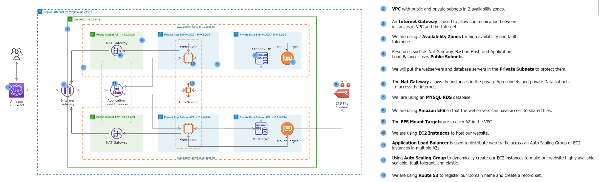

 

### 1. <u>VPC Setup</u>

As per the project overview above, i will start with the VPC, my objective is to create a VPC (Virtual Private Cloud) to isolate and secure the wordPress infrastructure.

I'll be carrying out the following steps:
- Defining IP address ranges for the VPC
- Create VPC with public and private subnets
- Configure route tables for each subnet

 

#### Creating the VPC - 

I'll be navigating to the AWS "VPC" dashboard and creating a VPC from there. 

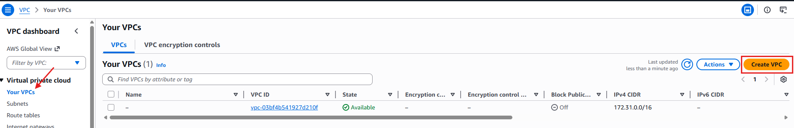

Once in the create screen, i will configure the setup as below.

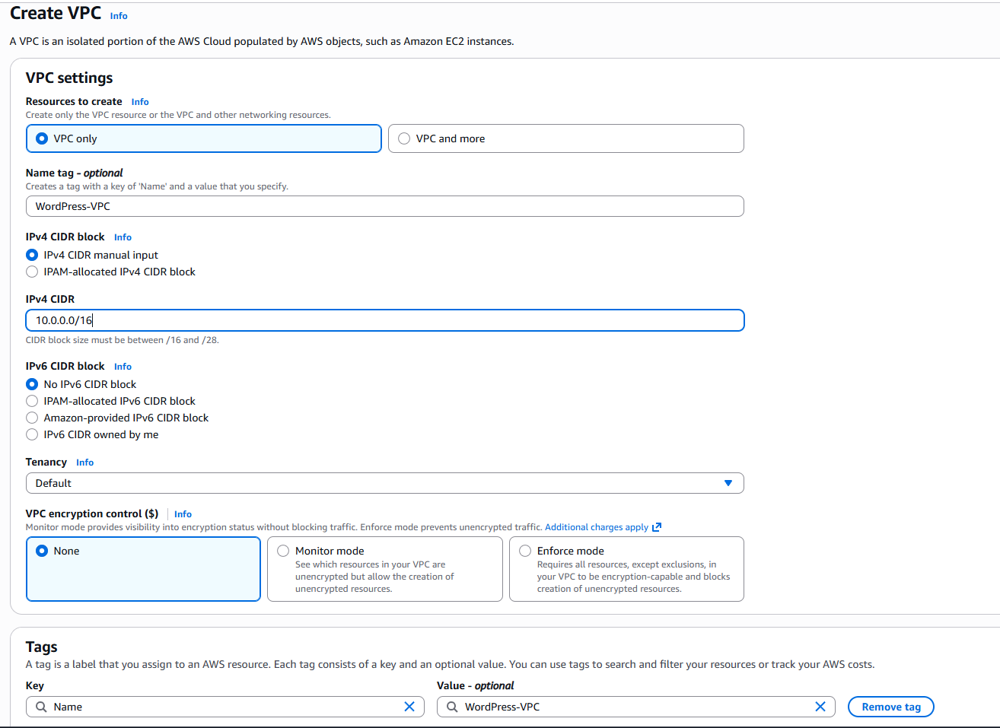

Once the VPC is created, i will go into the edit settings to make sure the DNS hostnames are enabled as well as the DNS support.

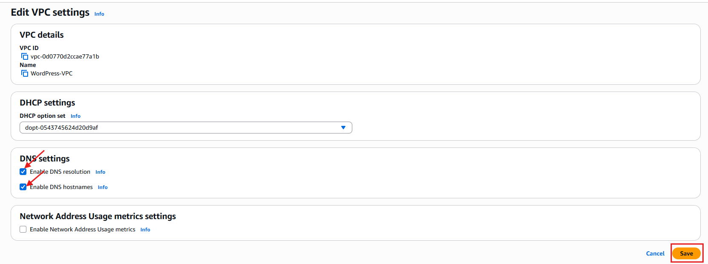

 

#### <b><u>Subnet Segmentation</b></u>

Now that my VPC is all set up, i will now need to create 6 subnets (3 in each AZ) as per the project overview criteria of the cloud architecture

This can be achieved by navigating to the "Subnet" panel on the left hand side and clicking "create" which has then taken me into the create subnet UI.

Below you will see my config for the very first subnet, i will creating 6 subnets in total and replicate the config for the first subnet. Below are the 6 subnets i will be creating and their AZ's:

- Public Subnet AZ1
- Public Subnet AZ2
- Private App Subnet AZ1
- Private App Subnet AZ2
- Private Data Subnet AZ1
- Private Data Subnet AZ2

 

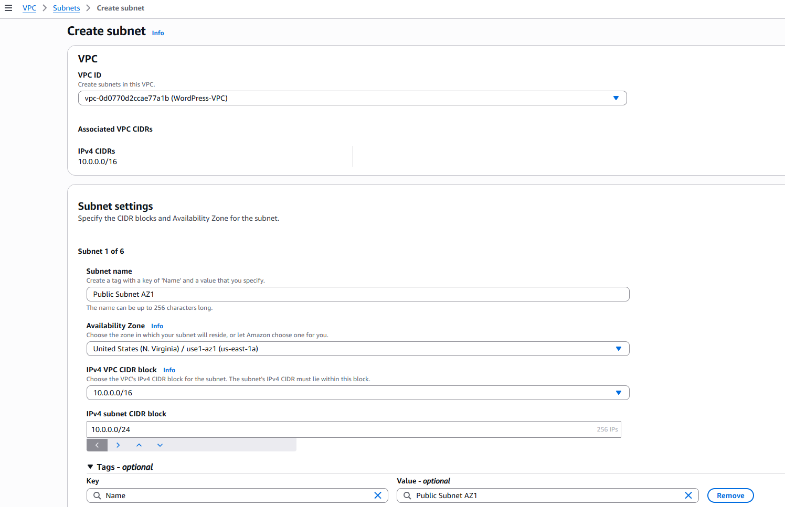

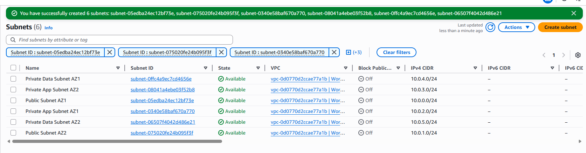

After i have successfully created my 6 subnets, i will then manually go into both of my public subnets and edit the settings to make sure "auto assign public IPv4 address" is enabled.

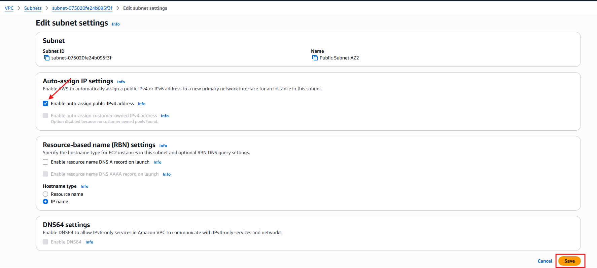

 

#### <u>Internet & NAT Gateways</u>

Now that the VPC and Subnets are created, the next step of the architecture requires i create and internet gateway for my public subnets and a NAT gateway for my private subnets.

This can be accomplished by navigating to the "Internet Gateways" panel on the left hand side and clicking "Create Internet Gateway"

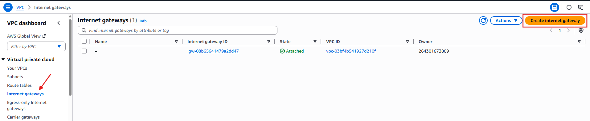

The IG creation itself is very easy to create and only requires me to name it.

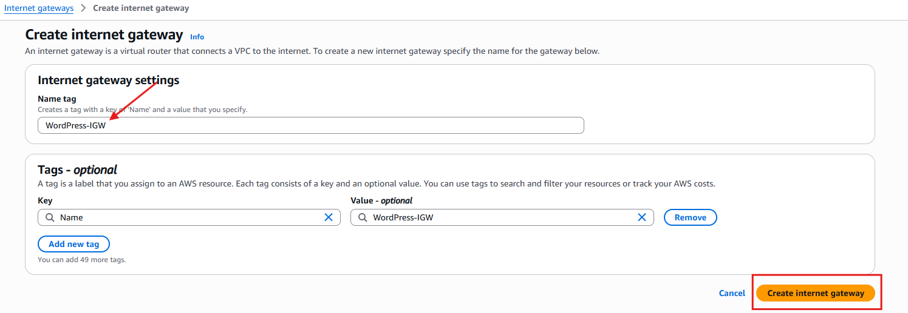

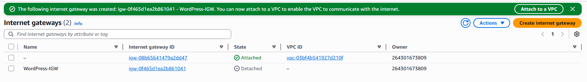

 

Now that the IGW has been created, i need to attach it to my VPC.

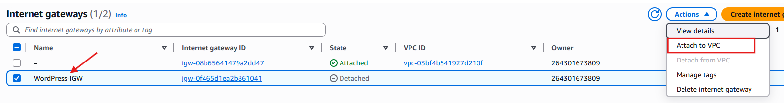

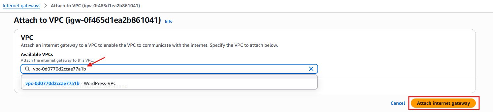

 

Now that the Internet Gateway has been created, the next part is to create two seperate NAT Gateways, one for AZ 1 and the other for AZ2.

Same principle as before, while on the VPC dashboard i'll navigate to the "NAT GAteway" option on the left side panel and click "Create NAT Gateway"

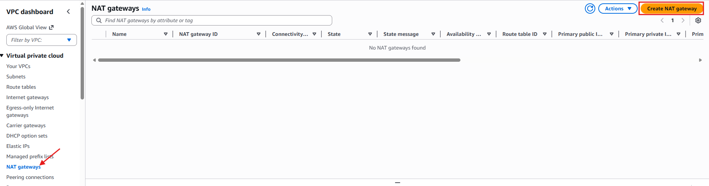

Next i'll configure my first NAT Gateway which will be connected to my "Public" subnet.

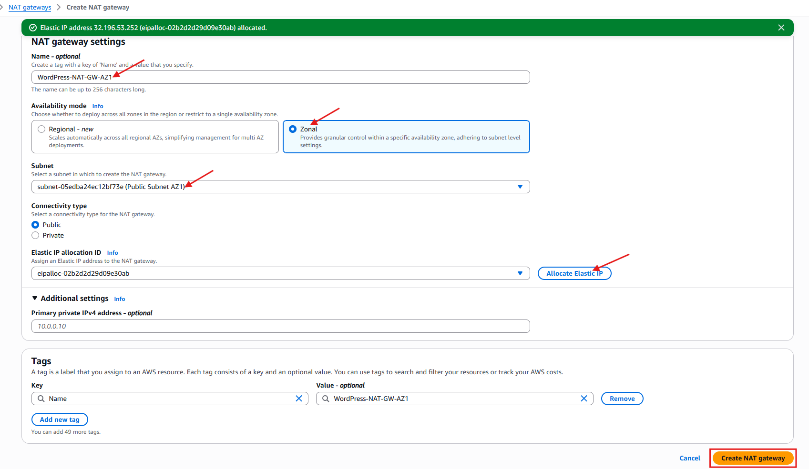

You will notice above i chose "Zonal" for my availability zone, this is because the project requires the NAT Gateways to be on static AZ's (AZ1 and AZ2)

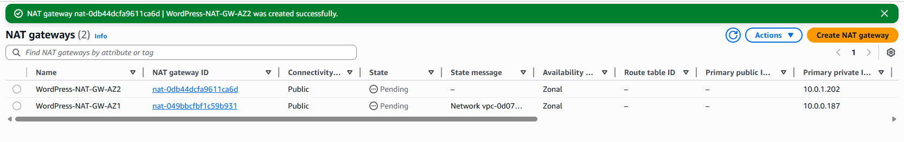

 

#### <u>Route Tables</u>

Now that i have created the Gateways it's time to create the route tables and tie everything together. There are 3 route tables to create as per the Architechure requirement, one will be the public route table, the second will be the Private Route Table for AZ1 and the third will be the Private Route Table for AZ2.

Firstly i'll navigate to the left side panel again within the VPC dashboard and select "route tables" and click "Create"

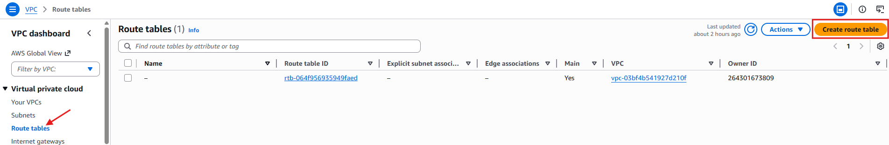

Once in the configuration screen i will give the Route Table a name and attach it to the "WordPress-VPC" i created earlier. I will follow the same config for the other 2 RT's (Route Tables)

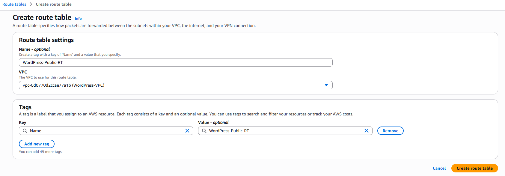

 

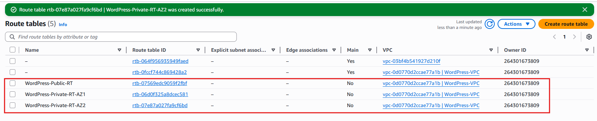

Now that i've created my 3 Route tables, the next step is to make sure that each route table has the path to the internet (Destination: 0.0.0.0/0), I will do this by Navigating into each route individually and Navigating to the "routes" tab and clicking "edit Routes"

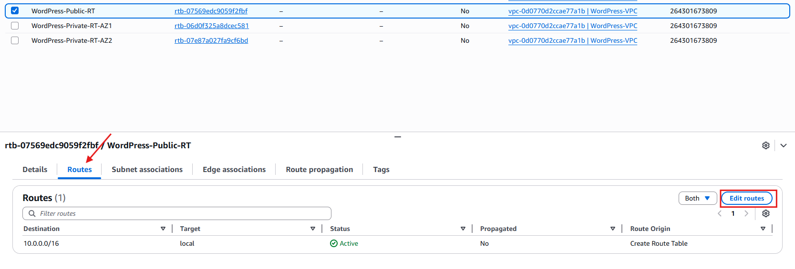

Once in the "Edit Routes" Configuration i'm going to add another route, the destination being 0.0.0.0 and the target being the Internet Gateway as this is my public RT, the private RT will have their targets pointing to their respective NAT Gateways for AZ 1 and 2.

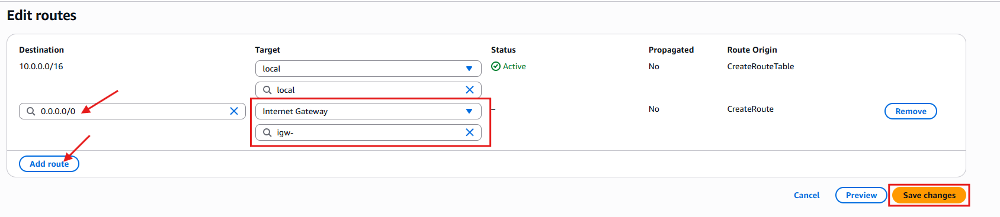

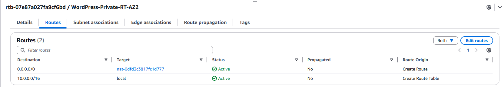

 

Now that i've pointed the route tables to their respective destinations the next step is to explicitly state the subnet associations, in this case my "Public-RT" route table will associate with my Public Subnet in AZ1 & AZ2, whereas my Private-RT-AZ1 & AZ2 will point at their respective Private App subnet and Private Data Subnets in AZ1 and AZ2.

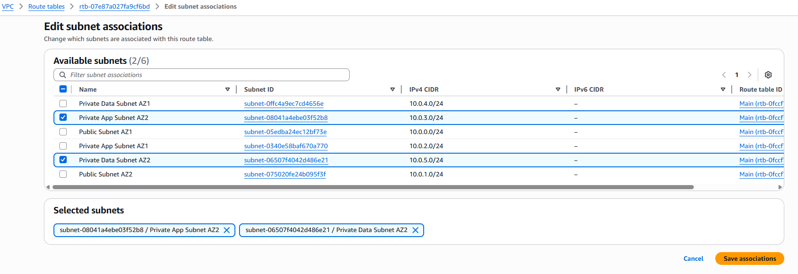

As you can see from the example above, this is my Private-RT-AZ2 table, so the subnet associations would be the Private App & Private Data Subnets in AZ2.

 

### <u>Security Groups</u>

Now that the route tables are taken care of, the next step in my project would be to create the security groups so traffic only flows where it's supposed to. Based on the project diagram, i will need at least four Security Groups.

The Security group can be found once again on the left hand side panel on the VPC Dashboard, once i've navigated to the security group page i will click into "Create Security Group" and configure my 4 security groups. The groups will be for the following:

- SG for Application Load Balancer. (traffic HTTP & HTTPS)
- SG for WordPress EC2 Instances.( Traffic HTTP, HTTPS & SSH)
- SG for RDS MYSQL Instance. (Traffic MYSQL)
- SG for EFS Mount Targets. (Traffic NFS)

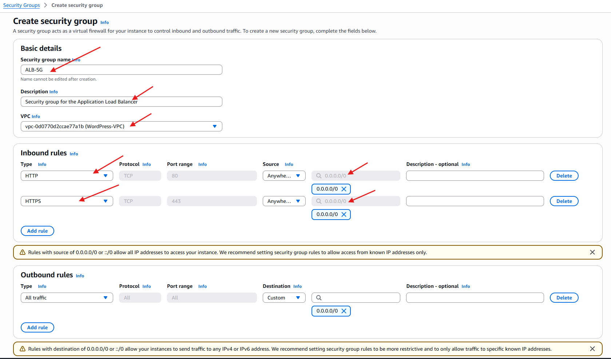

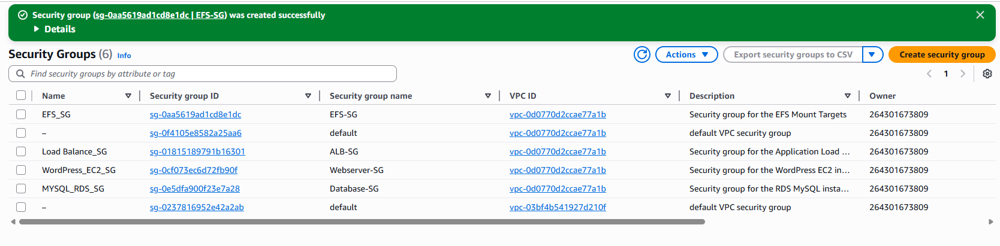

 

### <u>Creating the EFS File System</u>

Now that i've created the SG's the next logical step is to create the EFS File System

For this i'll have to navigate away from the VPC dashboard and go to the EFS Console. Once there i simply navigate to the "Create File System" button.

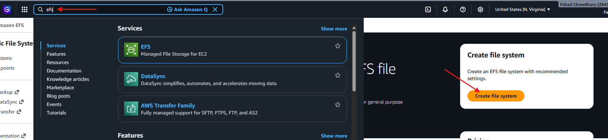

Here i will Configure the File System and customise the options to set the mount targets.

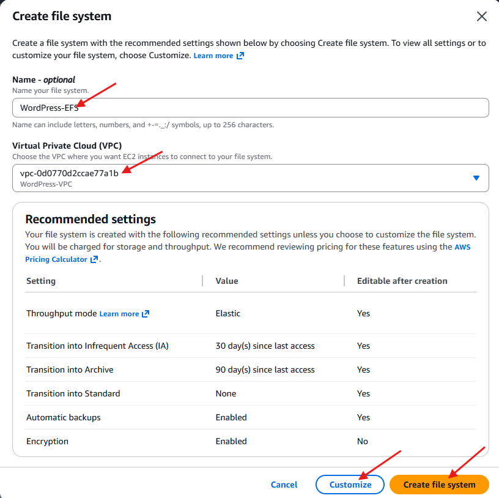

Below you will see i've corrected the mount targets and made sure the correct security group is attached (EFS_SG).

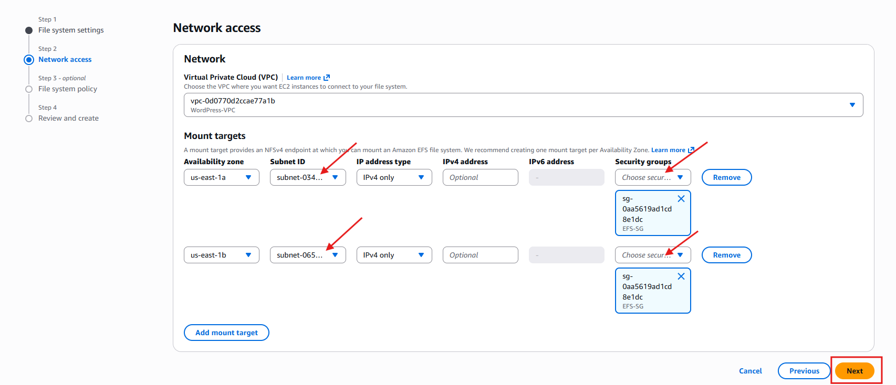

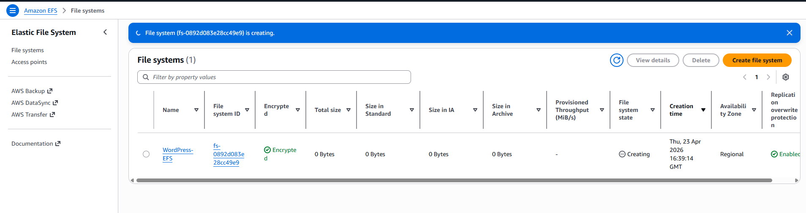

#### RDS Database

Now that i have created the file system, it's time for me to transition to RDS, here i will need to create the database subnet group. To do this i need to navigate to RDS in the search bar and then navigate to "Subnet Groups" in the left sidebar.

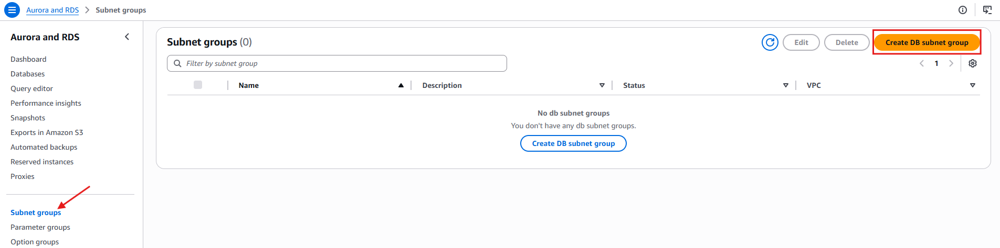

Now that the RDS DB subnet group is created, it's finally time for me to create the RDS Database, this will be done by navigating to "Databases" in the left sidebar and then clicking "Create Database" 

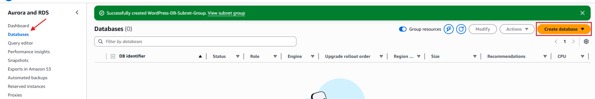

#### EC2 Instance Launch

Now that i have the RDS database up, the next step is for me to launch an EC2 instance that will host my site.

 

#### Application Load Balancer

Now it's time to create the loadbalancer, but before i get to that, i need to create the target group so i can attach it to the load balancer.

First i'll need to navigate to my newly created EC2 and go into target groups to create a target group.

Once there i'll now configure the target group and attach it to my WordPress VPC.

Once the config is done, i review and finalise the creation of the TG.

Finally it's time to create the load balancer now.

I'll navigate to the "Load Balancer" button located in the left sidebar. and click the "Create load balancer" button where i will do my configuration.

Below is my configuration for the Load Balancer where i tie everything together.

 

#### <u>Auto Scaling Group</u>

Now it's time to inititate the final part of the architecture which is setting up the auto scaling group.

Firstly, i'll have to create the launch template, which again is found on the sidebar of the EC2 console.

Next i'll configure the template to use with the ASG.

