# 
Introduction to Docker

 

### <u>Introduction</u>
In this project, i will be installing Docker on my Ubuntu machine so i can grasp the concept of containers, their isolkation and their role in packaging applications as well as familiarise myself with key Docker features, commands and best practices.

 

#### What is Docker?
Docker in simple terms is basically a box that contains all the resources an application needs to run across multiple machines or environments, such as a developers local machine to a testing environment or even other team members. This eliminated the "it works on my machine" phenomena whereby an application or code would work on the developers machine, but when it was shared with another team member or even a live environment it no longer worked. This was due to multiple reasons such as the host users security settings, python version or potentially other causes.

#### <u>Installation of Docker</u>

My first step is to launch my Ubuntu instance and connect to it, from there i will need to configure the Docker respository before proceeding to install and update Docker directly from the respository. What i mean by "configure the docker respository" is in simple terms to tell my instance "hey, here is the official Docker address and a digital key to prove the software is safe to download".

Below in my Ubuntu instance i will be using via VirtualBox.

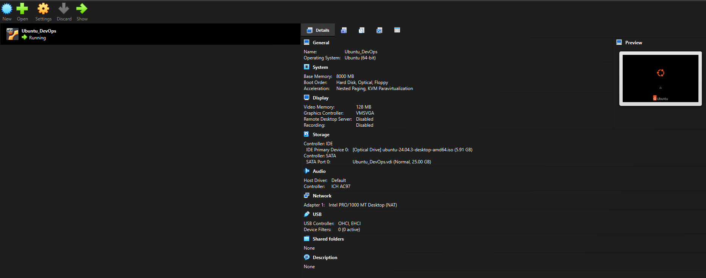

Now that i've successfully launched my instance and logged in, i have to add dockers official GPG key. I will refresh the package list using the 'sudo apt-get update' command.

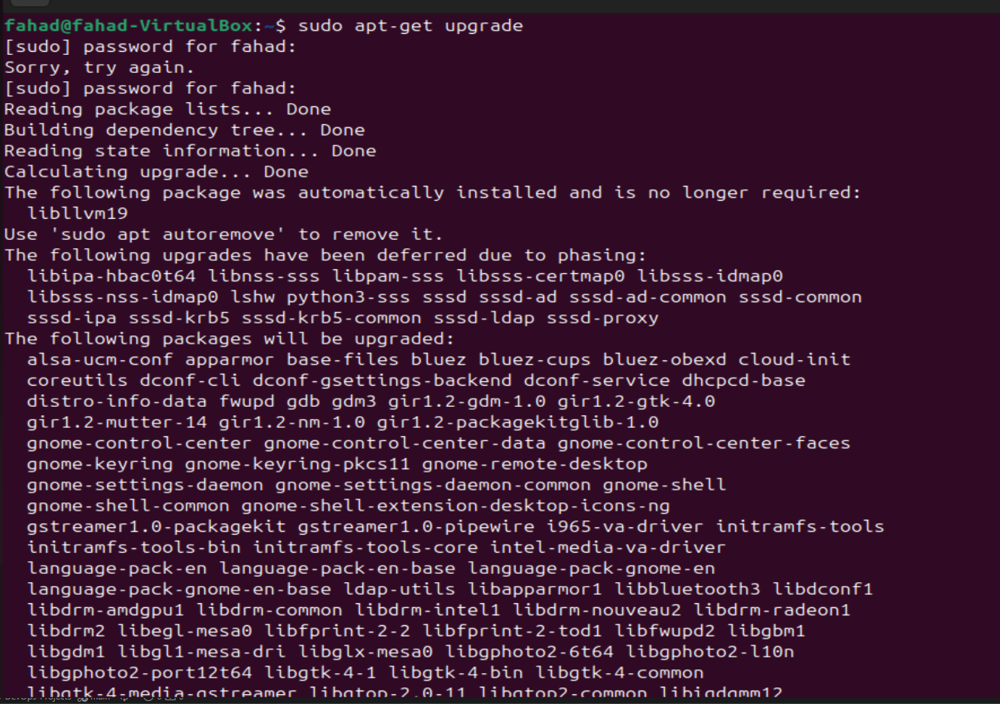

Once that's done the next step is to use the 'sudo apt-get install ca-certificates curl gnupg' command. This command installs essential packages including certificates authoritiers, a data transfer tool (curl), and the GNU privary Guard for secure communication and package verification.

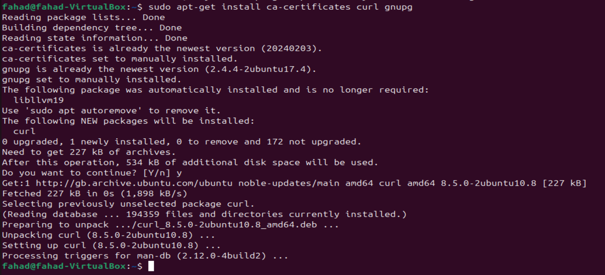

Once the above has been successfully carried out it's time create a dictory with specific permissions (0755) for story keyring files, which are used for dockers authentication. This will be done using the 'sudo install -m 0755 -d /etc/apt/keyrings' command, and also 'curl -fsSL https://download.docker.com/liux/ubuntu/gpg | sudo gpgp --dearmor -o /etc/apt/keyrings/docker.gpg' this downloads the Docker GPG key using 'curl'

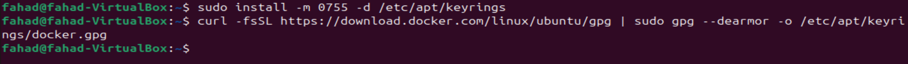

Using the 'sudo chomod a+r /etc/apt/keyrings/docker.gpg' command this allows me to set read permission for all users on the Docker GPOG key file within the APT keyring directory. Followed by the below command which will add the repsitory to Apt sources:

echo \
  "deb [arch=$(dpkg --print-architecture) signed-by=/etc/apt/keyrings/docker.gpg] https://download.docker.com/linux/ubuntu \
  $(. /etc/os-release && echo "$VERSION_CODENAME") stable" | \
  sudo tee /etc/apt/sources.list.d/docker.list > /dev/null

The "echo" command creates a Docket APT repo config entry for the ubuntu system, incorporating the system architecture and Docker GPG key.

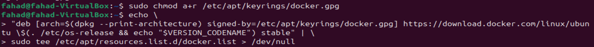

once this has been done i'm finally ready to install the latest version of docker, to do this i'll use the "sudo apt-get update" command, followed by "sudo apt-get install docker-ce docker-ce-cli containerd.io docker-buildx-plugin docker-compose-plugin" 

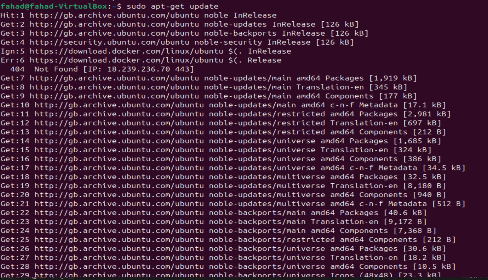

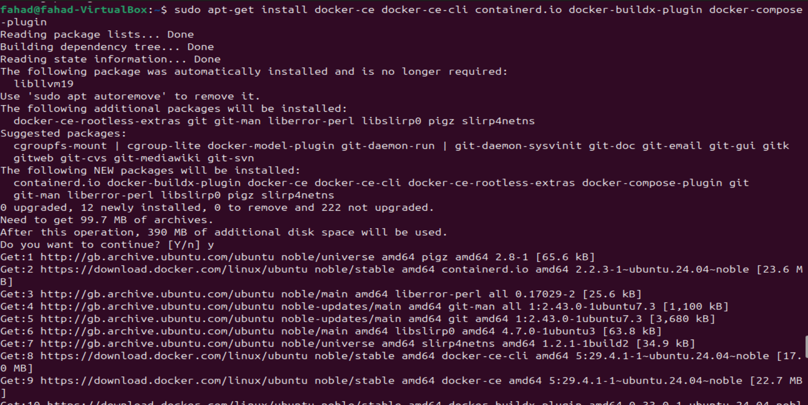

Now it's time to check the docker version and docker status to verify it installed correctly and is up and running.

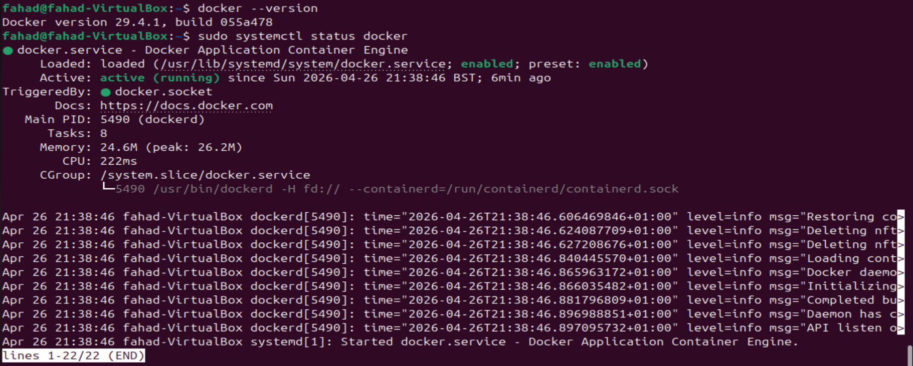

By default, after installing docker, it can only be run by a root user or using the 'sudo' command. To runt he docker command without sudo i will have to execute the command "sudo usermod -aG docker fahad"

This will allow me to run docker without using superuser privilleges.

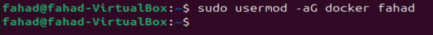

 

### Running "Hello World" Container
Now that i finally have docker installed and the user privs set up it's time to run the hello world container using the 'docker run' command.

the 'docker run' command is the entry point to execute containers in Docker. It allows me to create and start a container based on a specified Docker image. The most straightforward exampe is the "Hello World" container, a minimalistic container that prints a greeting message when executed.

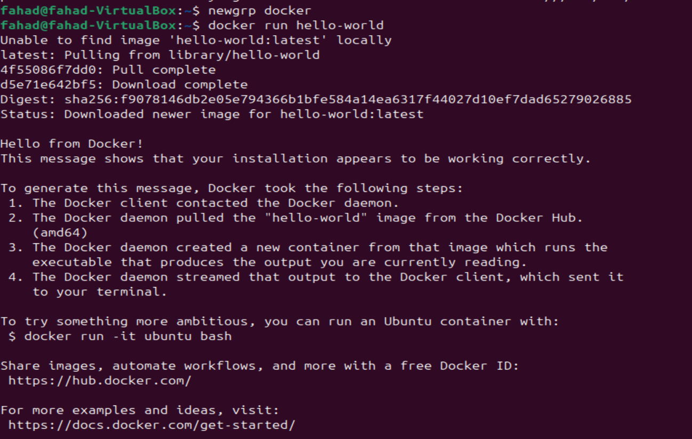

 

#### Docker Image: 
A Docker image is a lightweright, standalone, and executable package that includes everything needed to run a piece of software, including the code, runtime, libraries, and system tools. Images are cannot be modified once created. Changes result in the creation of a new image, like a github repo, your previous image is still in the history.

#### Container Lifecycle: 
Containers are running instances of docker images, they have a lifecycle such as create, start, stop, and delete. Once a container is created from an image, it can be started, stopped and restarted.

Now i will verify if the image is now in my local environment with "docker images" command.

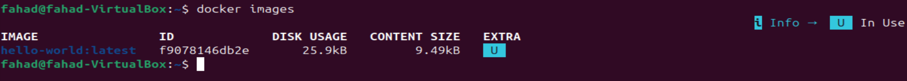

 

### <u>Basic Docker Commands</u>

The 'docker run' command is fundamental for executing containers. It creates and starts a container based on a specified image.

#### Docker PS
The docker ps command displays a list of running containers. This is useful for monitoring active containers and obtaining information such as container Ids names, and status.

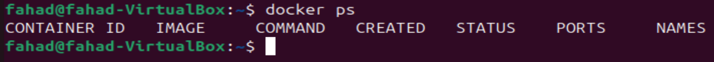

to view all containers, including those that have stopped, i only nmeed to add the '-a' option.

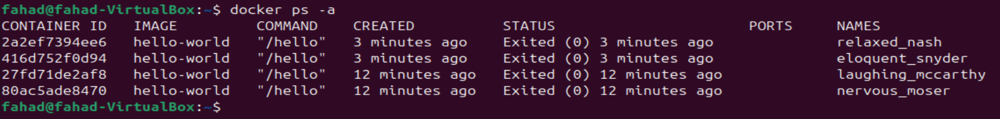

#### Docker Stop

The 'docker stop' with the container id included in the command which halts a running container.

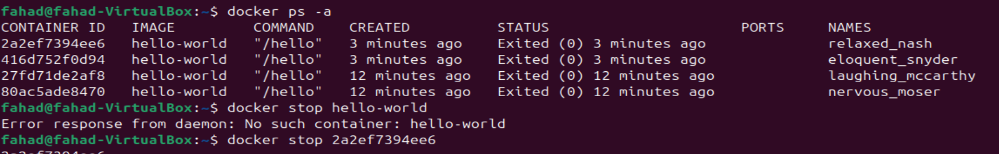

 

#### Docker Pull
The 'docker pull' command downloads a Docker image from a registry, such as Docker Hub, to my local machine.

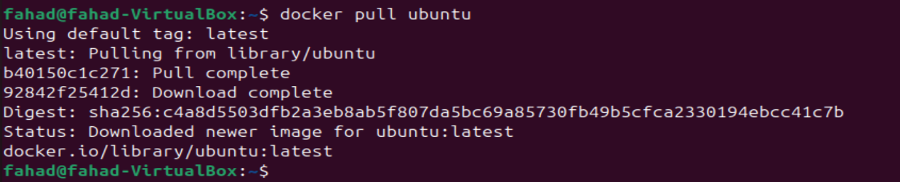

 

#### Docker Push
The 'docker push' command uploads a local Docker image to a registry, making it available for others to pull.

# Push a local image to Docker Hub
docker push your-username/image-name

 

Docker RMI
The 'docker rmi' command removes one or more images from the local machine. 

# Remove a Docker image (replace IMAGE_ID with the actual image ID)
docker rmi IMAGE_ID

These basic Docker commands provide a foundation for working with containers. Understanding how to run, list, stop, pull, push, and manage Docker images is crucial for effective containerization and orchestration.

