# 
 Working with Docker Images

 

### <u>Introduction with Docker Images</u>
docker images are the building blocks of containers. They are lightweight, portable, and self sufficient packages that contain everything needed to run a software application, including the code, runtime, libraries, and system tools. Images are created from a set of instructions knock as a 'Dockerfile', while specifies the environment and configuration for the application.

 

#### Pulling Images from Docker Hub

Docker Hub is a bloud based registry that hosts a vast collection of Docker images. I can pull images from Docker Hub to my local machine using the 'docker pull' command stated in my previous project.

The below command allows me to discover and explore various images hosted on Docker Hub by providing relevant search results. In this case, the output will be similar to this:

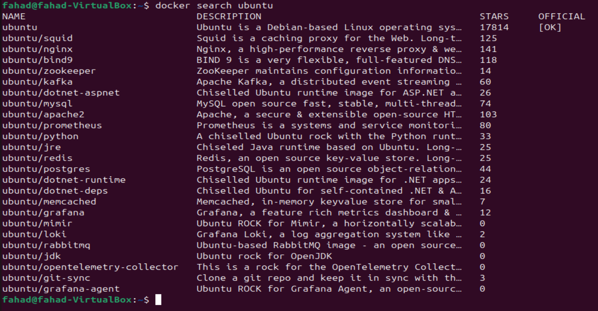

As you can see in the 'OFFICIAL' column, the "OK" designation signifies that an image has been constructed and is officially supported by the organisation responsible for the project. Once i have decided which image i want, i can retrieve it to my local machine using the "pull" subcommand.

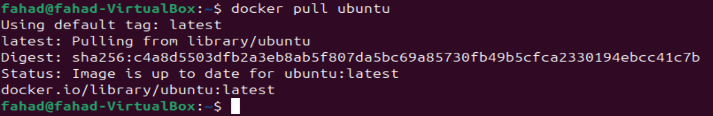

As my image is already up to date and already downloaded there was nothing for docker to install, now i will proceed to run a container using the ubuntu image by employing the "run" command. This is very similar to the hello-world example from my previous project, if an image is not present locally when the 'docker run' command is executed, Docker will automatically download the required image before initiating the container.

 

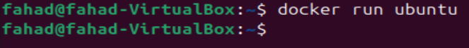

Now if i wanted to view a list of images that have been downloaded and are available on my local machine, i would use the "docker images" command.

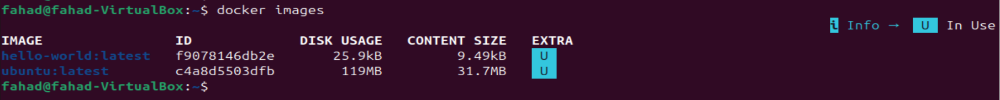

As you can see executing this command has provided me a comprehensive list of all the images stored locally, allowed me to verify the presence of the downloaded image and gather information about its size, version, and other relevant details.

 

### Dockerfile

A Dockerfile is a plaintext configuration file that contains a set of instructions for building a Docker image. It serves as a blueprint for creating a reproducible and consistent environment for my application. Dockerfiles are fundamental to the containerization process, allowing me to define the steps to assemble an image that encapsulates my application and its dependencies.

 

### Creating a Dockerfile
In this dockerfile, i will be using an nginx image. 'nginx' is an open source software for web serving, reverse proxying, caching, load balancing, media streaming, and more. It started out as a web server designed for maximum performance and stability. 

To create my Dockerfile, i will be a text editor, such as vim. i will start by specifying a base image, defining the working directory, copying files, installing dependencies, and configuring the runtime environment.

I have created a file using "vim dockerfile" and have posted the following code.

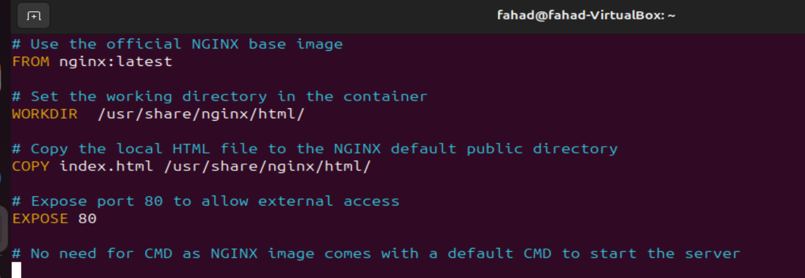

 

#### Explanation of the code snippet above

1) <b>FROM nginx:latest:</b> Specifies the official NGINX base image from Docker Hub.

2) <b>WORKDIR /usr/share/nginx/html/:</b> Specifies the working directory in the container

3) <b>COPY index.html /usr/share/nginx/html/:</b> Copies the local index.html file to the NGINX default public directory, which is where NGINX serves static content from.

4) <b>EXPOSE 80:</b> Informs Docker that the NGINX server will use port 80. This is a documentation feature and doesn't actually publish the port.

5) <b>CMD:</b> NGINX images come with a default CMD to start the server, so there's no need to specify it explicitly.

HTML file named index.html in the same directory as your dockerfile.

Now to build an image from the Dockerfile, i will first have to navigate to the directory containing the file and run: "docker build -t dockerfile ."

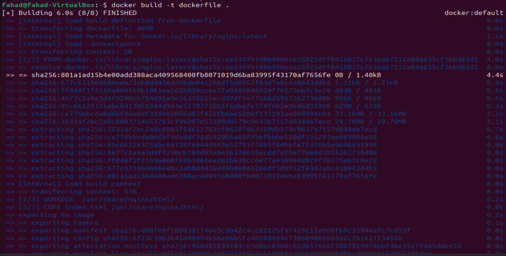

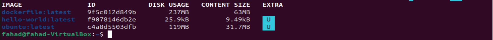

now to run a container based on the custom NGINX image that i created with a dockerfile, i will run this command: "docker run -p 8080:80 dockerfile"

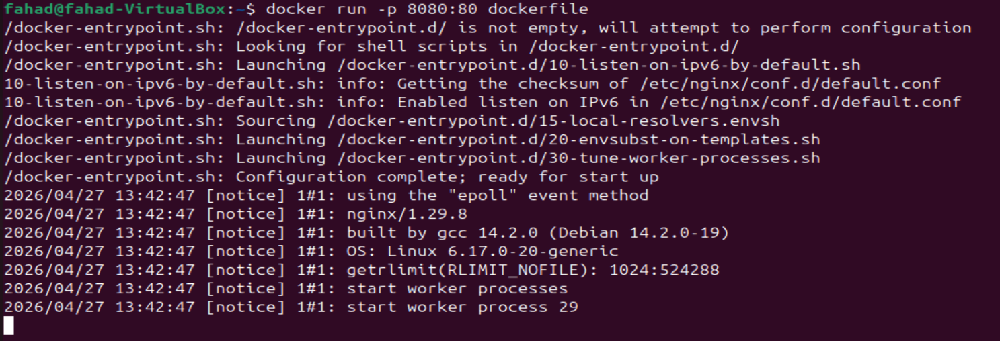

Running the command above will create a container that listens on port 8080 using the nginx image i created earlier. So i need to create a new rule in VirtualBox.

1) i'll navigate to my virtualbox, from there i will right click my Ubuntu VM and click "settings.

2) From here i will navigate to "Network" and then "Port Forwarding" which will open a new window that will allow me to add my rule.

3) from here i will give it a name (Docker Nginx), protocol will be TCP, host port will be 8080 and guest port will be 80.

 

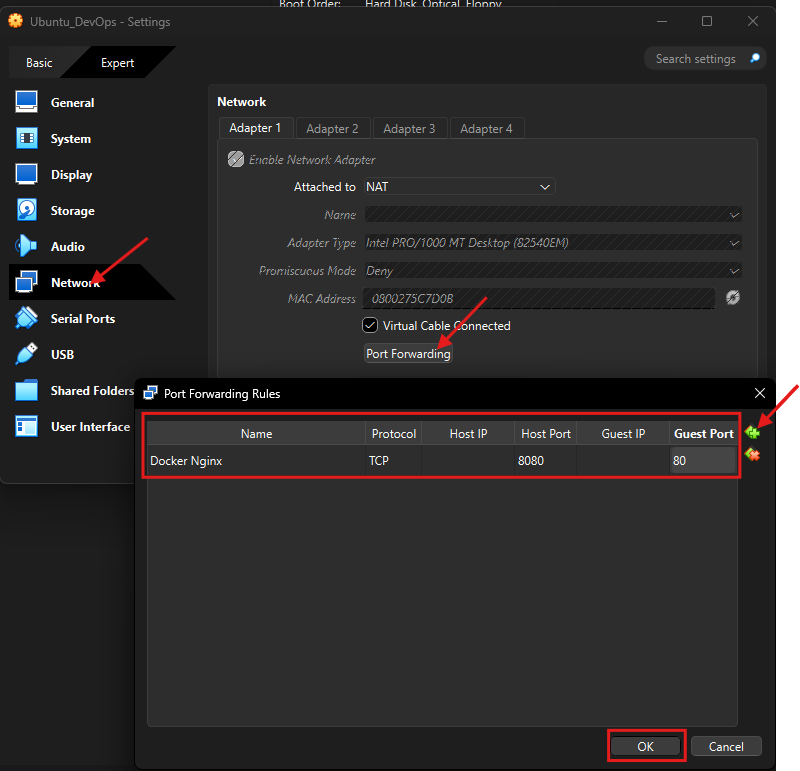

 

Now i'll confirm if my work above worked by using the "docker ps -a" command to list all the available containers.

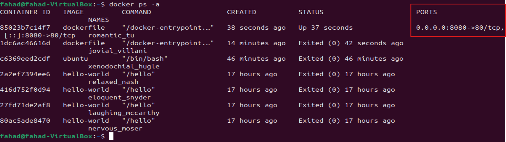

We can see in the image above, not only is the container up and running, but it now has the port listed as 0.0.0.0:8080->80/tcp

I should now be able to access the content on my web browser with http://publicip_address:8080

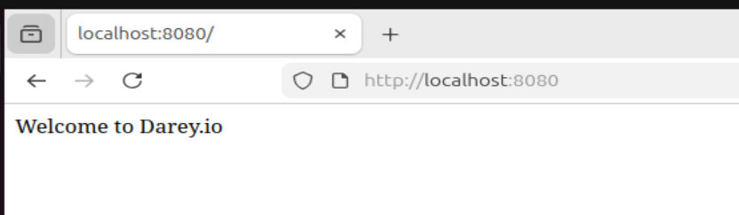

 

### Pushing Docker Images to Docker Hub

1) Create an account on Docker Hub. (i already have one)

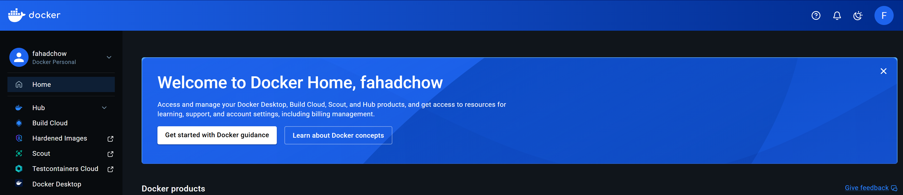

2) Create a repository on docker hub.

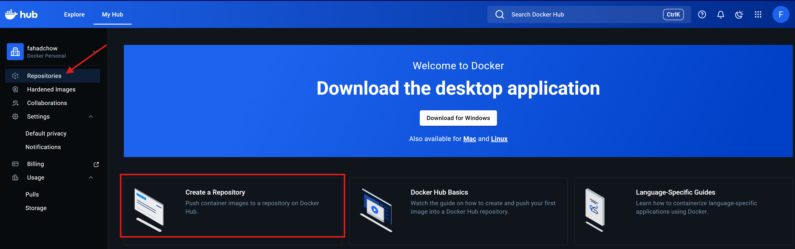

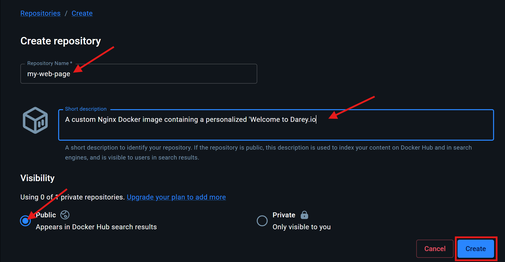

3) Tag your Docker Image Before pushing, ensure that your Docker image is appropriate tagged. You typically tag your image with your Docker Hub username and the repository name.

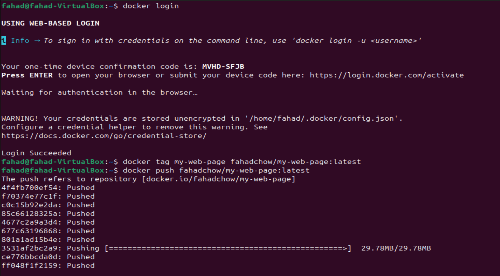

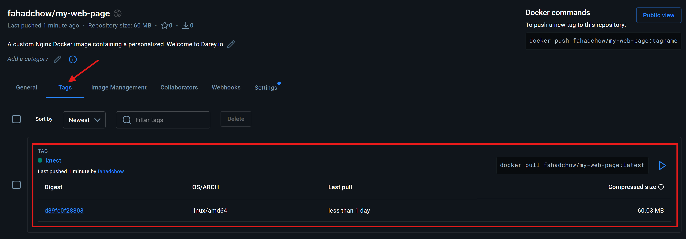

