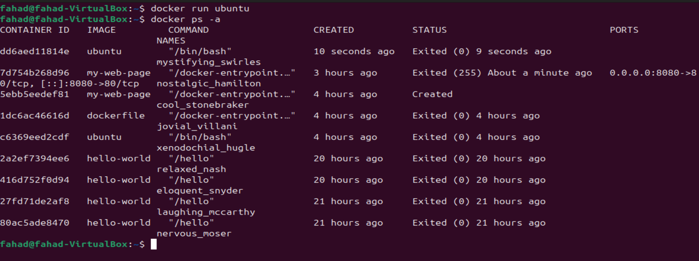
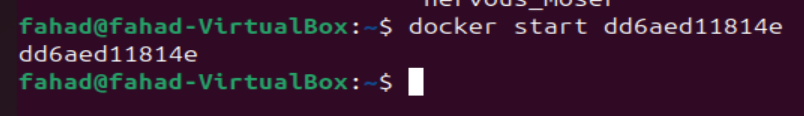
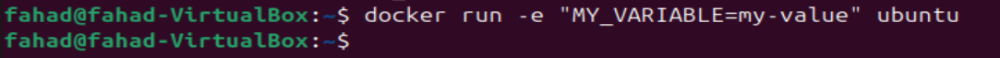
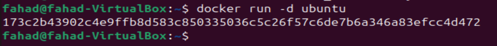
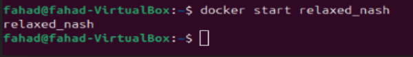
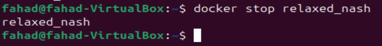
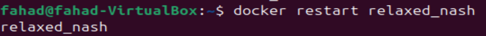
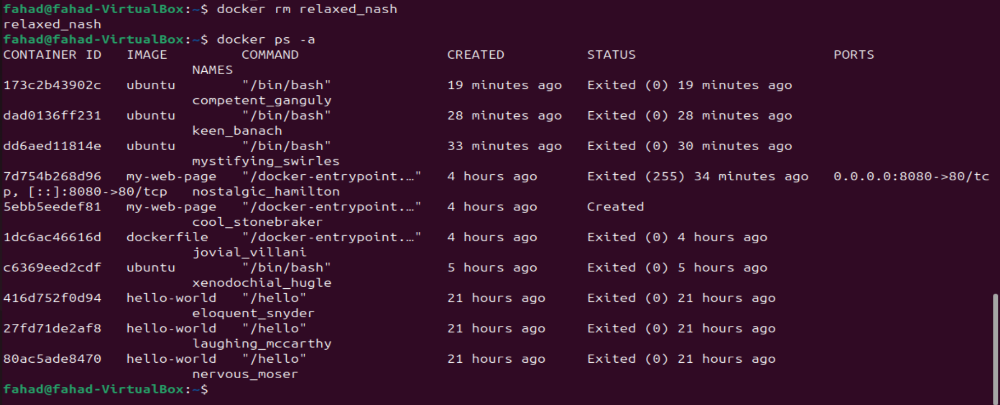

# 
Working with Docker Containers

 

### Introduction
Docker containers are lightweight, protable, and executable units that encapsulate an application and its dependencies. In my previous project, i worked a little with docker containers. I would dive deep into the basics of working with Docker containers, from launching and running containers to managing their lifecycle.

 

### Running Containers
To run a container, i would need to use the 'docker run' command followed by the name of the image i want to use. 

I pulled an Ubuntu image from my last project where it was from the official ubuntu repository on docker hub, now i will create a container from the ubuntu image. This command launches a container based on the ubuntu image "docker run ubuntu".

The image above shows that the container is created, but not running. I can manually start the container by taking the "CONTAINER ID" and running the command "docker start CONTAINER ID" i.e. docker start 7d754b268d96

 

### Launching Containers with Different Options
Docker provides various options to customise the behaviour of containers. For example. you can specify the environment variables, map ports, and mount volumes. Here's an example of running a container with a specific environment variable:

"docker run -e "MY_VARIABLE=my-value" ubuntu"

 

### Running Containers in the Background
By default, containers run in the foreground, and the terminal is attached to the container's standard input/output. To run a container in the background, i would need to use the '-d' option, example command "docker run -d ubuntu"

The above command starts a container in the background, allowing you to continue using the terminal.

#### Container lifecycle
Containers have a lifecycle that includes creating, starting, stopping, and restarting. Once a container is created, it can be started and stopped multiple times.

### Starting, Stopping, and Restarting Containers
To start a stopped container i just need to enter the "docker start container_name" command.

- Docker Start Command

The reason why i know this command worked is because the name was echo'd back to me or sometimes the ID of the container back to me to confirm that the command was send successfully and the container has been triggered.

 

- Stopping a running container

 

- Restarting a container

 

### Removing Containers

This command is a command i find very important for house keeping, to remove a container i normally use the command 'docker rm' following by the containers ID or name, rm standing for 'remove'

As you can see above, the name 'relaxed_nash' is no longer visible when i run the docker ps -a command. This means the container has been deleted, but the associated image will remain on my system.

