# 
Introduction to Jenkins

 

### Introduction to CICD
Continuous Integration and Continuous Delivery (CI/CD) is a set of best practices and methodologies that revolutionize the software development lifecycle by enhancing efficiency, reliability, and speed. CI/CD represents a seamless integration of automation and collaboration throughout the development process, aiming to deliver high-quality software consistently and rapidly. In the realm of CI, developers regularly integrate their code changes into a shared repository, triggering automated builds and tests to detect integration issues early. On the other hand, CD encompasses both Continuous Delivery and Continuous Deployment, ensuring that software is always in a deployable state and automating the deployment process for swift and reliable releases. The CI/CD pipeline fosters a culture of continuous improvement, allowing development teams to iterate quickly, reduce manual interventions, and deliver software with confidence.

 

#### What is Jenkins?
Jenkins is widely employed as a crucial CI/CD tool for automating software development processes. Teams utilize Jenkins to automate building, testing, and deploying applications, streamlining the development lifecycle. With Jenkins pipelines, developers can define, version, and execute entire workflows as code, ensuring consistent and reproducible builds. Integration with version control systems allows Jenkins to trigger builds automatically upon code changes, facilitating early detection of issues and enabling teams to deliver high-quality software at a faster pace. Jenkins' flexibility, extensibility through plugins, and support for various tools make it a preferred choice for organizations aiming to implement efficient and automated DevOps practices.

 

### Getting Started With Jenkins

I'm going to dive straight into jenkins and begin installing it on my ubuntu VM via virtualbox by first using the 'sudo apt update' command to update the package repositories.

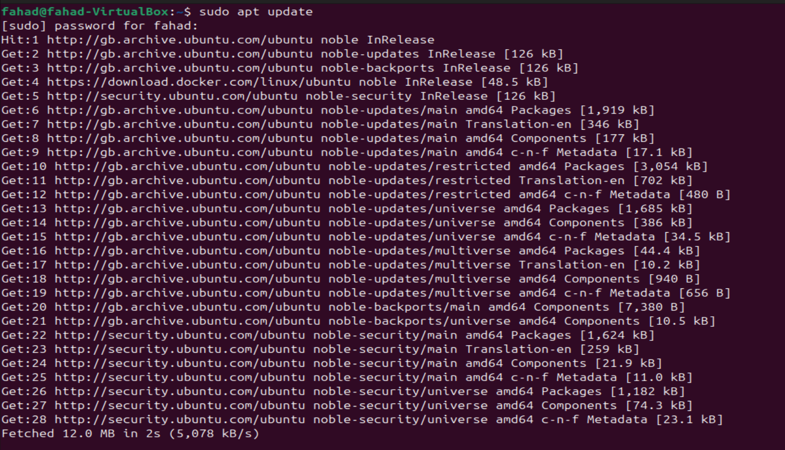

Once the package repositories are updated, i'm now ready to install JDK which is the java development kit, this is required to run complex java applications like Jenkins. I will now use the command 'sudo apt install default-jdk-headless' to install JDK

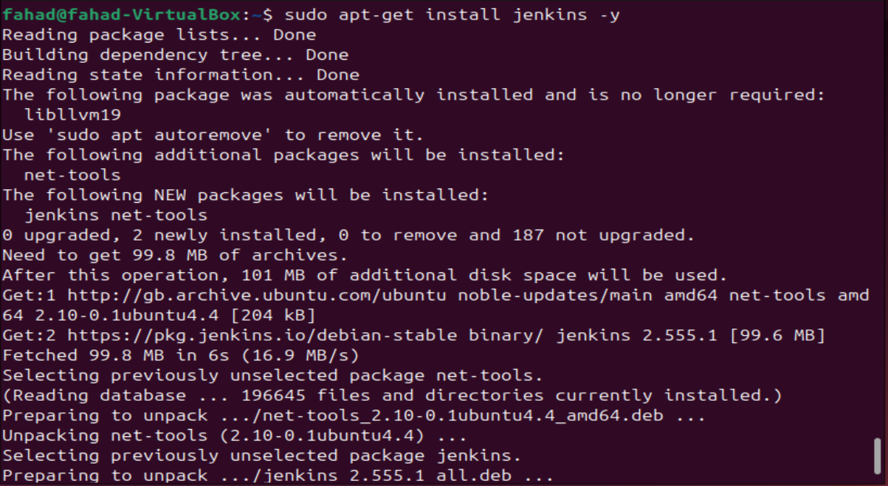

Now that i have JDK installed, i can now proceed to install Jenkins. with the command:

'wget -q -O - https://pkg.jenkins.io/debian-stable/jenkins.io.key | sudo apt-key add -
    sudo sh -c 'echo deb https://pkg.jenkins.io/debian-stable binary/ > \
    /etc/apt/sources.list.d/jenkins.list'
    sudo apt update
    sudo apt-get install jenkins'

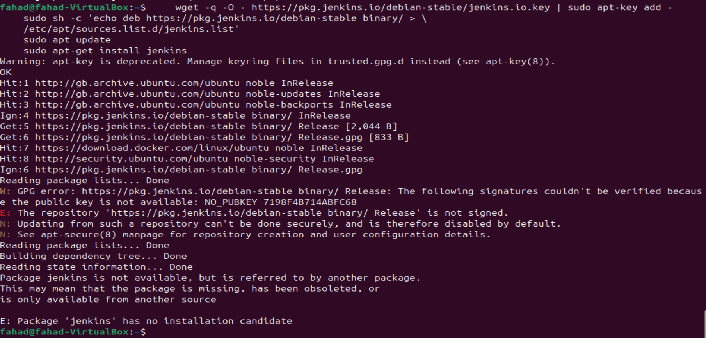

It seems i have failed to install Jenkins using the command provided to me via the project. I believe this is due to Jenkins not being included in the standard ubuntu software store, so i will have to manually tell Ubuntu where the Jenkins repository is. I will do this by adding the "key" and the "address"

1) Adding the Jenkins GPG Key
A GPG key is like a digital ID card so that Ubuntu knows that the software is safe. I will do this by using the command 'sudo wget -O /usr/share/keyrings/jenkins-keyring.asc https://pkg.jenkins.io/debian-stable/jenkins.io-2023.key'

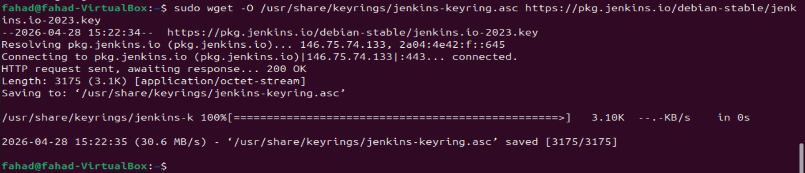

2) Adding the Jenkins Repository
This will tell Ubuntu exactly which "website" to download Jenkins from by using the command 'echo "deb [signed-by=/usr/share/keyrings/jenkins-keyring.asc] https://pkg.jenkins.io/debian-stable binary/" | sudo tee /etc/apt/sources.list.d/jenkins.list > /dev/null'

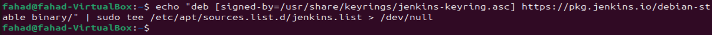

Now all i need to do is update the package repo and run the 'sudo apt install jenkins' command.

 

Now i need to confirm if Jenkins installed correctly and is up and running with the command 'sudo syustemctl status jenkins'

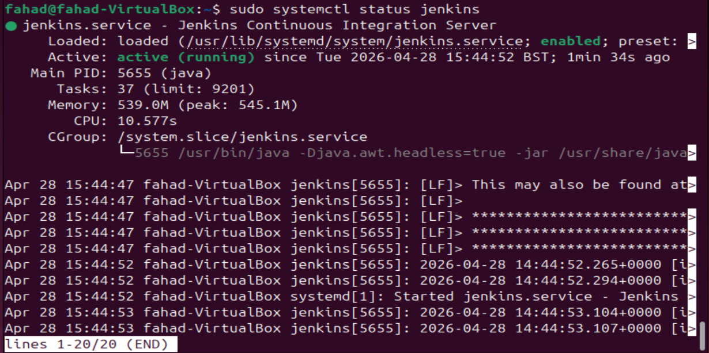

 

#### Set up Jenkins on the Web Console

1) First input my Jenkins instance ip address in my web browser

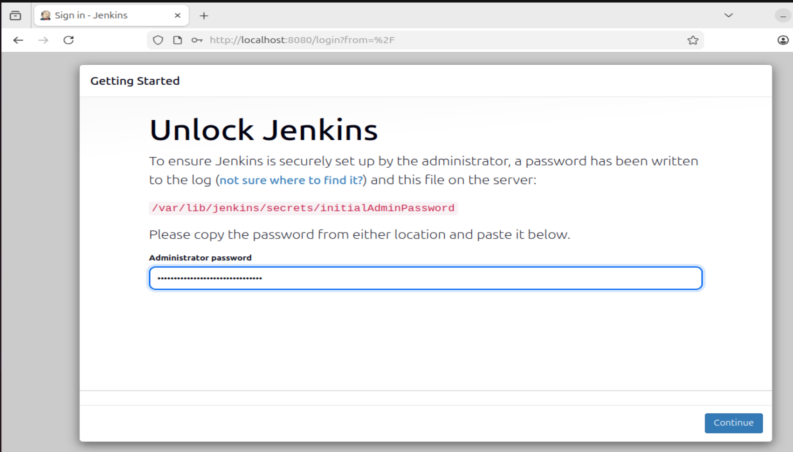

2) On my Jenkins instance carry out the command "/var/lib/jenkins/secrets/initialAdminPassword" to get my password

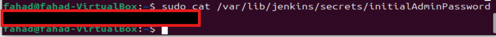

3) Install suggested plugins.

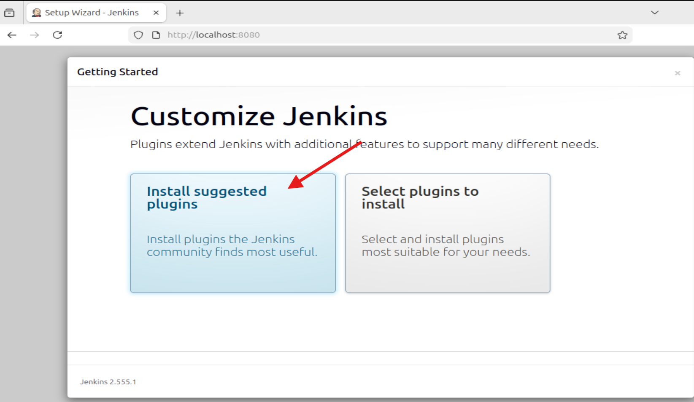

4) Create a user account

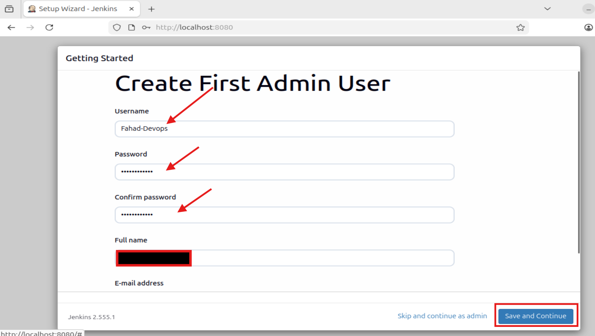

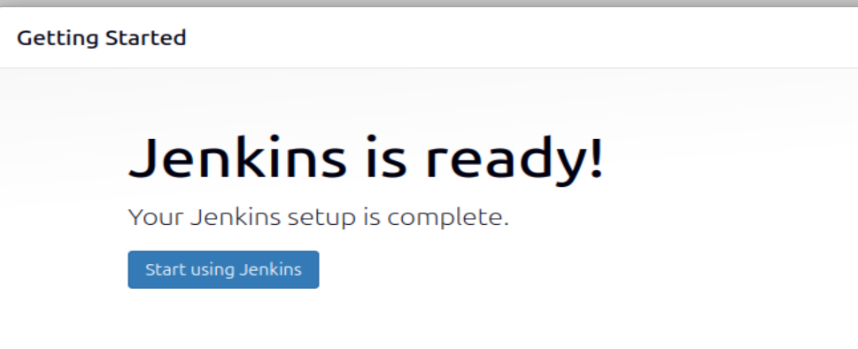

5) Log in to the Jenkins Console.

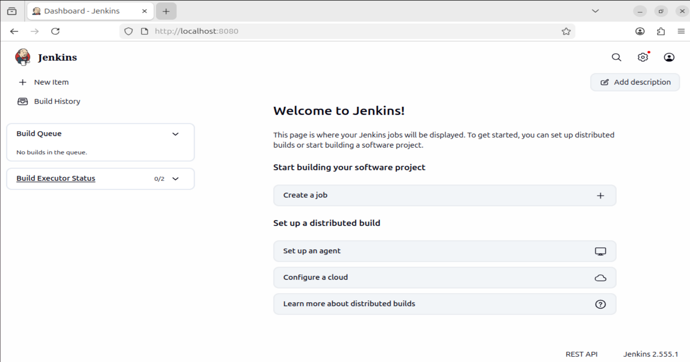

