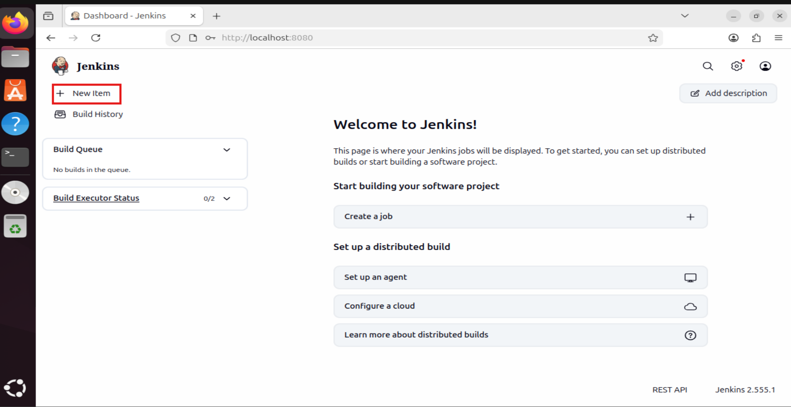
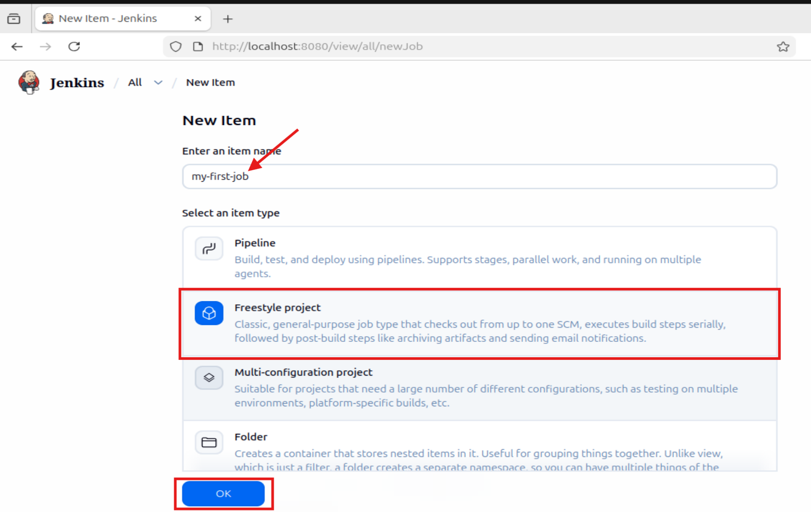
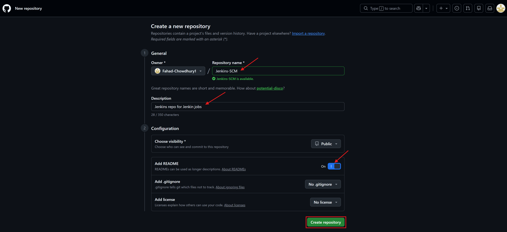
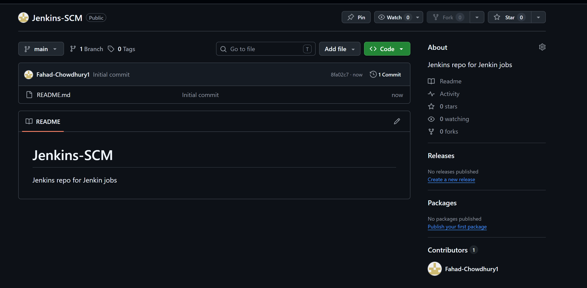
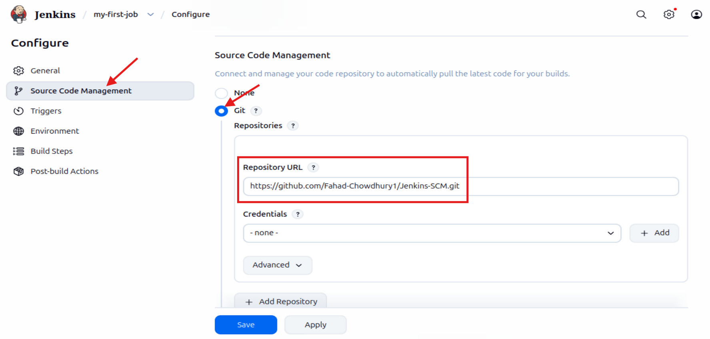
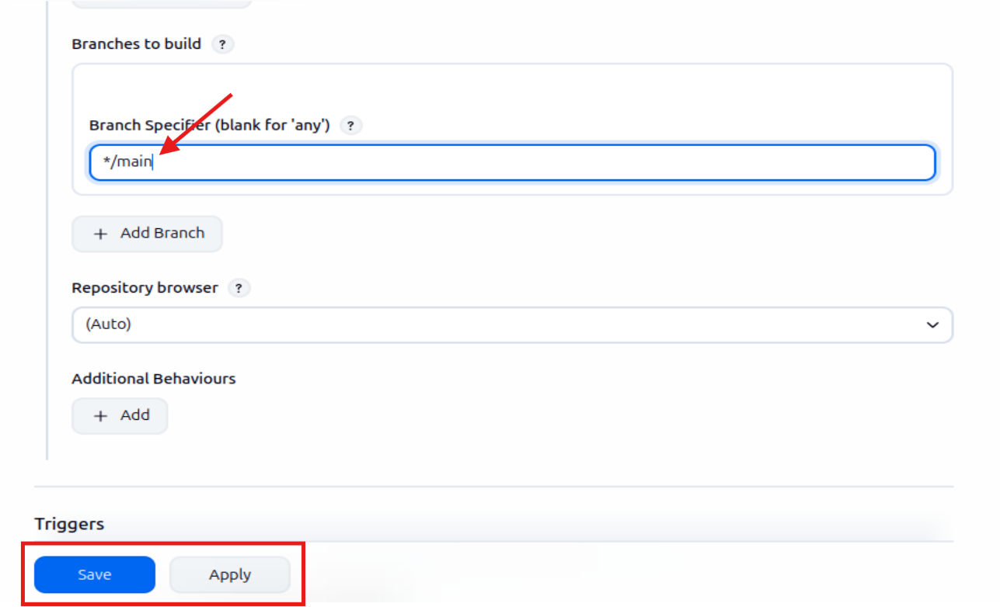
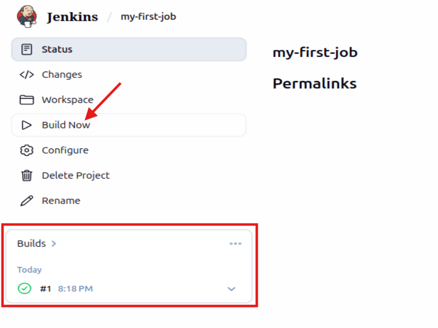
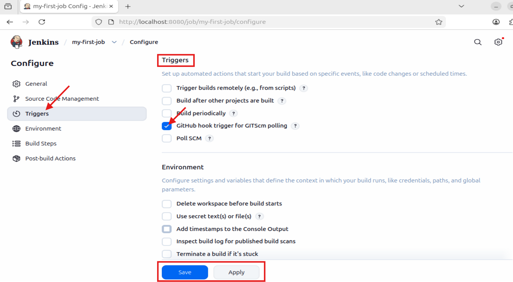
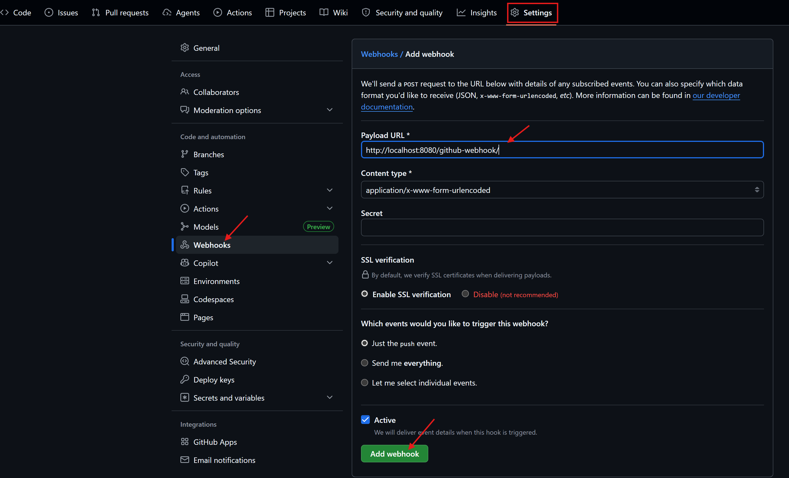

# 
Jenkins Freestyle Project

 

### Introduction
In Jenkins, a job is a unit of work or a task that can be executed by the jenkins automation server.

A Jenkins job represents a specific task or set of tasks that needs to be performed as of a build or deployment process. Jobs in jenkins are created to automate the execution of various steps such as compiling code, running tests, packaging applications, and deploying them to servers. Each Jenkins job is configured with a series of build steps, post build actions, and other settings that define how the job should be executed.

 

### Creating a Freestyle Project
In this project i will build my first job.

1) From the Jenkins dashboard menu on the left side, i will click on "new item"

2) Create a freestyle project and name it "my-first-job"

 

### Connecting Jenkins To My Source Code Management
Now that i have created a freestyle project, i will connect jenkins with github.

1) Create a new github repository called Jenkins-scm with a README.md file

2) Connect 'Jenkins' to 'Jenkins-scm' repository by pasting the repository url in the area selected below and making sure my branch is 'main'

3) Now i will save the configuration and run "build now" to connect jenkins to my repository

I have successfully connected Jenkins with my github repo (Jenkins-SCM)

 

### Configuring Build Trigger

As an engineer i will need to be able to automate things and make my work easier in possible ways. I have connected 'Jenkins' to 'Jenkins-SCM', but i cannot run a new build with clicking on 'Build Now'. To  eliminate this, i will need to configure a build trigger for my Jenkins job. With this, Jenkins will run a new build anytime a change is made to my github Repository.

1) I will click "Configure" and navigate to "triggers" from there i will add the following configurations.

3) Creating a hithub webhook using jenkins ip address and port.

