# 
Jenkins Pipeline Job

 

### <u>What is a Jenkins Pipeline Job?</u>
A Jenkins pipeline job is a way to define and automate a series of steps in the software delivery process. it allows you to script and organise your entire build, test, and deployment. Jenkins pipelines enable organisations to define, visualise, and execute intricate build, test, and deployment processes as code. This facilitates the seamless integration of continuous integration and continuous delivery (CI/CD) practices into software developement.

 

Earlier on in project "01.Introduction to docker" i created a dockerfile and made a docker image and container with it. Now i'm going to automate the same process with Jenkins pipeline code. 

 

### <b> Creating a pipeline Job</b>

Firstly i'm going to create my first pipeline job.

1. From the dashboard menu on the left side, i'm going to click "new item"

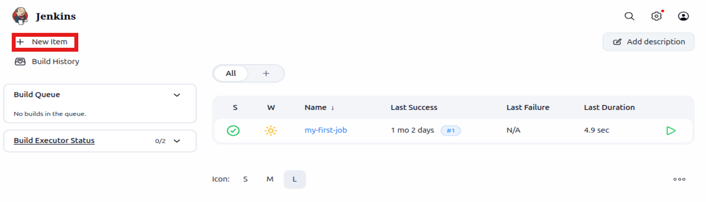

 

2. Next i'm going to create a pipeline job and name it "My pipeline job"

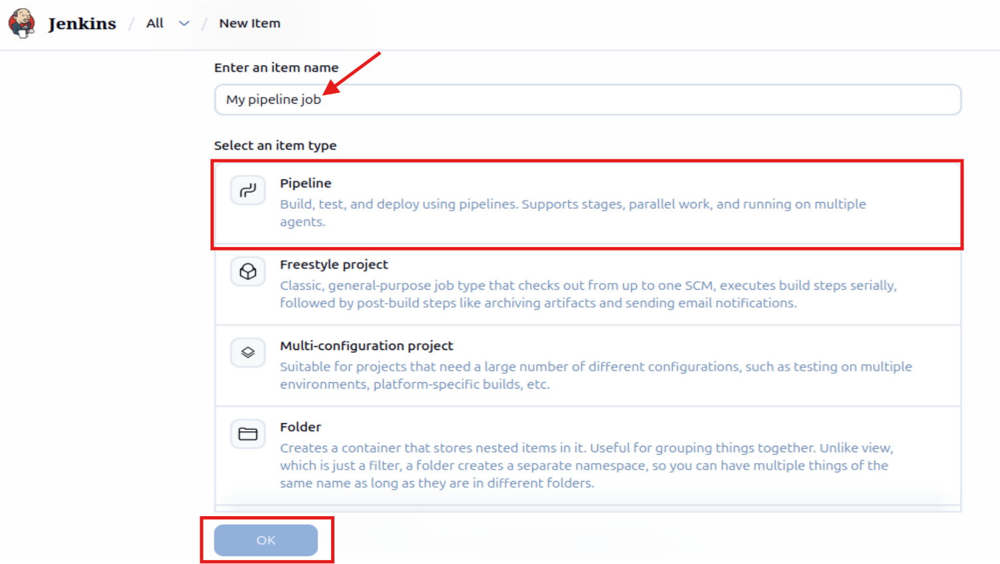

 

3. Next like i did previously with my earlier project, i'm going to create a build trigger for jenkins to trigger a new build.

To do this i will simply navigate to "configure" and scroll down until i come across the 'Trigger' setting, from here i just need to ensure that 'GitHub hook trigger for GITScm polling' is ticked.

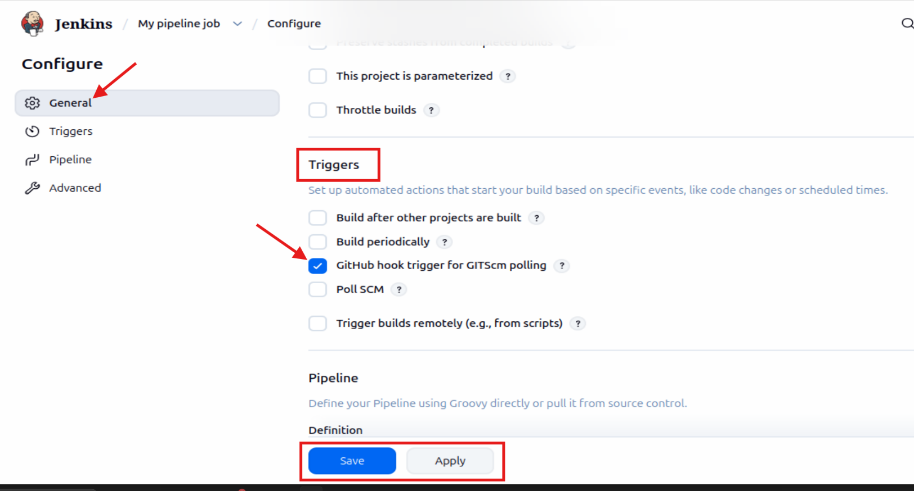

As i previously created a github webhook i do not need to create another one again.

 

### <b>Writing Jenkins Pipeline Script</b>

A Jenkins pipeline script refers to a script that defines and orchestrates the steps and stages of a continuous delivery (CI/CD) pipeline. Jenkins pipelines can be defined using either declarative or scripted syntax. Declarative syntax is a more structured and concise way to define pipelines. It uses a domain specific language to describe the pipeline stages, steps, and other configurations while scripted syntax provides more flexibility and is suitable for complex scripting requirements.

Below is the pipeline script i will be using:

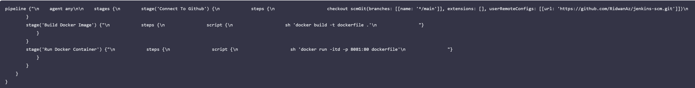

 

#### Explanation of the script above

The provided Jenkins spipeline script defines a series of stages for a continuous integration and continuous delivery (CI/CD) process. I'm going to break down each stage:

#### <b>Agent Configuration:</b>

- <b>agent any</b> - Specifes that the pipeline can run on any available agent (an agent can either be Jenkins master or node). This means the pipeline is not tied to a specific node type.

 

<b>Stages:</b>

- <b>stages {"\n      // Stages go here\n   "}</b> - Defines the various stages of the pipeline, each representing a phase in the software delivery process.

 

#### <b>Stage 1:Connect To Github:</b>

- <b>stage('Connect To Github') {"\n      steps {\n         checkout scmGit(branches: [[name: '*/main']], extensions: [], userRemoteConfigs: [[url: 'https://github.com/Fahad/jenkins-scm.git']])\n      "}
}</b> - This stage checks out the source code from a Github repository, it specifies that the pipeline should use the 'main' branch

 

#### <b>Stage 2: Build Docker Image:</b>

- <b>stage('Build Docker Image') {"\n      steps {\n         script {\n            sh 'docker build -t dockerfile .'\n         "}
   }
}</b> - This stage builds a Docker image named 'dockerfile' using the source code obtained from the GitHub repository. The 'docker build' command is executred using the shell ('sh')

 

#### <b>Stage 3: Run Docker Container:</b>

- <b>stage('Run Docker Container') {"\n      steps {\n         script {\n            sh 'docker run -itd --name nginx -p 8081:80 dockerfile'\n         "}
   }
}</b> - This stage runs a Docker container named 'nginx' in detached mode (itd). The container is mapped to port 8081 on the host machine (-p 8081:80). The Docker image used is the one built in the previous stage (dockerfile)

 

#### <b>Pipeline</b>

I will now copy the pipeline script and paste it in the section below named "Pipeline"

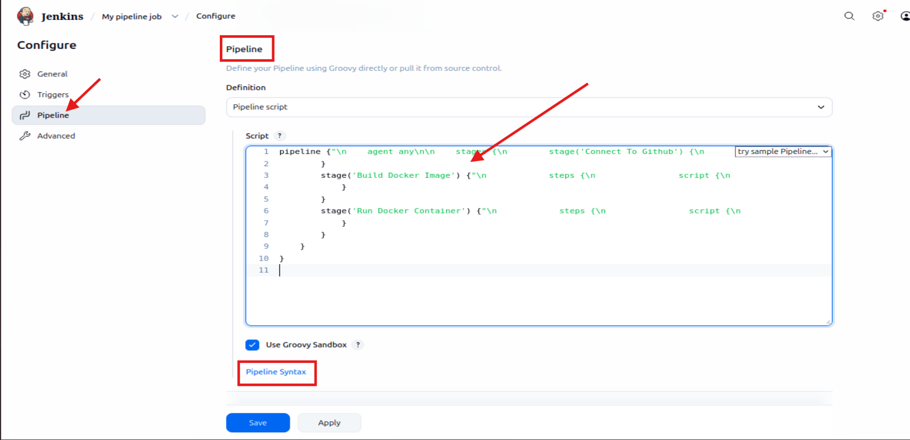

The stage 1 of the script connects Jenkins to github repository. To generate syntax for my github repository i have to navigate to the 'Pipeline Syntax' as highlighted in the above image.

 

Once in the Syntax menu, i will change the 'Sample Step' to 'checkout: Check out from version control'

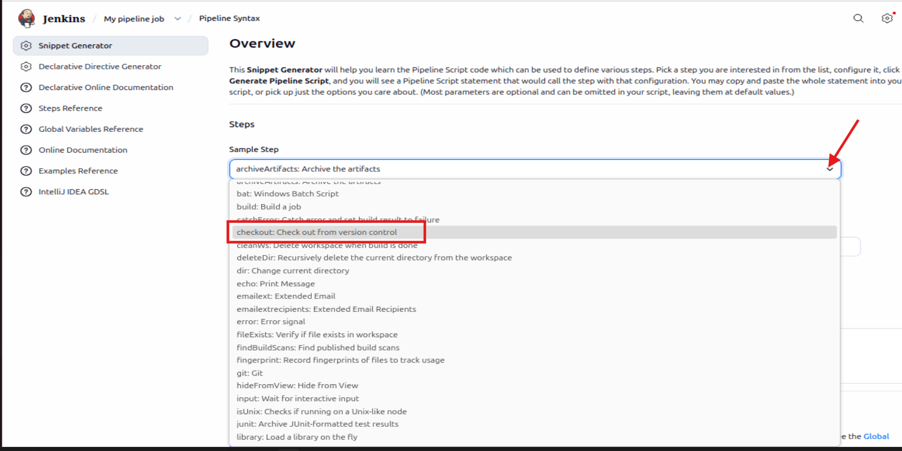

 

Once selected i will paste my repository url and make sure the 'branch' is set to main.

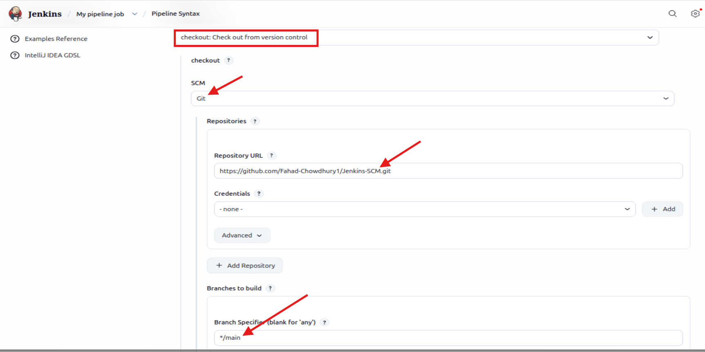

 

Finally i will scroll down and 'Generate Pipeline Script'

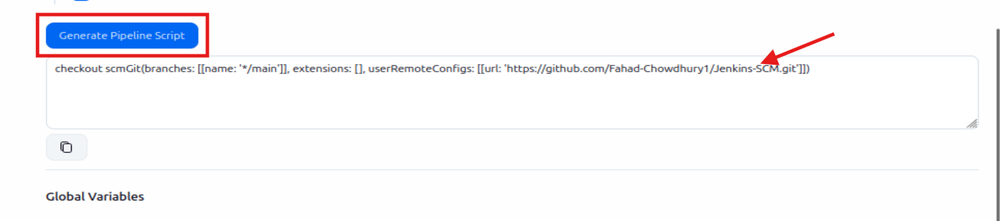

 

### <b>Installing Docker</b>
Before Jenkins can run docker commands, i need to install docker on the same instance jenkins was installed. Due to my shell scripting knowledge, i will install docker with shell script.

 

As i'm using the same instance i did my docker project on, i already have docker installed since project '01:Introduction_to_Docker' i won't need to reinstall it again. As can be evidenced with the 'Docker --version' command which confirms i have Docker installed as well as the version.

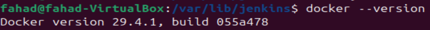

 

#### <b>Building Pipeline Script</b>

Now that i have confirmed i have docker installed on the same instance with Jenkins, i need to create a dockerfile before i can run my pipeline script. To do this i need to navigate to my github repo 'Jenkins.Scm' under main branch and create the 'dockerfile' file.

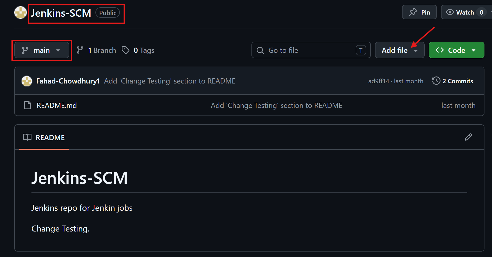

 

From here it will ask me to name the file, which i will put down as 'dockerfile' as well as entering the following script into the file seen in the image below.

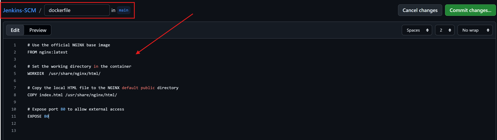

 

Once those changes have been commited the next step is to create another file on the main branch of 'Jenkins.SCM', this time naming it 'index.html' where i will post the message:

"Congratulations, You have successfully run your first pipeline code."

 

Pushing the above files will trigger Jenkins to automatically run the new build for my pipeline.

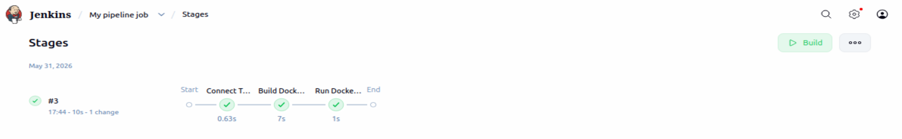

 

Now to access the contents of 'index.html' on my web browser i first need to edit inbound rules and open the port i mapped my container to (8081)

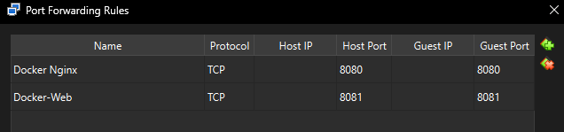

 

Now that i have successfully set up port forwarding i should now be able to access the index.html file via my web browser.

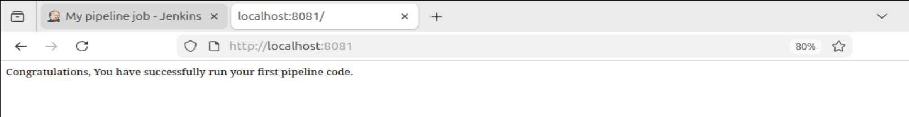

