# 
Introduction to continuous Integration and Continuous Delivery/Deployment

 

### <b>Introduction</b>
This project will involve setting up a simple web application (e.g. a Node.js application) and applying CI/CD practices using GitHub Actions. This application will have basic functionality such as service a static web page.

 

### <u>Practical Implementation</u>

Setting up the project:

1. <b>Initialise a Github Repository:</b>

- Create a new repository on Github.
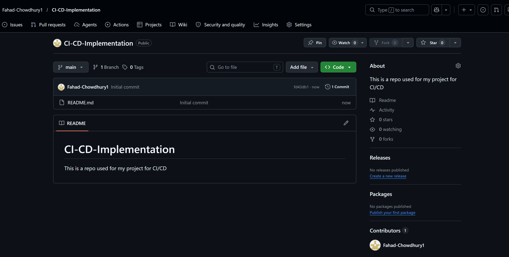

 

- Clone it to your local machine.

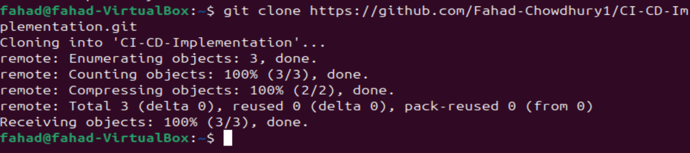

 

2. <b>Create a simple Node.js Application:</b>

- Initialise a Node.js project ('npm init')

First i need to install nodejs using the 'sudo apt install' command. 
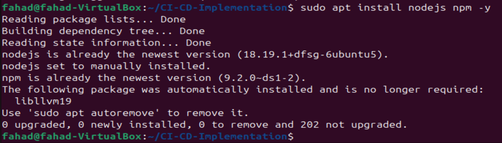

Next i will use npm init -y this creates the package.json file that will manage my projects dependencies.
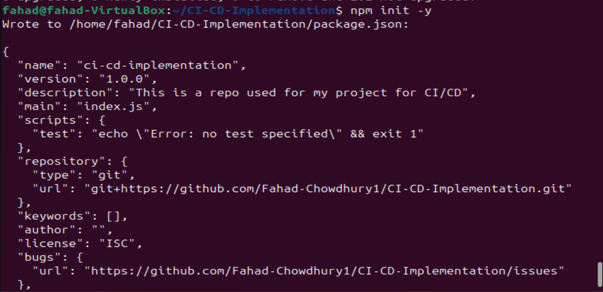

 

- Create a simple Server using Express.js to serve a static web page
Now i will install the Express framework required by my script, for this i will use the 'npm install express' command.
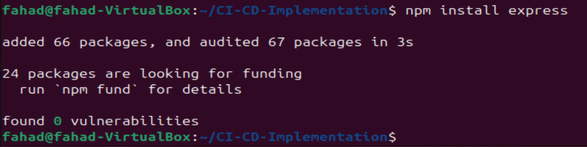

Now i will open a new file named 'index'js' using the "nano index.js" command and using the code provided by my project instructor.

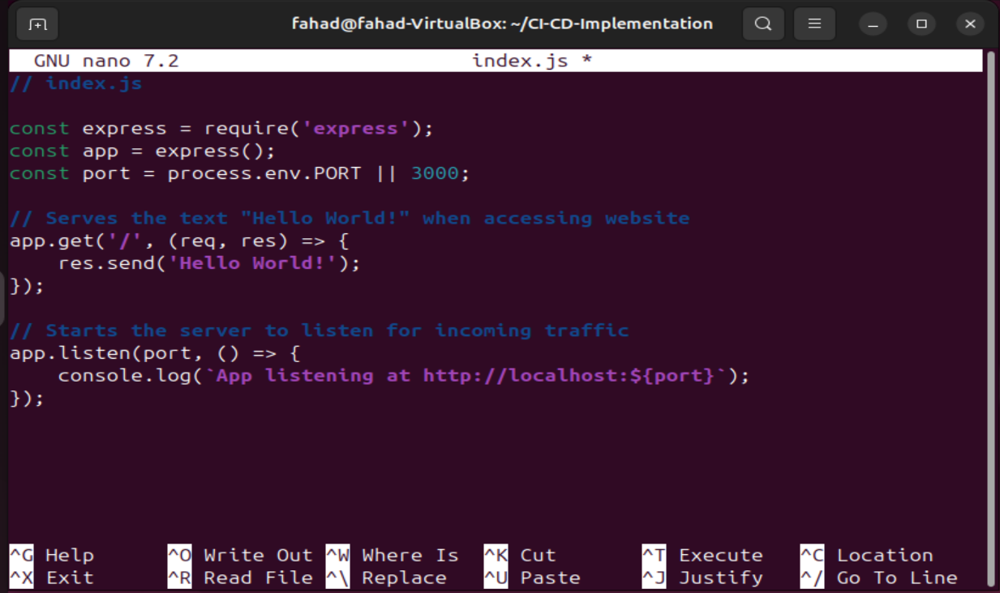

 

- add your code to the repository and push it to GitHub

Firstly i'll create the hidden .github. folder and workflows sub folder at once using "mkdir -p .github/workflows" command. Then i'll create and open the workflow configuration file using "nano .github/workflows/node.js.yml" command.

 

3. <b>Writing my first GitHub Action Workflow:</b>

- Creating a '.github/workflows' directory in my repository.

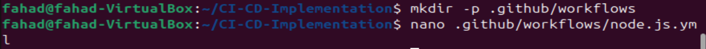

 

- Add a workflow file 'node.js.yml'

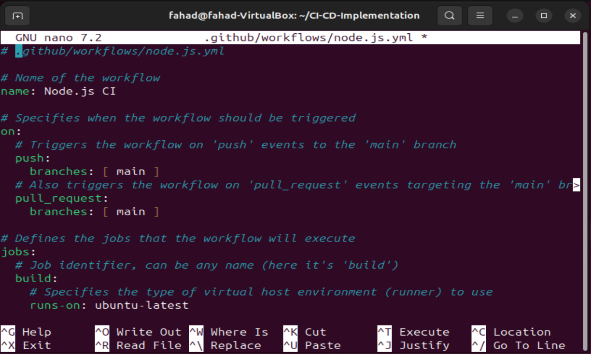

Now that i've successfully created the yaml file and pasted the script in there it's time to push my code to my main github repo.

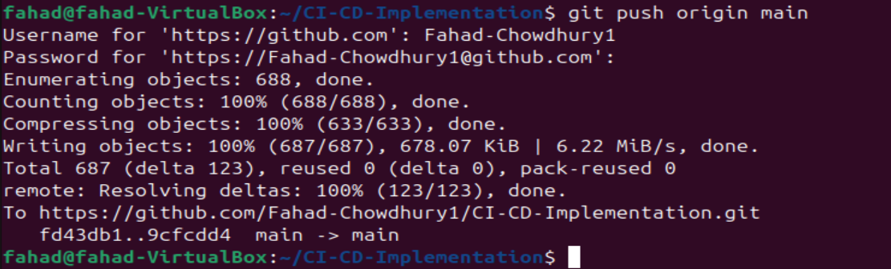

This above workflow is a basic example for a node.js project, demonstrating how to automate testing across different Node.js versions and ensuring that my code integrates and works as expected in a clean environment.

 

4. <b>Testing and Deployment:</b>

- Add automated tests for my application
First i'll create a new file named 'test.js' using the 'nano test.js' command.

Once the file is created, i will paste my script which will conduct a simple function test.

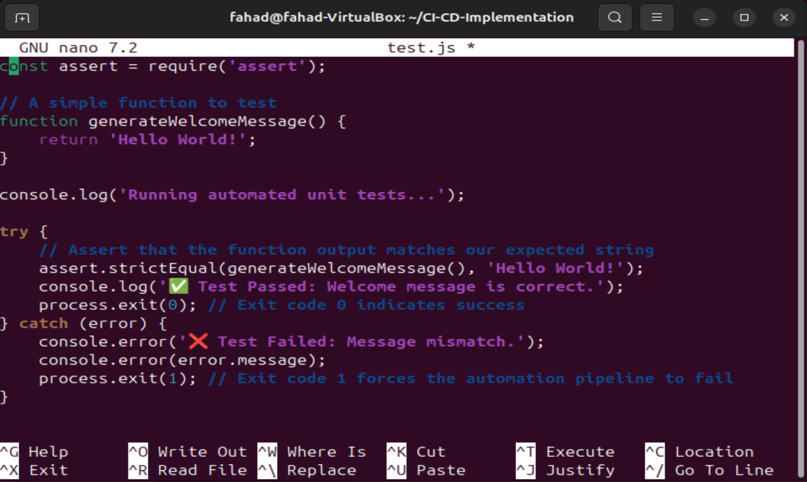

 

- Create a workflow for deployment.
Here i will modify my yml file, where i will add a dedicated deployment block that automatically simulates a release stage right after the test suite clears cleanly.

To do this i'll first open my workflow file i created earlier using "nano .github/workflows/node.js.yml" command.

I will replace the script inside with the following one below. which will introduce sequential deploy job.

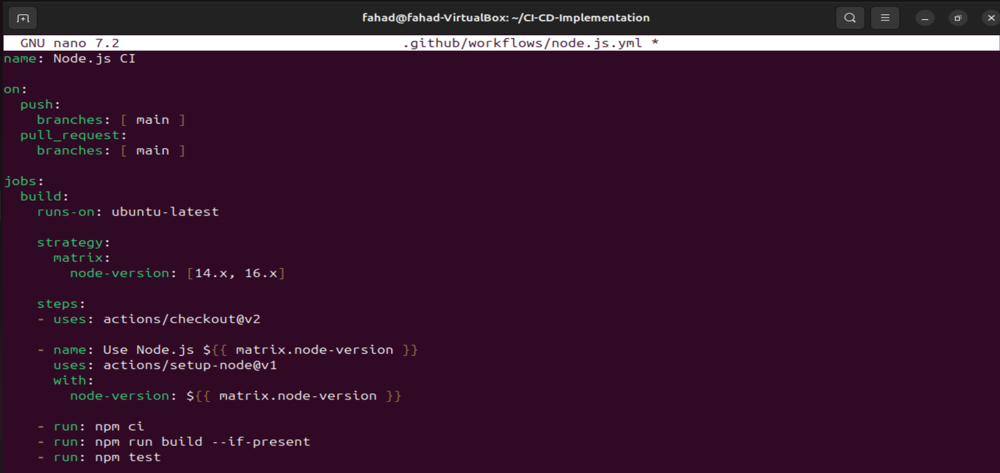

 

5. <b>Experiment and learn</b>

To fulfill the final objective, i will push these changes to Github. This will trigger the updated automation pipeline so i can see my tests and my deployment job executed in real time.

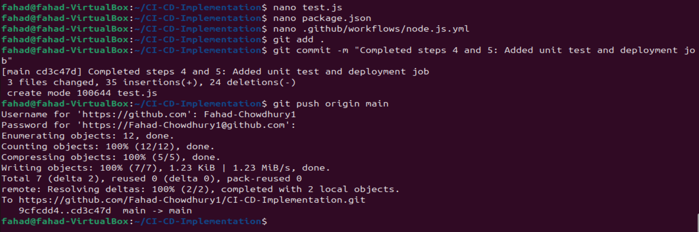

Now i'll run an 'npm test' command on my local machine to see the results before pushing it to GitHub.

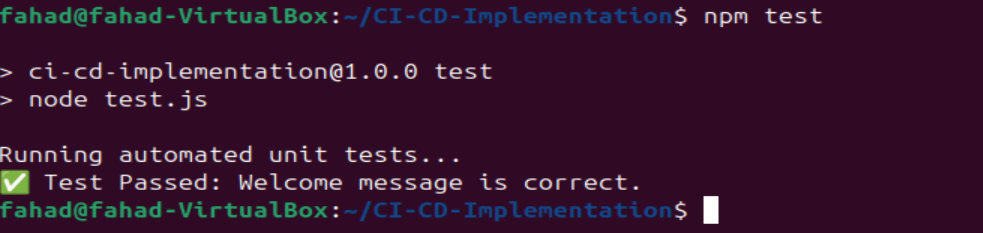

 

It took me a few tries to get this right, first 2 errors were due to the outdated nodes that the project was asking me to use (x14 & x16), for the 3rd try i switched over to node versions 18.x and 20.x, but it still failed. So i ran npm test which showed me that my json file had a duplication of "test:" "test:" which is why it failed. After removing the duplication the 4th attempt was a success.
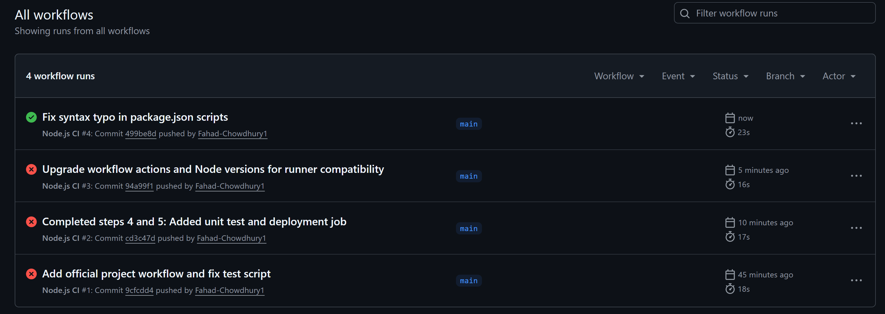
